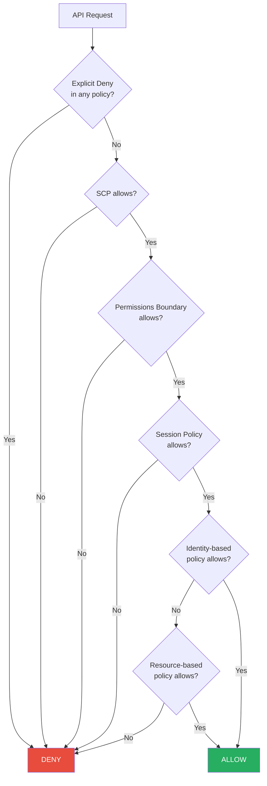
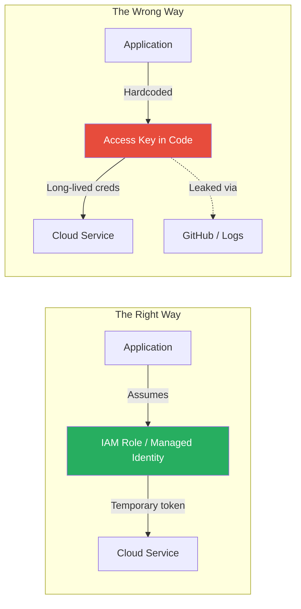

# Cloud Identity and IAM

## What It Is

Cloud IAM (Identity and Access Management) is the system that controls who can do what to which resources in a cloud environment. It encompasses user identities, service accounts, roles, policies, federation with external identity providers, and the policy evaluation engines that make allow/deny decisions on every single API call. In cloud, identity *is* the perimeter — there are no network walls to hide behind.

## Why It Matters

IAM misconfigurations are the number one attack vector in cloud breaches. An overly permissive role, a leaked long-lived access key, or a service account with admin privileges — any one of these can hand an attacker the keys to the kingdom. Cloud environments process millions of API calls daily, and every single one is authorized through IAM. If your IAM is wrong, nothing else you build on top matters. This is why "identity is the new perimeter" isn't a buzzword — it's an operational reality.

## Key Concepts

### Cloud IAM Models Compared

| Feature | AWS IAM | Azure Entra ID (formerly Azure AD) | GCP IAM |
|---|---|---|---|
| Identity model | IAM Users + Roles in each account | Centralized directory (Entra ID tenant) | Google Workspace / Cloud Identity |
| Policy attachment | Policies attached to users, groups, roles | RBAC roles assigned at scope (MG, sub, RG, resource) | Roles bound at org, folder, project, resource level |
| Policy language | JSON (Effect, Action, Resource, Condition) | JSON (RBAC role definitions) | YAML/JSON (roles + bindings) |
| Service accounts | IAM Roles (assumed by services) | Managed Identities (system/user-assigned) | Service Accounts (with keys or workload identity) |
| Organization controls | SCPs (Service Control Policies) | Azure Policy + Management Groups | Organization Policies + IAM Deny |
| Temporary credentials | STS AssumeRole (default 1hr) | Managed Identity tokens (auto-rotated) | Short-lived tokens via Workload Identity |
| Cross-account/project | Cross-account role assumption | Lighthouse, cross-tenant access | Cross-project IAM bindings |

### Identity Federation

Federation lets you authenticate users against your corporate identity provider (Okta, Azure AD, Ping) instead of creating cloud-native accounts. This is non-negotiable for any serious cloud deployment.

```mermaid
sequenceDiagram
    participant User
    participant Corporate IdP as Corporate IdP<br/>(Okta, Entra ID)
    participant Cloud Provider as Cloud Provider<br/>(AWS, Azure, GCP)
    participant Cloud Resources

    User->>Corporate IdP: Authenticate (SSO)
    Corporate IdP->>Corporate IdP: Verify credentials + MFA
    Corporate IdP->>Cloud Provider: SAML assertion / OIDC token
    Cloud Provider->>Cloud Provider: Map to cloud role based on claims
    Cloud Provider->>User: Temporary credentials (1-12 hrs)
    User->>Cloud Resources: API calls with temporary credentials
```

**Why federation matters:**
- No cloud-native passwords to manage, rotate, or leak
- Centralized MFA enforcement at the IdP
- Instant deprovisioning — disable in IdP, cloud access dies
- Audit trail connects cloud actions to corporate identities

### Temporary Credentials vs. Long-Lived Keys

| | Temporary Credentials | Long-Lived Access Keys |
|---|---|---|
| Lifespan | Minutes to hours | Until manually rotated/deleted |
| Rotation | Automatic | Manual (and rarely done) |
| Risk if leaked | Limited blast radius (time-bound) | Full persistent access until discovered |
| Use case | Human users, cross-account, CI/CD | Legacy systems (should be eliminated) |
| Best practice | **Always prefer these** | **Eliminate wherever possible** |

**AWS specifics:** Use IAM Identity Center (SSO) for humans, IAM Roles for services, OIDC federation for CI/CD (GitHub Actions, GitLab). Never create IAM Users with access keys for human use.

**Azure specifics:** Use Managed Identities for all Azure resources. System-assigned for single-resource, user-assigned for shared identity across resources. Never store service principal secrets in code.

**GCP specifics:** Use Workload Identity Federation for external workloads, Workload Identity for GKE pods. Avoid downloading service account key files.

### IAM Policy Evaluation Logic (AWS)

Understanding how policies are evaluated is critical for both security and troubleshooting.



**Key evaluation rules (AWS):**
1. Explicit deny always wins — in any policy, at any level
2. SCPs are guardrails, not grants — they limit what *can* be allowed, but don't grant permissions themselves
3. Permissions boundaries cap maximum permissions for a principal
4. The final allow must come from an identity-based or resource-based policy

### Least Privilege in Practice

Least privilege sounds simple. In practice, it's one of the hardest things to implement in cloud.

**Strategies that actually work:**

| Strategy | Description | Difficulty |
|---|---|---|
| Start with zero and add | Begin with no permissions, add as needed based on access requests | High discipline required |
| Use AWS Access Analyzer / Azure Advisor / GCP Recommender | Analyze actual usage and right-size permissions | Medium — requires data collection period |
| Scope to specific resources | `arn:aws:s3:::my-bucket/*` not `arn:aws:s3:::*` | Low — just be specific in policies |
| Use condition keys | Restrict by source IP, MFA, time, tags | Medium |
| Permissions boundaries | Cap max permissions for delegated admin | Medium |
| SCPs / Org Policies | Preventive guardrails at the organization level | Low-Medium |

### Service Accounts and Machine Identity



**Service account best practices:**
- Never embed credentials in code, config files, or environment variables on persistent storage
- Use instance profiles (AWS), managed identities (Azure), or workload identity (GCP)
- Restrict service account token scopes to minimum required APIs
- Monitor service account usage for anomalies — a service account making `CreateUser` calls at 3 AM is suspicious
- GCP-specific: Disable service account key creation at the org level via org policy

### Organization-Level Controls

| Control Type | AWS | Azure | GCP |
|---|---|---|---|
| Policy guardrails | Service Control Policies (SCPs) | Azure Policy | Organization Policies |
| Account/project structure | AWS Organizations (OUs) | Management Groups | Folders |
| Centralized identity | IAM Identity Center | Entra ID | Cloud Identity |
| Cross-account visibility | AWS Organizations + delegated admin | Lighthouse + cross-tenant | Cross-project IAM |
| Deny-based controls | SCPs (deny list) | Azure Policy (deny effect) | IAM Deny Policies (newer) |

**SCP example (AWS) — deny all access except from approved regions:**
```json
{
  "Version": "2012-10-17",
  "Statement": [
    {
      "Effect": "Deny",
      "Action": "*",
      "Resource": "*",
      "Condition": {
        "StringNotEquals": {
          "aws:RequestedRegion": ["us-east-1", "us-west-2"]
        }
      }
    }
  ]
}
```

## Common Mistakes

1. **Using root/owner accounts for daily work.** The AWS root user, Azure Global Admin, and GCP Organization Admin should be locked behind MFA, hardware keys, and break-glass procedures. They should never be used for routine tasks.
2. **Long-lived access keys in CI/CD.** Use OIDC federation (GitHub Actions, GitLab CI) to assume roles with temporary credentials. If you have access keys in your CI/CD secrets, you have a ticking time bomb.
3. **Wildcard permissions in production.** `"Action": "*"` and `"Resource": "*"` should never appear in production policies. Period.
4. **Not using permissions boundaries for delegated admin.** If teams create their own IAM roles, they can escalate privileges unless you cap them with permissions boundaries.
5. **Ignoring service account sprawl.** Organizations accumulate dozens of service accounts with unclear ownership. Each one is an attack vector. Audit, tag, and enforce ownership.
6. **Confusing authentication with authorization.** MFA protects authentication. It does nothing if the authenticated identity has admin permissions it doesn't need.
7. **Not enabling CloudTrail/audit logging for IAM events.** Every IAM change and API call should be logged. You can't detect privilege escalation if you aren't watching.

## Interview Angle

**What to emphasize:** Show that you understand IAM as a system, not just a list of features. Talk about policy evaluation logic, the principle of least privilege as an ongoing process (not a one-time config), and the importance of eliminating long-lived credentials.

**Sample answer structure when asked "How do you approach cloud IAM?":**

> "I start from the principle that identity is the perimeter in cloud — every API call is authorized through IAM, so getting it right is the single most impactful security control. My approach has three layers:
>
> First, **organization-level guardrails** — SCPs or org policies that prevent actions that should never happen, like creating resources in unapproved regions or disabling logging. These are preventive controls that apply regardless of what individual teams do.
>
> Second, **eliminating long-lived credentials entirely**. Human users authenticate through federation with our corporate IdP, getting temporary credentials via SSO. Services use IAM roles, managed identities, or workload identity — never access keys. CI/CD uses OIDC federation.
>
> Third, **continuous right-sizing**. I use tools like AWS Access Analyzer and IAM policy simulators to identify overly permissive policies and tighten them based on actual usage data. Least privilege isn't a one-time setup — it's an ongoing process because workloads and access patterns change."

## Further Reading

- [AWS IAM Best Practices](https://docs.aws.amazon.com/IAM/latest/UserGuide/best-practices.html)
- [Azure Entra ID Security Operations Guide](https://learn.microsoft.com/en-us/entra/architecture/security-operations-introduction)
- [GCP IAM Overview](https://cloud.google.com/iam/docs/overview)
- [AWS IAM Policy Evaluation Logic](https://docs.aws.amazon.com/IAM/latest/UserGuide/reference_policies_evaluation-logic.html)
- [Datadog State of Cloud Security 2023 — IAM Findings](https://www.datadoghq.com/state-of-cloud-security/)
- [Rhino Security Labs — AWS IAM Privilege Escalation](https://rhinosecuritylabs.com/aws/aws-privilege-escalation-methods-mitigation/)
