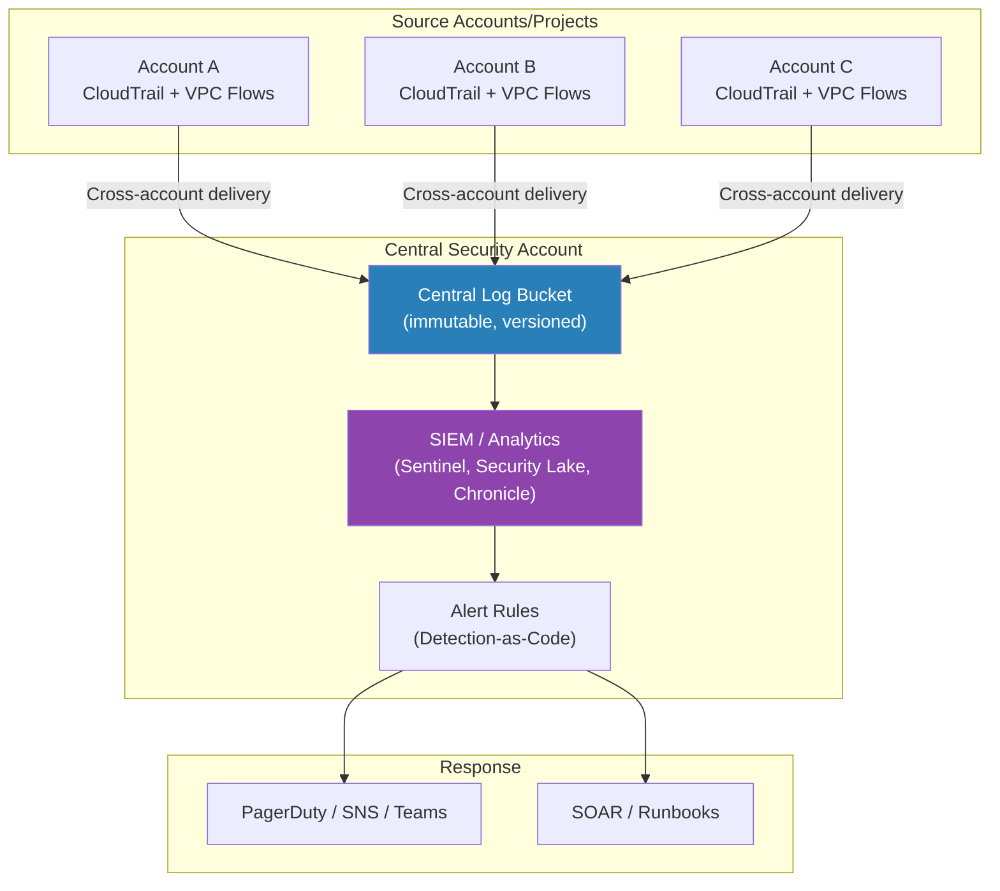
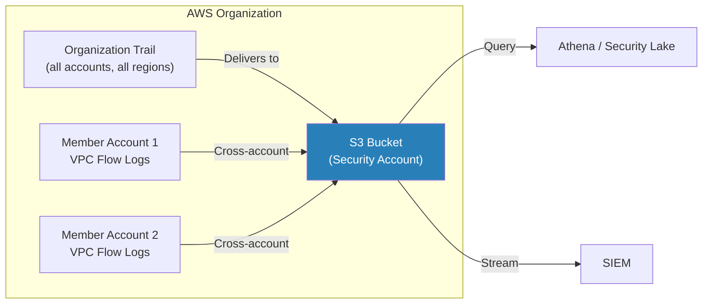
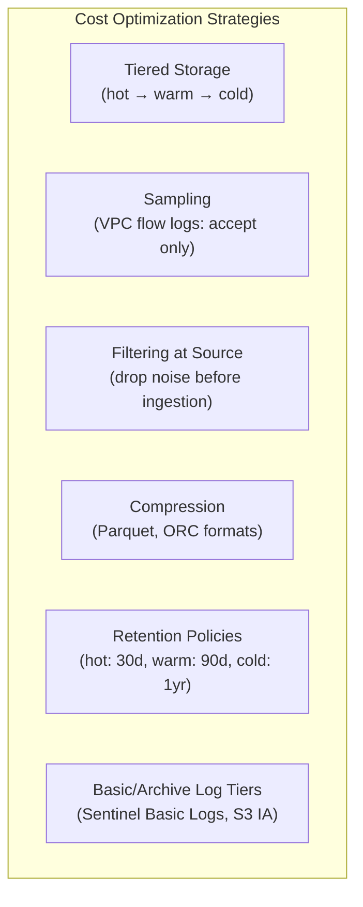

# Cloud Logging and SIEM

## What It Is

Cloud logging and SIEM (Security Information and Event Management) is the practice of collecting, centralizing, analyzing, and alerting on security-relevant events across cloud environments. Every cloud API call, network flow, DNS query, and resource change generates log data. The challenge is collecting it all into a single place, making it searchable, writing detection rules against it, and doing so without the log bill bankrupting the organization. This is where detection engineering meets cloud architecture.

## Why It Matters

You can't detect what you can't see. If an attacker compromises an IAM role, creates a backdoor user, exfiltrates data from S3, and deletes CloudTrail — you'll only know about it if your logging architecture was designed to survive exactly that scenario. Cloud-native logging is the foundation of incident detection and response. Without centralized, tamper-resistant logs, you're flying blind. The median dwell time for cloud breaches is still measured in days to weeks — proper logging and detection cuts that to minutes.

## Key Concepts

### Cloud-Native Log Sources

| Log Source | AWS | Azure | GCP | What It Captures |
|---|---|---|---|---|
| API/Management logs | CloudTrail | Activity Log | Admin Activity Audit Logs | Every control plane API call (create, delete, modify resources) |
| Data access logs | CloudTrail Data Events | Storage Analytics | Data Access Audit Logs | Reads/writes to data (S3 object access, database queries) |
| Network flow logs | VPC Flow Logs | NSG Flow Logs | VPC Flow Logs | Network connections (source, dest, port, action, bytes) |
| DNS logs | Route 53 Resolver Query Logs | DNS Analytics | Cloud DNS Logging | DNS queries from VPCs |
| Load balancer logs | ALB/NLB Access Logs | App Gateway Logs | Cloud Load Balancing Logs | HTTP requests, response codes, latency |
| WAF logs | AWS WAF Logs | Azure WAF Logs | Cloud Armor Logs | Blocked/allowed web requests, rule matches |
| Kubernetes logs | EKS Control Plane Logs | AKS Diagnostic Logs | GKE Audit Logs | K8s API server, authentication, admission, scheduler |
| Identity/auth logs | CloudTrail (IAM events) | Entra ID Sign-in Logs | Cloud Audit Logs | Login events, MFA, role assumptions, token issuance |

### Centralized Logging Architecture



**Architecture principles:**
- **Separate security account.** Logs flow to a dedicated security account that workload teams cannot access or modify.
- **Immutable storage.** Log buckets use Object Lock (compliance mode) or equivalent to prevent deletion.
- **Cross-account delivery.** CloudTrail organization trails, Azure Diagnostic Settings, GCP log sinks — all push logs centrally.
- **Minimal latency.** For detection, logs should arrive in the SIEM within minutes, not hours.

### Cloud-Native SIEM Options

| Platform | SIEM | Strengths | Considerations |
|---|---|---|---|
| Azure | **Microsoft Sentinel** | Deep M365/Entra integration, KQL query language, built-in UEBA, massive connector ecosystem | Cost scales with data ingestion; use Basic Logs tier for verbose sources |
| AWS | **Amazon Security Lake** (OCSF) + analytics | Normalizes to OCSF format, S3-based (query with Athena, OpenSearch) | Newer service, analytics layer still evolving |
| GCP | **Google Chronicle (SecOps)** | Fixed-price (not per-GB), petabyte-scale, YARA-L detection language | Tight Google ecosystem integration |
| Multi-cloud | **Splunk** | Most mature, best search, huge ecosystem | Expensive at scale, complex to operate |
| Multi-cloud | **Elastic Security** | Open source option, good detection rules | Requires self-management or Elastic Cloud |
| Multi-cloud | **Panther / Matano** | Detection-as-code native, serverless architecture | Newer, smaller community |

### Cross-Account Log Aggregation Patterns

**AWS:**


**Key configuration:**
- AWS: Organization CloudTrail trail (covers all member accounts automatically)
- Azure: Diagnostic Settings at Management Group level, Log Analytics Workspace in security subscription
- GCP: Organization-level log sink to BigQuery or Cloud Storage in security project

### Detection-as-Code in Cloud

Detection-as-code means writing, testing, versioning, and deploying detection rules the same way you manage application code.

| Aspect | Traditional SOC | Detection-as-Code |
|---|---|---|
| Rule creation | Click through SIEM UI | Write in code (KQL, SPL, YARA-L, Python) |
| Version control | Manual backups, tribal knowledge | Git repository with PR reviews |
| Testing | "Deploy and hope" | Unit tests, replay against historical data |
| Deployment | Manual import | CI/CD pipeline (terraform, API) |
| Review process | One analyst writes and deploys | Peer review, approval gates |
| Documentation | Separate wiki pages | Inline with detection rule (same file) |

**Example detection rule structure:**
```yaml
# detection: iam-user-created-with-console-access
title: IAM User Created with Console Access
description: >
  Detects creation of IAM users with console login enabled.
  In mature environments, IAM users should not be created —
  all human access should be through SSO/federation.
severity: high
data_sources:
  - cloudtrail
query: |
  eventName = "CreateUser" OR eventName = "CreateLoginProfile"
false_positives:
  - Break-glass account creation (should be rare and documented)
  - Initial account bootstrap
mitre:
  - T1136.003  # Create Account: Cloud Account
references:
  - https://docs.aws.amazon.com/IAM/latest/UserGuide/id_users_create.html
```

### Essential Detection Rules for Cloud

| Detection | Log Source | Why It Matters |
|---|---|---|
| Root/Owner account login | CloudTrail, Entra Sign-in | Root should never be used routinely |
| IAM user created | CloudTrail, Audit Logs | In federated environments, this is suspicious |
| Access key created for IAM user | CloudTrail | Long-lived credentials being generated |
| CloudTrail / audit logging disabled | CloudTrail, Activity Log | Attacker covering tracks |
| S3 bucket made public | CloudTrail, S3 events | Data exposure risk |
| Security group opened to 0.0.0.0/0 | CloudTrail, VPC events | Unrestricted network access |
| Console login without MFA | CloudTrail, Entra Sign-in | Authentication weakness |
| Cross-account role assumed from unknown account | CloudTrail | Potential unauthorized access |
| Unusual API calls from new region | CloudTrail | Attacker operating from different geography |
| GuardDuty / Defender finding generated | GuardDuty, Defender | Cloud-native threat detection signal |

### Cost Management for Cloud Logging

Cloud logging costs can spiral out of control quickly. A single VPC Flow Log at high volume can cost thousands per month.



| Strategy | Savings | Trade-Off |
|---|---|---|
| Log only rejected VPC flows (not accepted) | 50-70% volume reduction | Lose visibility into allowed traffic patterns |
| Filter noisy sources before SIEM ingestion | 30-50% SIEM cost reduction | Must ensure filtered events aren't security-relevant |
| Use SIEM basic/archive tiers for verbose logs | 50-80% per-GB cost | Slower queries, limited analytics |
| Store raw logs in S3/Blob (query on-demand with Athena/KQL) | Major cost reduction vs always-hot SIEM | Higher query latency, requires skilled analysts |
| Set retention policies aggressively | Ongoing cost reduction | Compliance may require longer retention |
| Normalize to OCSF/ECS before ingestion | Better query performance, smaller index | Upfront engineering investment |

**Pro Tip:** The architecture that works at scale is a two-tier approach: raw logs go to cheap object storage (S3, Blob, GCS) with long retention, while security-relevant logs (CloudTrail management events, authentication events, GuardDuty findings) go to the SIEM for real-time alerting. You query the cold tier only during investigations.

### Log Integrity and Tamper Protection

| Control | AWS | Azure | GCP |
|---|---|---|---|
| Log integrity validation | CloudTrail log file integrity validation (digest files) | Activity Log immutability (built-in) | Audit Logs immutability (built-in) |
| Storage immutability | S3 Object Lock (compliance mode) | Blob immutable storage | Bucket Lock + retention policies |
| Cross-account protection | Logs in security account, workload accounts have no write/delete access | Logs in security subscription | Logs in security project |
| Deletion alerting | EventBridge rule on `StopLogging` or `DeleteTrail` | Azure Monitor alert on diagnostic setting changes | Log sink monitoring |

**Non-negotiable:** An attacker's first move after compromising an admin account is to disable logging. Your architecture must detect and alert on logging disruption within minutes, and your log storage must be in an account the attacker can't reach.

## Common Mistakes

1. **Not enabling CloudTrail / audit logging.** Sounds obvious, but many organizations have gaps — especially in non-production accounts or newly created projects.
2. **Logs in the same account as workloads.** If an attacker compromises an admin role, they can delete the logs. Always centralize logs in a separate security account.
3. **No data event logging for sensitive resources.** Management events tell you someone modified a bucket policy. Data events tell you someone downloaded every object in the bucket. For sensitive data stores, you need both.
4. **Alert fatigue from noisy rules.** Hundreds of untuned alerts guarantee that analysts ignore them all. Start with 10-15 high-fidelity rules and expand carefully.
5. **Not budgeting for logging costs.** VPC Flow Logs, CloudTrail data events, and SIEM ingestion costs add up fast. Plan for this in the architecture phase, not after the bill arrives.
6. **No detection-as-code.** Manually created SIEM rules with no version control, no testing, and no documentation become a maintenance nightmare.
7. **Ignoring DNS logs.** DNS is used in nearly every attack phase — C2, data exfiltration, tunneling. If you're not logging DNS queries, you're missing a critical data source.

## Interview Angle

**What to emphasize:** Show that you think about logging as an architecture problem, not just "turn on CloudTrail." Talk about centralization, tamper protection, cost management, and detection-as-code. Mentioning specific detection rules and log sources demonstrates hands-on experience.

**Sample answer structure when asked "How do you design cloud logging and detection?":**

> "I design cloud logging around three principles: centralization, tamper-resistance, and cost-efficiency.
>
> For centralization, all logs flow to a dedicated security account that workload teams have no access to. AWS Organization CloudTrail captures management events across all accounts automatically. VPC Flow Logs and application logs are shipped cross-account to a central S3 bucket.
>
> For tamper-resistance, the log bucket uses S3 Object Lock in compliance mode — nobody, not even root, can delete logs before the retention period. I also have an EventBridge rule that fires immediately if anyone tries to disable CloudTrail or modify logging configuration.
>
> For detection, I follow a two-tier model. High-value logs — CloudTrail management events, authentication events, GuardDuty findings — go into the SIEM for real-time alerting. Verbose logs — VPC Flow Logs, data events — go to S3 in Parquet format and I query them on-demand with Athena during investigations. This keeps SIEM costs manageable.
>
> Detection rules are managed as code in Git — peer reviewed, tested against historical data, and deployed via CI/CD. I start with a core set of high-confidence rules: root account usage, IAM user creation, logging disruption, public S3 buckets, and anomalous cross-account access. Then I expand based on the threat model."

## Further Reading

- [AWS CloudTrail Best Practices](https://docs.aws.amazon.com/awscloudtrail/latest/userguide/best-practices-security.html)
- [Microsoft Sentinel Documentation](https://learn.microsoft.com/en-us/azure/sentinel/)
- [Google Chronicle Security Operations](https://cloud.google.com/chronicle/docs)
- [AWS Security Lake (OCSF)](https://docs.aws.amazon.com/security-lake/latest/userguide/what-is-security-lake.html)
- [Detection-as-Code with Panther](https://panther.com/detection-as-code/)
- [MITRE ATT&CK Cloud Matrix](https://attack.mitre.org/matrices/enterprise/cloud/)
- [Elastic Detection Rules (open source)](https://github.com/elastic/detection-rules)
