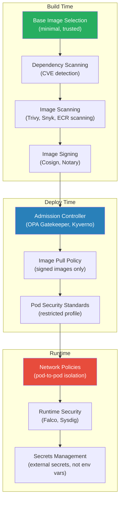
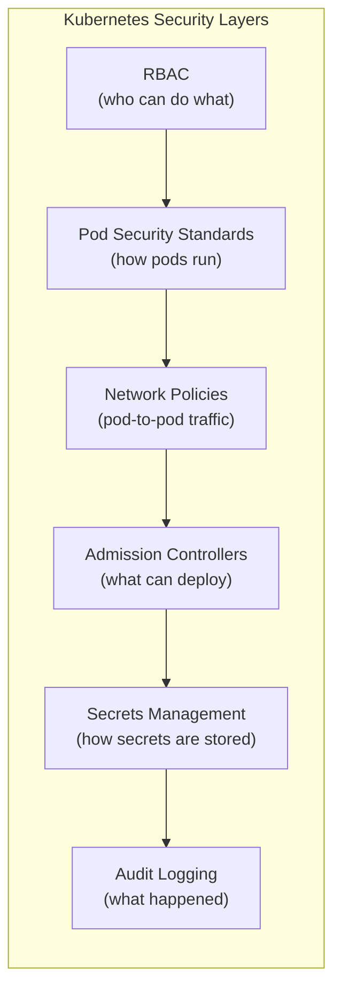
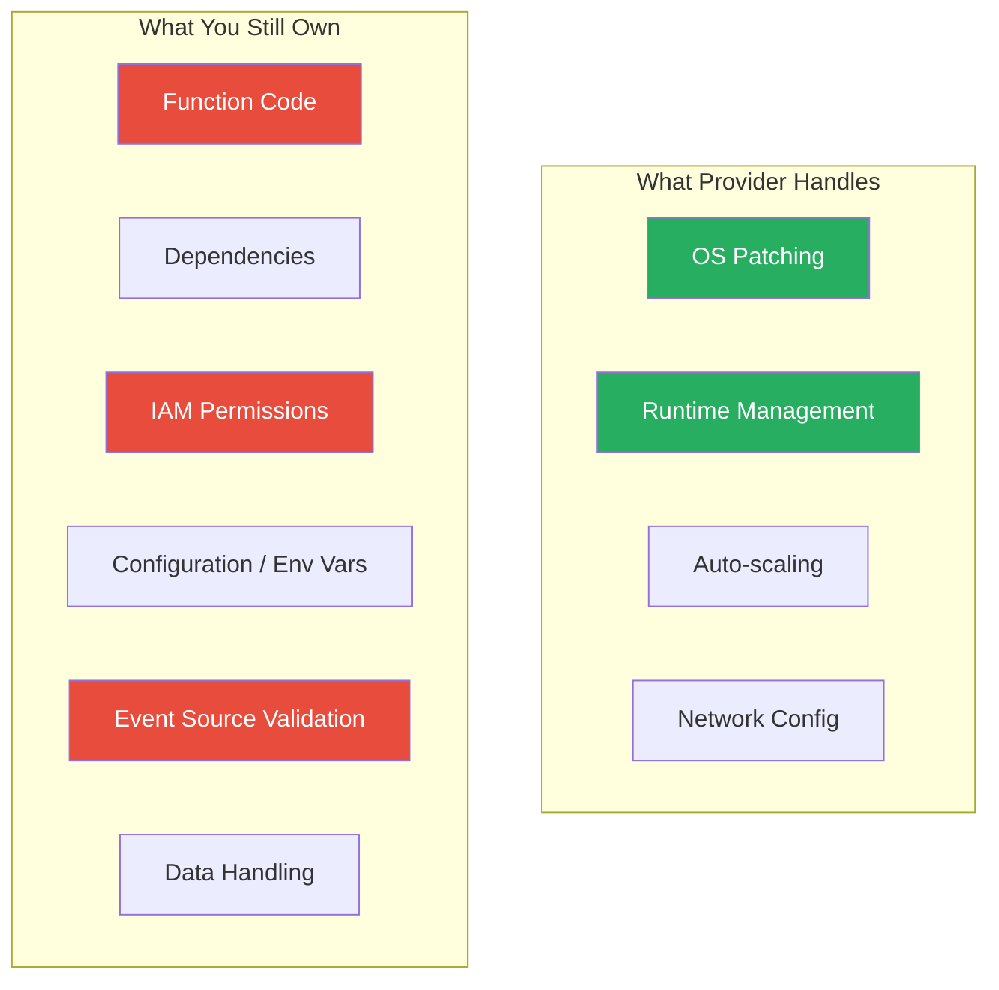
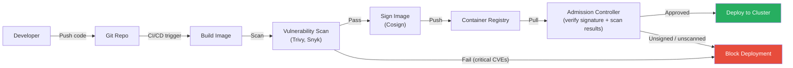

# Container and Serverless Security

## What It Is

Containers and serverless functions are the dominant compute patterns in modern cloud architectures. Containers package application code with its dependencies into portable, isolated units (Docker images running on Kubernetes or ECS). Serverless (Lambda, Azure Functions, Cloud Functions) abstracts away the server entirely — you write function code and the provider handles everything else. Both patterns shift the security model significantly: the attack surface changes, the responsibility boundary moves, and traditional security tools often don't apply.

## Why It Matters

Containers and serverless aren't inherently more or less secure than VMs — they're *differently* secure. Container breakouts, vulnerable base images, over-privileged pods, and supply chain attacks on container registries are real and growing threats. Serverless eliminates OS-level attacks but introduces event injection, overly permissive function roles, and dependency vulnerabilities that are harder to detect. As organizations adopt these patterns, security teams must adapt their tooling, processes, and architecture thinking or risk leaving massive gaps.

## Key Concepts

### Container Security Layers

Container security is not one thing — it's a stack of controls at every layer from image build to runtime.



### Image Security

| Practice | What It Does | Tools |
|---|---|---|
| Minimal base images | Reduces attack surface (fewer packages = fewer vulnerabilities) | Alpine, Distroless, scratch |
| Image scanning in CI/CD | Blocks vulnerable images before deployment | Trivy, Snyk Container, Grype, ECR scanning |
| No secrets in images | Prevents credential leaks via image layers | docker history, Trufflehog, git-secrets |
| Image signing | Ensures only trusted images deploy | Cosign (Sigstore), Docker Content Trust, Notary |
| Fixed tags / digests | Prevents tag mutation attacks (`:latest` is mutable) | Pin to `@sha256:...` digest |
| Regular rebuilds | Picks up patched base images | Automated weekly rebuilds in CI/CD |

**Critical point on base images:** A `python:3.12` image based on Debian contains ~400 packages you don't need. A `python:3.12-slim` cuts that in half. `gcr.io/distroless/python3` cuts it to almost nothing. Every unnecessary package is a potential CVE.

### Kubernetes Security Controls



### Kubernetes RBAC

| Concept | Description | Security Impact |
|---|---|---|
| ServiceAccount | Identity for pods | Every pod should have a dedicated ServiceAccount with minimal permissions |
| Role / ClusterRole | Set of permissions | Use namespace-scoped Roles over ClusterRoles wherever possible |
| RoleBinding / ClusterRoleBinding | Attaches role to identity | Audit all ClusterRoleBindings — they grant cluster-wide access |
| `automountServiceAccountToken: false` | Prevents auto-mounting the SA token | Set this on pods that don't need API access (most of them) |

**Warning:** The default ServiceAccount in every namespace gets an API token automatically mounted. If a pod is compromised, the attacker gets that token. Always set `automountServiceAccountToken: false` and create dedicated ServiceAccounts with minimum RBAC.

### Pod Security Standards (PSS)

PSS replaced the deprecated PodSecurityPolicy (PSP) in Kubernetes 1.25+.

| Profile | What It Allows | Use Case |
|---|---|---|
| **Privileged** | Anything — no restrictions | System-level workloads (CNI plugins, node agents) |
| **Baseline** | Blocks known privilege escalation (no hostNetwork, hostPID, privileged containers) | General workloads — minimum viable security |
| **Restricted** | Strictest — non-root, no capabilities, read-only root filesystem, seccomp enforced | Sensitive workloads — production default target |

**Enforce Restricted by default, grant Baseline exceptions only when justified and documented.**

### Kubernetes Network Policies

Without network policies, every pod can talk to every other pod in the cluster. This is a flat network problem inside Kubernetes.

```yaml
# Example: Allow web pods to receive traffic only on port 8080,
# only from ingress controller pods
apiVersion: networking.k8s.io/v1
kind: NetworkPolicy
metadata:
  name: allow-ingress-to-web
  namespace: production
spec:
  podSelector:
    matchLabels:
      app: web
  policyTypes:
    - Ingress
  ingress:
    - from:
        - podSelector:
            matchLabels:
              app: ingress-controller
      ports:
        - protocol: TCP
          port: 8080
```

**Key rule:** Start with a default-deny policy in every namespace, then explicitly allow only required traffic paths. This is the Kubernetes equivalent of a deny-all firewall rule.

### Admission Controllers

Admission controllers intercept API requests to the Kubernetes API server before objects are persisted. They're your last line of defense before a misconfigured workload deploys.

| Controller | Purpose | Type |
|---|---|---|
| **OPA Gatekeeper** | Policy-as-code using Rego language | Validating + Mutating |
| **Kyverno** | Kubernetes-native policies (YAML-based, easier to learn) | Validating + Mutating + Generate |
| **Pod Security Admission** | Built-in PSS enforcement | Validating |
| **ImagePolicyWebhook** | Enforce image signing/scanning | Validating |

**Example policies to enforce:**
- No containers running as root
- No images from untrusted registries
- All pods must have resource limits
- No privileged containers
- All images must be scanned with zero critical CVEs

### Serverless Security

Serverless shifts the responsibility model dramatically — you don't manage OS, runtime, or scaling. But new risks emerge.



### Serverless-Specific Risks

| Risk | Description | Mitigation |
|---|---|---|
| **Over-permissive IAM roles** | Function gets `*:*` because "it needs to access stuff" | Scope IAM to exact actions and resources per function |
| **Event injection** | Attacker-controlled data in event payloads (S3 key names, API Gateway input, SNS messages) | Validate and sanitize all event inputs — treat them as untrusted |
| **Dependency vulnerabilities** | Lambda layers / function packages with vulnerable libraries | Scan dependencies in CI/CD, use lock files, rebuild regularly |
| **Secrets in environment variables** | Credentials stored as Lambda env vars (visible in console + API) | Use Secrets Manager / Parameter Store with IAM-controlled access |
| **Cold start information leakage** | Warm containers may retain data from previous invocations | Don't store sensitive data in global scope; clear temp files |
| **Execution time/memory abuse** | DoS via expensive function invocations | Set concurrency limits, timeout limits, and budget alerts |

### Multi-Cloud Container and Serverless Comparison

| Feature | AWS | Azure | GCP |
|---|---|---|---|
| Container registry | ECR (with scanning) | ACR (with Defender scanning) | Artifact Registry (with scanning) |
| Managed Kubernetes | EKS | AKS | GKE |
| Serverless containers | Fargate, App Runner | Container Apps, ACI | Cloud Run |
| Serverless functions | Lambda | Azure Functions | Cloud Functions |
| Runtime security | GuardDuty EKS Protection | Defender for Containers | Security Command Center |
| Image scanning | ECR scanning (Inspector) | Defender for Containers | Artifact Analysis |
| Secrets integration | Secrets Manager + CSI driver | Key Vault + CSI driver | Secret Manager + CSI driver |

### Supply Chain Security for Containers



**Supply chain controls checklist:**
- Only pull base images from trusted, verified sources
- Pin image versions to digest (not mutable tags)
- Scan images at build time AND periodically in the registry (new CVEs emerge after deployment)
- Sign images with Cosign/Sigstore and verify signatures at admission
- Use private registries — never pull directly from Docker Hub in production
- SBOM (Software Bill of Materials) generation for every image
- Enforce image provenance with SLSA framework

## Common Mistakes

1. **Running containers as root.** Most containerized applications don't need root. Set `runAsNonRoot: true` and `runAsUser: 1000` in the pod spec.
2. **No network policies in Kubernetes.** Without them, any compromised pod can reach every other pod. Default-deny is essential.
3. **`:latest` tag in production.** The `:latest` tag is mutable — it can be overwritten with a different image. Pin to specific versions or digests.
4. **Lambda functions with `*:*` permissions.** Each function should have its own role scoped to exactly the resources it needs. Never share roles across functions.
5. **Ignoring image scanning results.** Scanning is pointless if you don't act on findings. Block deployments with critical vulnerabilities.
6. **Secrets in Dockerfiles or environment variables.** Use multi-stage builds (secrets in build stage don't persist in final image) and external secrets managers.
7. **Not setting resource limits.** A container without CPU/memory limits can starve other workloads on the same node — and be exploited for crypto mining.
8. **Treating serverless events as trusted input.** S3 event notifications, API Gateway payloads, and SQS messages can all contain attacker-controlled data. Validate everything.

## Interview Angle

**What to emphasize:** Show that you understand the full lifecycle of container security (build, deploy, runtime) and can articulate how serverless changes the threat model. Mention specific tools and patterns, not just concepts.

**Sample answer structure when asked "How do you secure containers in production?":**

> "I secure containers across the full lifecycle. At build time, I enforce minimal base images — Distroless or Alpine — and scan every image in CI/CD with Trivy. Images with critical CVEs are blocked from merging. We sign images with Cosign so only verified images can deploy.
>
> At deploy time, admission controllers — we use Kyverno — enforce policies: no root containers, no privileged mode, images must come from our private registry, and must have a valid signature. Pod Security Standards are set to Restricted as the default, with documented exceptions.
>
> At runtime, we have default-deny network policies in every namespace so pods can only communicate on explicitly approved paths. Secrets come from an external secrets manager through the CSI driver, never from environment variables. And we run Falco for runtime anomaly detection — it alerts on unexpected process execution, file access, or network connections inside containers.
>
> For serverless, the approach shifts. I focus on per-function IAM scoping — every function gets its own role with minimum permissions. All event inputs are validated because they can contain attacker-controlled data. And dependencies are scanned the same way as container images."

## Further Reading

- [NIST SP 800-190 — Application Container Security Guide](https://csrc.nist.gov/publications/detail/sp/800-190/final)
- [Kubernetes Security Best Practices (official docs)](https://kubernetes.io/docs/concepts/security/)
- [OWASP Serverless Top 10](https://owasp.org/www-project-serverless-top-10/)
- [Sigstore / Cosign for Container Signing](https://docs.sigstore.dev/)
- [Aqua Security — Container Security Best Practices](https://www.aquasec.com/cloud-native-academy/container-security/)
- [AWS Lambda Security Best Practices](https://docs.aws.amazon.com/lambda/latest/dg/lambda-security.html)
- [SLSA Framework (Supply Chain Levels for Software Artifacts)](https://slsa.dev/)
