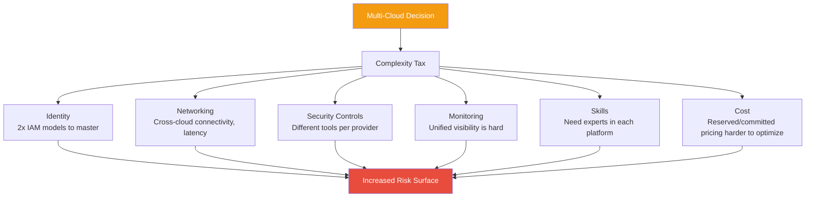
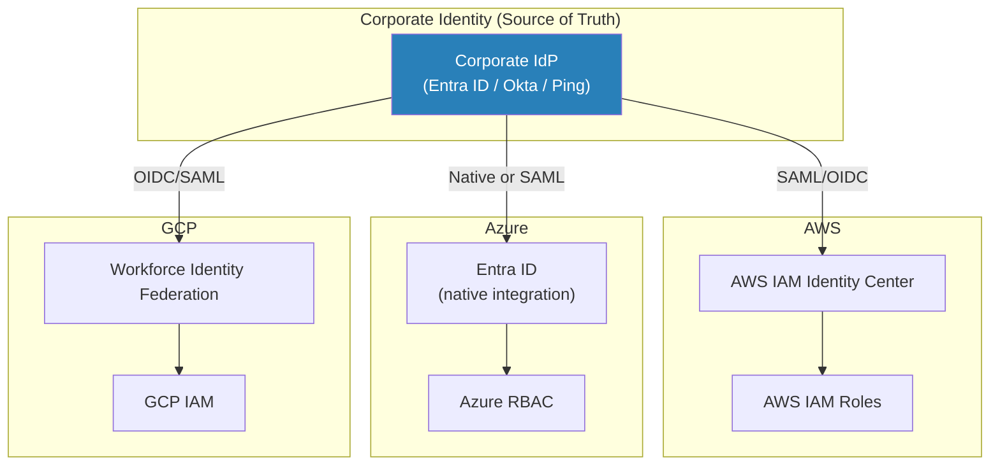
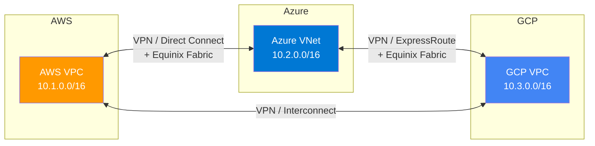
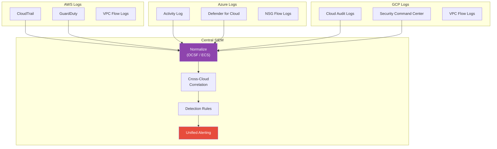
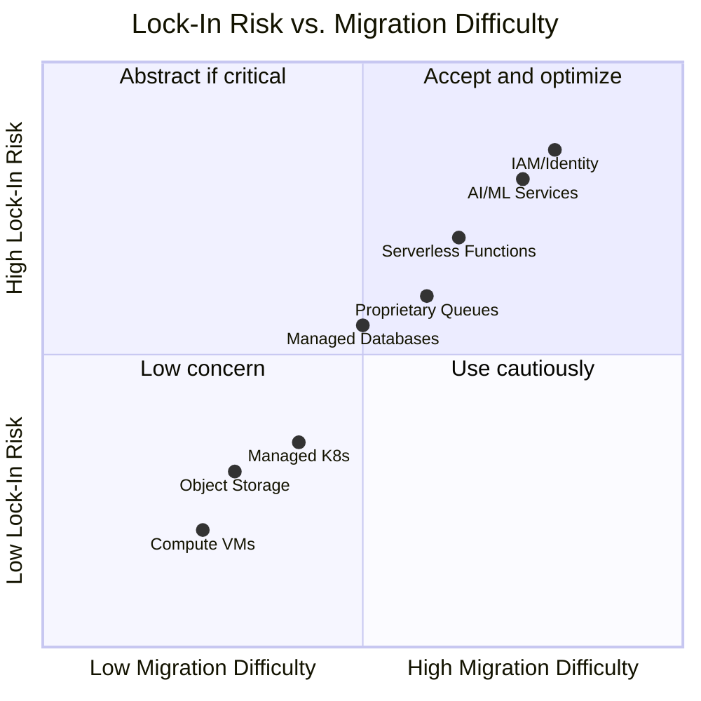

# Multi-Cloud Security Considerations

## What It Is

Multi-cloud refers to the deliberate use of two or more cloud providers (AWS, Azure, GCP, OCI, etc.) within a single organization's architecture. It's one of the most debated topics in cloud strategy — vendors push it, executives love the idea of "no lock-in," and engineers are often left dealing with the operational reality: managing security, identity, networking, and compliance across fundamentally different platforms with different APIs, different security models, and different failure modes.

## Why It Matters

The decision to go multi-cloud — or to explicitly stay single-cloud — is an architecture decision with massive security implications. Multi-cloud done well provides genuine resilience and negotiating leverage. Multi-cloud done poorly means your team is a mile wide and an inch deep on every platform, with inconsistent security controls, identity gaps between providers, and nobody who truly understands any of them. The security architect's job is to give an honest assessment of when multi-cloud adds value and when it adds risk — and to design the appropriate security architecture either way.

## Key Concepts

### When Multi-Cloud Makes Sense (And When It Doesn't)

| Scenario | Multi-Cloud? | Why |
|---|---|---|
| Regulatory requirement for geographic/provider diversity | **Yes** | Some jurisdictions or industries mandate it |
| M&A integration (acquired company uses different cloud) | **Yes, temporarily** | Pragmatic reality, plan migration path |
| Best-of-breed services (GCP for ML, AWS for infra) | **Maybe** | Genuine technical advantage, but adds complexity |
| "Avoid vendor lock-in" as general policy | **Usually no** | The cost of running two clouds exceeds switching costs for most organizations |
| Disaster recovery across providers | **Rarely worth it** | Multi-region within one provider is simpler and more reliable |
| "All our eggs in one basket" fear | **No** | AWS/Azure/GCP are more reliable than your ability to operate across all of them |

**Opinionated take:** Most organizations that go multi-cloud do it for political or procurement reasons, not technical ones. The engineering cost of maintaining security parity across two clouds is enormous. If you don't have a concrete, specific reason that justifies that cost, stay single-cloud and go multi-region instead.

### The Real Cost of Multi-Cloud

### Identity Federation Across Clouds

The single most critical challenge in multi-cloud security is identity. You need a unified identity fabric that spans providers.

**Identity architecture principles:**
- **Single source of truth.** One IdP (Entra ID, Okta, etc.) is authoritative for all identities. Every cloud federates from this source.
- **No cloud-native users for humans.** All human access through SSO federation. No AWS IAM users, no local Azure accounts, no GCP user accounts.
- **Consistent group-to-role mapping.** Security groups in the IdP map to equivalent roles in each cloud. "Platform-Admins" group should give the same *level* of access in AWS, Azure, and GCP (not identical permissions — that's impossible — but equivalent privilege level).
- **Unified MFA enforcement.** MFA at the IdP level, not per-cloud. This ensures consistent authentication strength everywhere.

### Network Interconnection

| Interconnection Type | How It Works | Security Considerations |
|---|---|---|
| Public internet (VPN) | Site-to-site VPN between cloud providers | Encrypted but traverses public internet; latency variable |
| Dedicated interconnect | Direct physical connection (AWS Direct Connect, Azure ExpressRoute, GCP Cloud Interconnect) | Private, consistent latency, expensive |
| Cloud-to-cloud via third-party fabric | Megaport, Equinix Fabric, PacketFabric | Private connectivity without managing physical circuits |
| Application-layer only | APIs and webhooks between cloud services | Simplest; use mTLS and API authentication |

**Key design decisions:**
- **Non-overlapping CIDR ranges.** Plan IP address space across all clouds upfront. Overlapping ranges create routing nightmares.
- **Centralized DNS resolution.** A single DNS strategy that resolves across all clouds (Route 53 forwarding to Azure Private DNS and vice versa).
- **Consistent encryption in transit.** All cross-cloud traffic must be encrypted — either through VPN/IPsec or application-layer TLS.
- **Segmentation parity.** If you have dev/staging/prod isolation in AWS, you need the same in Azure and GCP.

### Unified Security Monitoring

| Challenge | Problem | Solutions |
|---|---|---|
| Different log formats | CloudTrail JSON vs Activity Log vs GCP Audit Log — different schemas | Normalize to OCSF or ECS; use cloud-native normalization (Security Lake) |
| Different alert sources | GuardDuty, Defender for Cloud, Security Command Center | Forward all findings to a single SIEM |
| Different APIs | 3 different APIs for querying security state | CSPM tools (Wiz, Prisma Cloud, Orca) that abstract across providers |
| Different terminology | Security Groups vs NSGs vs Firewall Rules | Create an internal glossary and mapping document |
| Alert fatigue multiplied | 3x the alert volume from 3x the providers | Unified risk scoring and prioritization in a single pane |

**Multi-cloud SIEM architecture:**

### Policy Consistency

Maintaining consistent security policies across clouds is one of the hardest operational challenges.

| Policy Area | Approach to Consistency |
|---|---|
| IAM least privilege | Define permission levels (read-only, operator, admin) abstractly, then implement per-cloud |
| Encryption requirements | "All data encrypted at rest with customer-managed keys" — implemented differently in each cloud's KMS |
| Network segmentation | Define tiers (public, app, data) abstractly, implement with each cloud's network primitives |
| Logging requirements | "All management events + authentication events logged centrally" — different services per cloud |
| Vulnerability management | CSPM tool that evaluates all clouds against the same benchmark |
| Compliance | CIS Benchmarks exist for each cloud — map to a unified control framework |

**Tools for cross-cloud policy enforcement:**

| Tool | Type | Coverage |
|---|---|---|
| **Wiz** | CSPM/CNAPP | AWS, Azure, GCP, OCI — agentless scanning |
| **Prisma Cloud (Palo Alto)** | CSPM/CNAPP | AWS, Azure, GCP, OCI — comprehensive policy engine |
| **Orca Security** | CSPM/CNAPP | AWS, Azure, GCP — SideScanning (agentless) |
| **Open Policy Agent (OPA)** | Policy engine | Any cloud — policy-as-code with Rego |
| **Terraform + Sentinel** | IaC policy | Any cloud Terraform manages — shift-left policy |
| **Checkov / tfsec** | IaC scanning | Static analysis of Terraform/CloudFormation for misconfigurations |

### Vendor Lock-In vs. Pragmatism

**Pragmatic approach to lock-in:**
- **Low lock-in:** VMs, containers, object storage, Kubernetes — relatively portable
- **Medium lock-in:** Managed databases, message queues — APIs differ but concepts transfer
- **High lock-in:** Serverless functions, AI/ML services, identity systems — deeply integrated, painful to move
- **Accept lock-in where it adds value.** Using DynamoDB or Cosmos DB instead of self-managing databases is usually the right call, even though it's locked in. The operational benefit outweighs the portability risk.
- **Abstract where it's cheap to do so.** Using Terraform instead of CloudFormation costs little and enables multi-cloud. Using Kubernetes instead of ECS adds minimal overhead but increases portability.

### Multi-Cloud Security Architecture Patterns

**Pattern 1: Primary + Secondary (Active/Passive)**
- 90%+ of workloads in primary cloud
- Secondary cloud for specific use cases (M&A, regulatory, best-of-breed)
- Security team focuses deep expertise on primary, basic competency on secondary

**Pattern 2: Workload Segmentation**
- Different workloads in different clouds based on technical fit
- ML/Data in GCP, enterprise apps in Azure, infrastructure in AWS
- Unified identity and monitoring, but workloads don't cross clouds

**Pattern 3: Full Active/Active (rare, expensive)**
- Same applications deployed across multiple clouds
- Requires abstraction layers (Kubernetes, Terraform, multi-cloud SIEM)
- Only justified for true high-availability requirements or regulatory mandates

**Security architect's recommendation:** Pattern 1 or 2 for most organizations. Pattern 3 only when there's a specific, documented requirement that justifies the enormous complexity cost.

## Common Mistakes

1. **Going multi-cloud to "avoid lock-in" without calculating the actual cost.** The engineering and security overhead of running two clouds almost always exceeds the theoretical switching cost of being locked into one.
2. **No unified identity strategy.** Running separate identity systems per cloud creates gaps, inconsistencies, and a fractured view of who has access to what.
3. **Lowest-common-denominator security.** Trying to use only controls that exist identically across all clouds means you skip the best security features of each. Use cloud-native controls within each cloud, unified by policy.
4. **Assuming skills transfer 1:1.** An AWS security expert is not automatically an Azure security expert. The concepts transfer, but the implementation details — where breaches live — don't.
5. **No centralized SIEM.** Separate monitoring per cloud means you can't correlate attacks that span providers. An attacker who compromises Azure AD and pivots to AWS will only be caught by cross-cloud correlation.
6. **Inconsistent compliance posture.** Being SOC 2 compliant in AWS but not in your Azure environment is not being SOC 2 compliant. Compliance must span all environments.
7. **Overlapping network address spaces.** Not planning CIDR allocation across clouds means you can't establish private connectivity later without painful re-addressing.

## Interview Angle

**What to emphasize:** Show that you can evaluate multi-cloud critically — not as a buzzword to chase, but as an architecture decision with real trade-offs. Demonstrate that you understand the security challenges (identity, monitoring, policy consistency) and have practical strategies for addressing them.

**Sample answer structure when asked "How do you approach multi-cloud security?":**

> "I start by asking *why* multi-cloud. If there's a genuine requirement — regulatory, M&A, best-of-breed services — then I design for it deliberately. If it's 'avoid vendor lock-in' as a general principle, I usually push back, because the security and operational cost of running two clouds well almost always exceeds the theoretical switching cost.
>
> When multi-cloud is the right answer, I focus on three pillars. First, **unified identity** — a single IdP federating into all clouds, with no cloud-native human accounts, consistent MFA enforcement, and group-to-role mappings that provide equivalent access levels across providers.
>
> Second, **centralized monitoring** — all security logs from all clouds normalize into a single SIEM. I use OCSF or ECS for schema normalization so detection rules can correlate across providers. An attacker who compromises one cloud and pivots to another should be detected by cross-cloud correlation.
>
> Third, **policy parity through abstraction** — I define security requirements in cloud-agnostic terms ('all data encrypted with customer-managed keys,' 'all management events logged centrally') and implement them per-cloud using native controls. A CSPM tool like Wiz or Prisma Cloud evaluates all environments against the same benchmark.
>
> Within each cloud, I still use cloud-native security tools fully. I'm not looking for lowest-common-denominator controls — I want GuardDuty in AWS, Defender in Azure, and SCC in GCP, all feeding into the same SIEM."

## Further Reading

- [NIST SP 500-322 — Evaluation of Cloud Computing Services Based on NIST SP 800-145](https://www.nist.gov/publications/evaluation-cloud-computing-services-based-nist-sp-800-145)
- [CSA Cloud Controls Matrix v4](https://cloudsecurityalliance.org/research/cloud-controls-matrix/)
- [Wiz Multi-Cloud Security](https://www.wiz.io/)
- [OCSF (Open Cybersecurity Schema Framework)](https://schema.ocsf.io/)
- [HashiCorp Multi-Cloud Strategy with Terraform](https://www.hashicorp.com/solutions/multi-cloud)
- [Gartner — Cloud Security Posture Management Market Guide](https://www.gartner.com/en/documents/cloud-security-posture-management)
