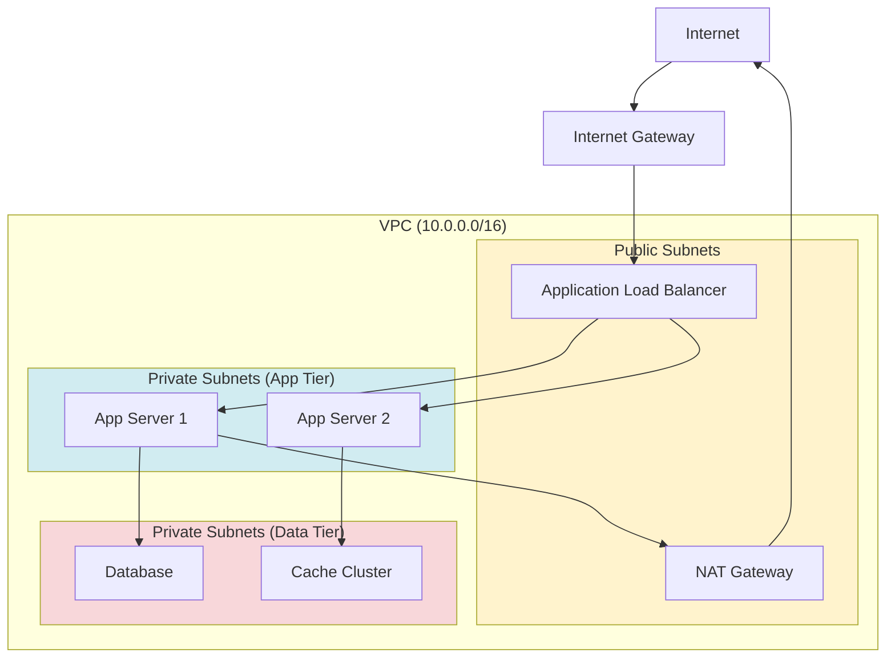
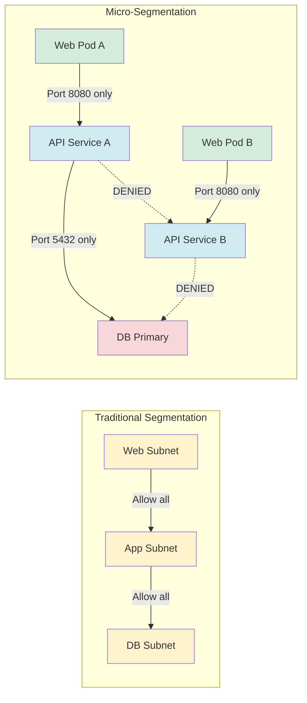
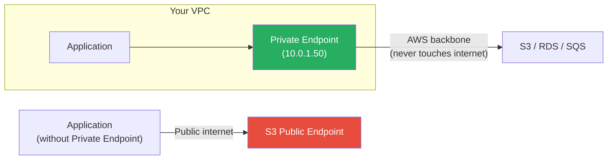
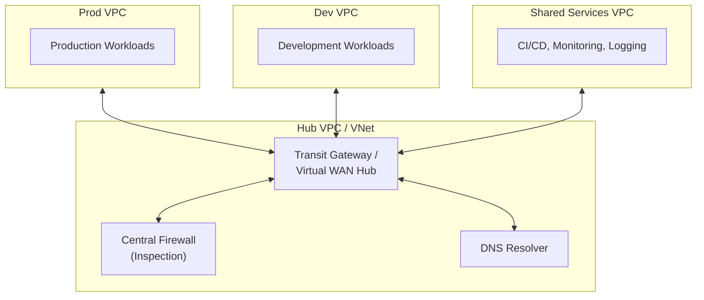

# Network Segmentation in the Cloud

## What It Is

Cloud network segmentation is the practice of dividing cloud networks into isolated zones to limit lateral movement, enforce least-privilege network access, and contain blast radius when a breach occurs. Unlike on-prem where you buy physical firewalls and configure VLANs, cloud gives you software-defined networking primitives — VPCs, subnets, security groups, network ACLs, and private endpoints — that you compose into a segmented architecture.

## Why It Matters

A flat network in the cloud is an attacker's dream. Once they compromise a single workload — through SSRF, a vulnerable dependency, or stolen credentials — they can reach every other workload in the network. The 2019 Capital One breach leveraged this: a compromised WAF could reach the metadata service and then access S3 because there was insufficient network isolation between tiers. Proper segmentation means a compromised web server can't talk to the database directly, internal services aren't exposed to the internet, and sensitive workloads are isolated behind private connectivity.

## Key Concepts

### VPC Architecture Fundamentals

**Key design principles:**
- **Public subnets** contain only resources that must be internet-facing (load balancers, NAT gateways, bastion hosts if you must)
- **Private subnets** for application workloads — they reach the internet only through NAT gateways for outbound
- **Data subnets** for databases and storage — no internet route at all, accessible only from app tier
- Each tier spans multiple Availability Zones for resilience

### Multi-Cloud Network Primitives

| Concept | AWS | Azure | GCP |
|---|---|---|---|
| Virtual network | VPC | VNet | VPC |
| Subnet isolation | Subnets (public/private by route table) | Subnets (NSG-based isolation) | Subnets (regional, firewall rules) |
| Stateful firewall | Security Groups | Network Security Groups (NSGs) | Firewall Rules |
| Stateless ACLs | NACLs | N/A (NSGs only) | N/A (firewall rules only) |
| Private connectivity to services | VPC Endpoints / PrivateLink | Private Endpoints / Private Link | Private Google Access / Private Service Connect |
| Hub-spoke networking | Transit Gateway | Virtual WAN / VNet Peering with hub | Shared VPC / VPC Peering |
| DNS resolution | Route 53 Resolver | Azure DNS Private Resolver | Cloud DNS |
| DDoS protection | Shield Standard/Advanced | DDoS Protection Standard | Cloud Armor |
| Network logging | VPC Flow Logs | NSG Flow Logs | VPC Flow Logs |

### Security Groups vs. NACLs vs. Firewall Rules

| Property | Security Groups (AWS) | NACLs (AWS) | NSGs (Azure) | Firewall Rules (GCP) |
|---|---|---|---|---|
| Stateful? | Yes | No | Yes | Yes |
| Applied to | ENI (instance-level) | Subnet | Subnet or NIC | VPC or instance via tags |
| Default behavior | Deny all inbound, allow all outbound | Allow all | Deny all inbound, allow all outbound | Implied deny ingress, allow egress |
| Rule evaluation | All rules evaluated (allow-only) | Rules evaluated in order (numbered) | Priority-based | Priority-based |
| Reference other groups? | Yes (powerful for micro-seg) | No | Yes (ASGs) | Yes (tags/service accounts) |
| Best used for | Primary workload firewall | Subnet-level guardrails (deny lists) | Primary workload firewall | Primary workload firewall |

**Pro Tip:** In AWS, security groups are your primary tool. NACLs are a second layer — use them for explicit deny rules (block known bad IPs, restrict subnet-to-subnet traffic) but don't try to manage all access through NACLs.

### Micro-Segmentation Patterns

Micro-segmentation goes beyond subnet-level isolation to enforce access control between individual workloads.

**Implementation by platform:**

| Approach | AWS | Azure | GCP |
|---|---|---|---|
| Security group references | SG-A allows inbound from SG-B only | ASG references in NSG rules | Tag-based firewall rules |
| Kubernetes network policies | Calico, Cilium | Azure CNI + network policies | GKE Dataplane V2 (Cilium-based) |
| Service mesh | App Mesh, Istio | Istio, Linkerd | Traffic Director, Istio |
| Cloud-native micro-seg | VPC Lattice (newer) | — | — |

### Private Connectivity (PrivateLink / Private Endpoints)

Private endpoints eliminate the need to traverse the public internet when accessing cloud services.

**Why this matters for security:**
- Traffic stays on the provider's backbone — not routable from the internet
- No need for internet gateway, NAT gateway, or public IPs for service access
- Can be combined with VPC endpoint policies to restrict which resources are accessible
- Reduces attack surface significantly

### Transit Gateway / Hub-Spoke Architecture

For multi-VPC environments, hub-spoke is the standard pattern.

**Benefits:**
- Centralized inspection of inter-VPC traffic
- Shared services (DNS, logging, CI/CD) accessible from all spokes
- Isolation between environments (dev can't reach prod directly)
- Simplified routing and connectivity management

### Egress Filtering

Controlling outbound traffic is as important as controlling inbound. If a workload is compromised, egress filtering prevents data exfiltration and C2 callbacks.

| Strategy | How | When to Use |
|---|---|---|
| Security group outbound rules | Restrict to specific IPs/ports | Basic — always do this |
| NAT Gateway + route tables | Force all outbound through NAT | Provides logging point |
| Cloud firewall (AWS Network Firewall, Azure Firewall, GCP Cloud Firewall) | Deep packet inspection, FQDN filtering | When you need domain-level egress control |
| Proxy / CASB | Forward web traffic through inspection proxy | When you need TLS inspection and URL filtering |
| VPC endpoint policies | Restrict which S3 buckets / services can be accessed | Prevent data exfiltration to attacker-owned buckets |

**Critical point on S3 exfiltration:** A VPC endpoint policy for S3 should restrict access to your organization's buckets only. Without this, a compromised instance can exfiltrate data to an attacker-controlled S3 bucket over the same VPC endpoint.

## Common Mistakes

1. **Flat networks.** Putting everything in public subnets "because it's easier." Every workload that doesn't need direct internet access belongs in a private subnet.
2. **Default security groups with allow-all.** The default VPC security group allows all outbound and all inbound from itself. Production workloads need custom, restrictive security groups.
3. **Not using private endpoints.** Every major cloud service supports private connectivity. There is no reason your RDS database should have a public endpoint.
4. **Ignoring egress.** Teams obsess over inbound rules but allow all outbound. A compromised host with unrestricted egress can exfiltrate data freely.
5. **One giant VPC for everything.** Separate environments (dev/staging/prod) should be in separate VPCs (or accounts/projects). VPC peering or transit gateway provides controlled connectivity where needed.
6. **NACLs as primary firewall.** NACLs are stateless and harder to manage. Use security groups as the primary control and NACLs as a supplementary deny layer.
7. **Not logging network flows.** VPC Flow Logs should be enabled everywhere. Without them, you're blind to network-level anomalies.

## Interview Angle

**What to emphasize:** Demonstrate you can design a multi-tier, multi-VPC architecture with proper segmentation. Talk about defense in depth — security groups at the instance level, NACLs at the subnet level, private endpoints for service access, and centralized inspection for inter-VPC traffic.

**Sample answer structure when asked "How would you design network segmentation in the cloud?":**

> "I design cloud networks in concentric rings of trust. Starting from the outside in: public subnets only contain load balancers and NAT gateways. Application workloads sit in private subnets with security groups scoped to the minimum ports and sources needed. Data stores sit in isolated subnets with no internet route and security groups that only allow connections from the application tier.
>
> For multi-VPC environments, I use a hub-spoke model with a transit gateway and a central inspection VPC running a cloud-native firewall. All inter-VPC and internet-bound traffic routes through inspection. Services like S3 and SQS are accessed through VPC endpoints with endpoint policies that restrict access to our organization's resources — this prevents data exfiltration to attacker-controlled buckets.
>
> I also enforce egress filtering. Every workload has explicit outbound rules, and we use FQDN-based egress filtering for workloads that need to reach external APIs. The goal is that even if an attacker compromises a single workload, they're contained to that tier and can't move laterally or exfiltrate data easily."

## Further Reading

- [AWS VPC Security Best Practices](https://docs.aws.amazon.com/vpc/latest/userguide/vpc-security-best-practices.html)
- [Azure Network Security Best Practices](https://learn.microsoft.com/en-us/azure/security/fundamentals/network-best-practices)
- [GCP VPC Design Best Practices](https://cloud.google.com/architecture/best-practices-vpc-design)
- [AWS Transit Gateway Reference Architecture](https://docs.aws.amazon.com/vpc/latest/tgw/tgw-best-design-practices.html)
- [NIST SP 800-215 — Secure Cloud Network Architecture](https://csrc.nist.gov/publications/detail/sp/800-215/final)
