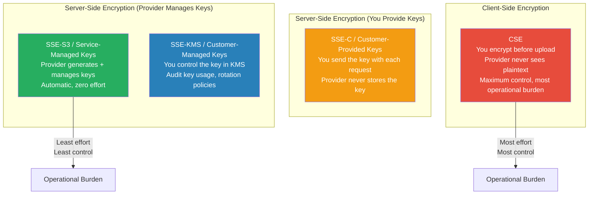
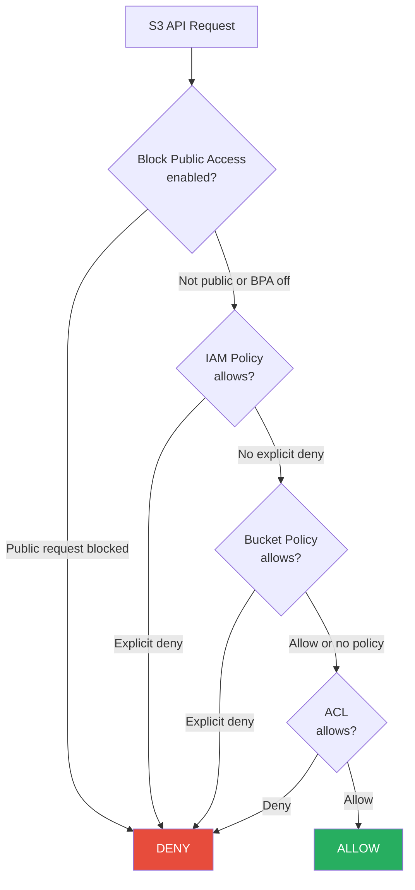
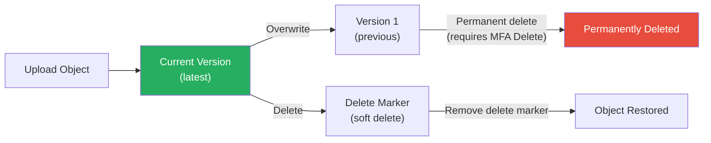

# Secure Cloud Storage

## What It Is

Cloud object storage (S3, Azure Blob Storage, Google Cloud Storage) is the backbone of modern data architectures — holding everything from application assets to database backups to sensitive customer data. Securing it means controlling who can access objects, how data is encrypted at rest and in transit, preventing accidental public exposure, and maintaining audit trails for every access. Getting storage security wrong is the easiest way to end up on the front page.

## Why It Matters

Misconfigured cloud storage is responsible for more data breaches than almost any other cloud misconfiguration category. The pattern is disturbingly consistent: an organization creates a storage bucket, sets overly permissive access, forgets about it, and months later a researcher (or attacker) discovers terabytes of exposed data. Twitch (2021), Accenture (2017), the US Department of Defense (2017), and literally hundreds of other organizations have exposed sensitive data through misconfigured buckets. AWS had to add multiple layers of "are you sure?" public access controls because the problem was so pervasive.

## Key Concepts

### Cloud Storage Services Compared

| Feature | AWS S3 | Azure Blob Storage | Google Cloud Storage |
|---|---|---|---|
| Storage classes | Standard, IA, One Zone-IA, Glacier, Deep Archive | Hot, Cool, Cold, Archive | Standard, Nearline, Coldline, Archive |
| Access control model | Bucket policies + ACLs + IAM + Block Public Access | RBAC + SAS tokens + ACLs + container policies | IAM + ACLs + signed URLs |
| Default encryption (at rest) | SSE-S3 (AES-256, automatic since Jan 2023) | Microsoft-managed keys (automatic) | Google-managed keys (automatic) |
| Customer-managed keys | SSE-KMS (AWS KMS) | Customer-managed keys (Azure Key Vault) | CMEK (Cloud KMS) |
| Client-side encryption | CSE (you encrypt before upload) | Client-side (you encrypt before upload) | Client-side (you encrypt before upload) |
| Versioning | Bucket-level toggle | Blob versioning | Object versioning |
| Immutability | Object Lock (governance/compliance mode) | Immutable blob storage (legal hold, time-based) | Retention policies + bucket lock |
| Access logging | S3 Server Access Logging, CloudTrail data events | Storage Analytics, Azure Monitor | Cloud Audit Logs, data access logs |
| Public access prevention | Block Public Access (account + bucket level) | Allow/disallow public blob access | Public access prevention (org policy + bucket level) |

### Encryption Options Explained

**When to use what:**

| Encryption Type | Use When | Trade-Off |
|---|---|---|
| SSE-S3 / Service-managed | Default for non-regulated data | No control over key, provider has access |
| SSE-KMS / Customer-managed | Compliance requires key control, need audit trail of key usage | Small cost per API call, must manage key policy |
| SSE-C | You want server-side encryption but refuse to store keys in cloud KMS | Must send key with every request, key management burden on you |
| Client-side (CSE) | True zero-trust — provider must never see plaintext (healthcare, financial, classified) | Complex key management, can't use provider-side search/analytics |

**Pro Tip:** For most organizations, SSE-KMS with customer-managed keys is the sweet spot. You get audit trails (CloudTrail logs every key usage), key rotation, and the ability to revoke access by disabling the key — without the operational complexity of client-side encryption.

### Bucket Policy and Access Control Architecture

**Access control best practices:**
- **Enable Block Public Access at the account level.** This is a single toggle that prevents any bucket in the account from being made public, regardless of bucket policies or ACLs. Do this first.
- **Disable ACLs.** AWS recommends "bucket owner enforced" setting which disables ACLs entirely. Use IAM and bucket policies instead.
- **Use bucket policies for cross-account access.** Don't grant direct IAM permissions in another account — use a bucket policy with conditions.
- **Condition keys are powerful.** Restrict by VPC endpoint (`aws:sourceVpce`), organization (`aws:PrincipalOrgID`), or TLS version (`s3:TlsVersion`).

### Public Access Prevention

Every cloud provider has learned from the deluge of public bucket breaches and now offers multiple layers of prevention:

| Layer | AWS | Azure | GCP |
|---|---|---|---|
| Account/Org level | S3 Block Public Access (account-wide) | Azure Policy to deny public blob access | Organization policy `constraints/storage.publicAccessPrevention` |
| Bucket/Container level | S3 Block Public Access (per bucket) | Container public access level setting | `publicAccessPrevention: enforced` per bucket |
| Detection | Access Analyzer for S3 | Microsoft Defender for Storage | Security Command Center |
| Alerting | Config Rules + EventBridge | Azure Policy compliance | SCC findings + Pub/Sub |

**Non-negotiable rule:** Block public access at the account/organization level. Individual buckets should never override this unless there's a documented, approved exception (like a static website bucket).

### Versioning and Deletion Protection

| Feature | Purpose | How It Works |
|---|---|---|
| Versioning | Recover from accidental deletes or overwrites | Every overwrite creates a new version; deletes add a delete marker (recoverable) |
| MFA Delete | Prevent unauthorized permanent deletion | Requires MFA to permanently delete versions or disable versioning |
| Object Lock (Compliance mode) | Regulatory immutability | No one — not even root — can delete objects before retention expires |
| Object Lock (Governance mode) | Operational protection with override | Authorized users with `s3:BypassGovernanceRetention` can delete |
| Lifecycle policies | Auto-transition or expire data | Move to cheaper tiers, auto-delete after retention period |

### Common S3 Breach Patterns

| Pattern | How It Happens | Prevention |
|---|---|---|
| Public bucket with sensitive data | Developer sets bucket to public for testing, forgets to revert | Block Public Access at account level |
| Overly permissive bucket policy | `"Principal": "*"` without conditions | Policy review automation, Access Analyzer |
| Leaked pre-signed URLs | Pre-signed URL shared too broadly or with long expiration | Short expiration (minutes, not days), audit generation |
| Cross-account policy mistakes | Bucket policy grants access to wrong account | Use `aws:PrincipalOrgID` condition to restrict to your org |
| Backup buckets forgotten | Old backup buckets with stale ACLs allowing public access | Inventory all buckets regularly, enforce tagging |
| Logging bucket exposed | The bucket collecting access logs is itself public | Apply same security controls to logging buckets |

### Data Lifecycle and Cost Optimization

Secure storage isn't just about access control — it's also about not keeping data longer than you need it.

| Lifecycle Stage | Action | Security Relevance |
|---|---|---|
| Active | Standard storage, full access controls | Primary attack surface |
| Warm | Move to infrequent access tier (30+ days) | Same controls, lower cost |
| Cold | Move to archive tier (90+ days) | Access requires restore request (natural friction) |
| Expiration | Auto-delete after retention period | Reduces attack surface — data that doesn't exist can't be breached |

**Warning:** Many organizations keep data forever "just in case." From a security perspective, every byte of stored data is liability. Implement retention policies and auto-delete data that's past its useful life.

## Common Mistakes

1. **Not enabling Block Public Access at the account level.** This is a 5-second configuration that prevents the most common storage breach pattern. There is no reason not to do it.
2. **Using ACLs instead of IAM policies.** ACLs are a legacy access mechanism. Disable them and use bucket policies + IAM for all access control.
3. **Encryption at rest without key management strategy.** Encrypting with service-managed keys checks a compliance box but provides limited protection — the provider (and anyone with IAM access) can decrypt. Use customer-managed keys when key rotation and access auditing matter.
4. **No access logging.** If you can't see who accessed what, you can't detect data exfiltration. Enable CloudTrail data events for sensitive buckets (not just management events).
5. **Pre-signed URLs with week-long expiration.** Pre-signed URLs should expire in minutes or hours, not days. Long-lived pre-signed URLs are effectively public access.
6. **Ignoring cross-account access paths.** A bucket policy that allows access from another AWS account may be intentional — or it may be a misconfiguration. Use Access Analyzer to find external access.
7. **Not using versioning on critical buckets.** Without versioning, a ransomware attack or accidental deletion is permanent. Enable versioning + MFA Delete on any bucket containing data you can't afford to lose.

## Interview Angle

**What to emphasize:** Show that you think about storage security as a layered problem: prevent public access, control who can access what, encrypt appropriately, log everything, and manage the data lifecycle.

**Sample answer structure when asked "How do you secure cloud storage?":**

> "I approach cloud storage security in layers. First, I prevent the most common failure mode — public exposure — by enabling Block Public Access at the account level and enforcing it through organization policies. No bucket should ever be public unless there's an explicitly documented and approved exception.
>
> Second, access control. I disable legacy ACLs and use IAM policies combined with bucket policies. For cross-account access, I use organization-level condition keys to ensure access stays within our org. For sensitive data, I add VPC endpoint policies so data can only be accessed from our network.
>
> Third, encryption. I use customer-managed KMS keys for anything regulated or sensitive, because it gives me audit trails on key usage and the ability to revoke access by disabling the key. The default service-managed encryption is fine for non-sensitive data.
>
> Finally, visibility and lifecycle. CloudTrail data events on sensitive buckets so I can see every access. Versioning and Object Lock for critical data. And lifecycle policies that auto-delete data after its retention period, because data that doesn't exist can't be breached."

## Further Reading

- [AWS S3 Security Best Practices](https://docs.aws.amazon.com/AmazonS3/latest/userguide/security-best-practices.html)
- [Azure Blob Storage Security Recommendations](https://learn.microsoft.com/en-us/azure/storage/blobs/security-recommendations)
- [GCP Cloud Storage Best Practices](https://cloud.google.com/storage/docs/best-practices)
- [AWS S3 Block Public Access](https://docs.aws.amazon.com/AmazonS3/latest/userguide/access-control-block-public-access.html)
- [Cloudflare R2 Security Model](https://developers.cloudflare.com/r2/reference/security/) — interesting alternative perspective
- [OWASP Cloud Storage Security Cheat Sheet](https://cheatsheetseries.owasp.org/cheatsheets/Cloud_Storage_Security_Cheat_Sheet.html)
