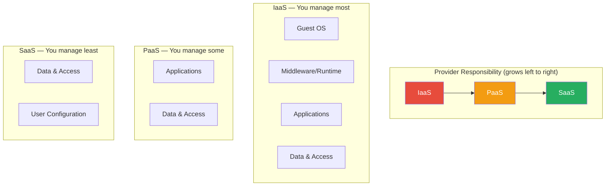
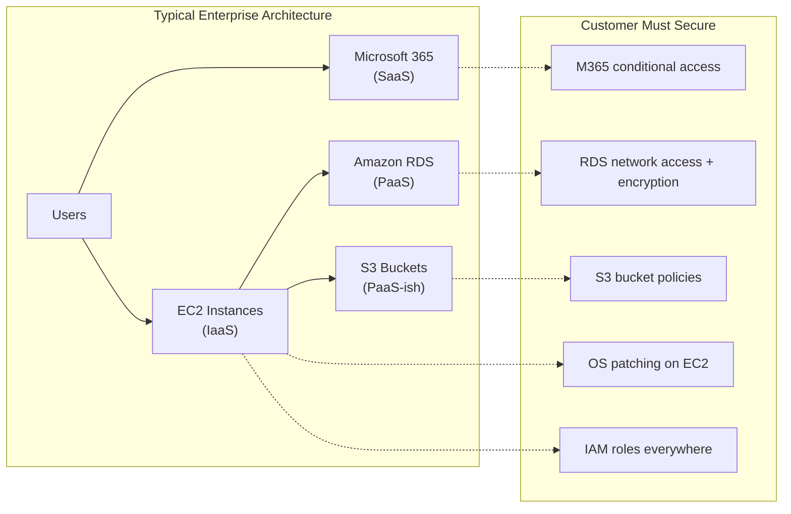

# Shared Responsibility Model

## What It Is

The shared responsibility model defines the security boundary between a cloud provider and its customers. The provider secures the infrastructure *of* the cloud (physical data centers, hypervisors, network fabric), while the customer secures what they put *in* the cloud (data, configurations, access controls). Where that line falls depends entirely on whether you're using IaaS, PaaS, or SaaS.

## Why It Matters

The majority of cloud security breaches are not caused by provider failures — they're caused by customer misconfiguration. Capital One's 2019 breach (100M+ records from a misconfigured WAF and overly permissive IAM role), the hundreds of publicly exposed S3 buckets every year, and the constant stream of unprotected databases on Azure and GCP all trace back to one root cause: the customer assumed the provider was handling something that was actually their responsibility. Understanding this model is not optional — it's the foundation of every cloud security decision you'll ever make.

## Key Concepts

### The Responsibility Matrix

| Responsibility Area | IaaS (EC2, VMs) | PaaS (RDS, App Service) | SaaS (M365, Salesforce) |
|---|---|---|---|
| Physical security | Provider | Provider | Provider |
| Network infrastructure | Provider | Provider | Provider |
| Hypervisor / host OS | Provider | Provider | Provider |
| Guest OS patching | **Customer** | Provider | Provider |
| Network controls (SGs, FW) | **Customer** | **Shared** | Provider |
| Application code | **Customer** | **Customer** | Provider |
| Identity & access | **Customer** | **Customer** | **Customer** |
| Data classification | **Customer** | **Customer** | **Customer** |
| Data encryption | **Customer** | **Shared** | **Shared** |
| Client-side security | **Customer** | **Customer** | **Customer** |

**The critical takeaway:** Identity, access management, and data are *always* the customer's responsibility, regardless of service model.

### How It Shifts by Service Type

### Multi-Cloud Provider Comparison

| Concept | AWS | Azure | GCP |
|---|---|---|---|
| Shared responsibility docs | [AWS Shared Responsibility](https://aws.amazon.com/compliance/shared-responsibility-model/) | [Azure Shared Responsibility](https://learn.microsoft.com/en-us/azure/security/fundamentals/shared-responsibility) | [GCP Shared Fate](https://cloud.google.com/architecture/framework/security) |
| Provider's term for it | Shared Responsibility | Shared Responsibility | **Shared Fate** (deliberate rebrand) |
| Key differentiator | Granular per-service docs | Integrated with Microsoft 365 model | "Shared Fate" = provider takes more active role with opinionated defaults |
| Default security posture | Permissive (you lock it down) | Moderate (some defaults secure) | Increasingly opinionated (org policies, secure defaults) |

**Note:** Google's "Shared Fate" model is worth understanding. GCP argues that simply publishing a responsibility matrix isn't enough — the provider should ship secure defaults, provide blueprints, and actively help customers get security right. This is a philosophical shift, not just a naming change.

### The IaaS/PaaS/SaaS Spectrum in Practice

Most real architectures don't live cleanly in one box. A single application might use:
- **IaaS** for custom compute (EC2 instances running a proprietary service)
- **PaaS** for the database layer (RDS, Cloud SQL)
- **SaaS** for email and collaboration (Microsoft 365)

Each component has a different responsibility split. The security architect's job is to map the actual services in use to the correct responsibility model and ensure nothing falls through the cracks.

### Real-World Breaches From Responsibility Confusion

| Incident | Root Cause | Whose Responsibility? |
|---|---|---|
| Capital One 2019 (100M records) | Overly permissive IAM role + misconfigured WAF allowed SSRF to metadata service | Customer (IAM + network config) |
| Twitch 2021 (125GB source code) | Misconfigured server allowed unauthorized access | Customer (access controls) |
| Exposed S3 buckets (ongoing, thousands) | Public access left enabled on buckets with sensitive data | Customer (bucket policies) |
| Azure Cosmos DB "ChaosDB" 2021 | Jupyter Notebook feature enabled by default with access to keys | **Provider** (insecure default) — rare example |
| GCP metadata API abuses | Applications not using metadata concealment, SSRF to 169.254.169.254 | Customer (application security + metadata protection) |

## Common Mistakes

1. **"We're in the cloud, so security is handled."** The most dangerous misconception. Cloud providers secure the foundation — everything above it is on you.
2. **Treating IaaS like on-prem.** Teams lift-and-shift VMs but don't adopt cloud-native security controls (security groups, IAM roles, cloud KMS). They bring firewall appliances instead of using native controls.
3. **Ignoring the PaaS gray zone.** PaaS services like RDS or Azure App Service handle OS patching, but you still own network access, authentication, and encryption configuration.
4. **Not reading the per-service fine print.** "Managed" doesn't mean "fully secured." Amazon Elasticsearch Service (OpenSearch) can still be exposed publicly if you don't configure access policies.
5. **Assuming encryption is automatic.** Some services encrypt at rest by default (S3 since 2023), many others require explicit configuration. Encryption in transit is almost never automatic for customer-deployed workloads.
6. **Forgetting client-side responsibility.** Even in SaaS, compromised endpoints and phished credentials are the customer's problem.

## Interview Angle

**What to emphasize:** Show that you understand the model isn't a static diagram — it shifts per service, per feature, and per configuration choice. Demonstrate you can map real services to the correct responsibility split.

**Sample answer structure when asked "Explain the shared responsibility model":**

> "The shared responsibility model defines the security boundary between the cloud provider and the customer. The provider secures the physical infrastructure, hypervisors, and network fabric. The customer secures their data, identities, and configurations. Where exactly that line falls depends on the service model — with IaaS you manage the most, with SaaS the least. But identity and data are always the customer's responsibility regardless.
>
> The reason this matters so much is that the vast majority of cloud breaches come from customer misconfiguration, not provider failures. Capital One's breach was a misconfigured IAM role, not an AWS infrastructure flaw. When I'm designing a cloud architecture, I start by mapping every service to the responsibility model and explicitly documenting who owns what — because the gaps between assumed and actual responsibility are where breaches happen."

## Further Reading

- [AWS Shared Responsibility Model](https://aws.amazon.com/compliance/shared-responsibility-model/)
- [Microsoft Azure Shared Responsibility](https://learn.microsoft.com/en-us/azure/security/fundamentals/shared-responsibility)
- [Google Cloud Shared Fate Overview](https://cloud.google.com/architecture/framework/security)
- [CSA Cloud Controls Matrix](https://cloudsecurityalliance.org/research/cloud-controls-matrix/)
- [Capital One Breach Analysis — Krebs on Security](https://krebsonsecurity.com/2019/07/capital-one-data-theft-impacts-106m-people/)
