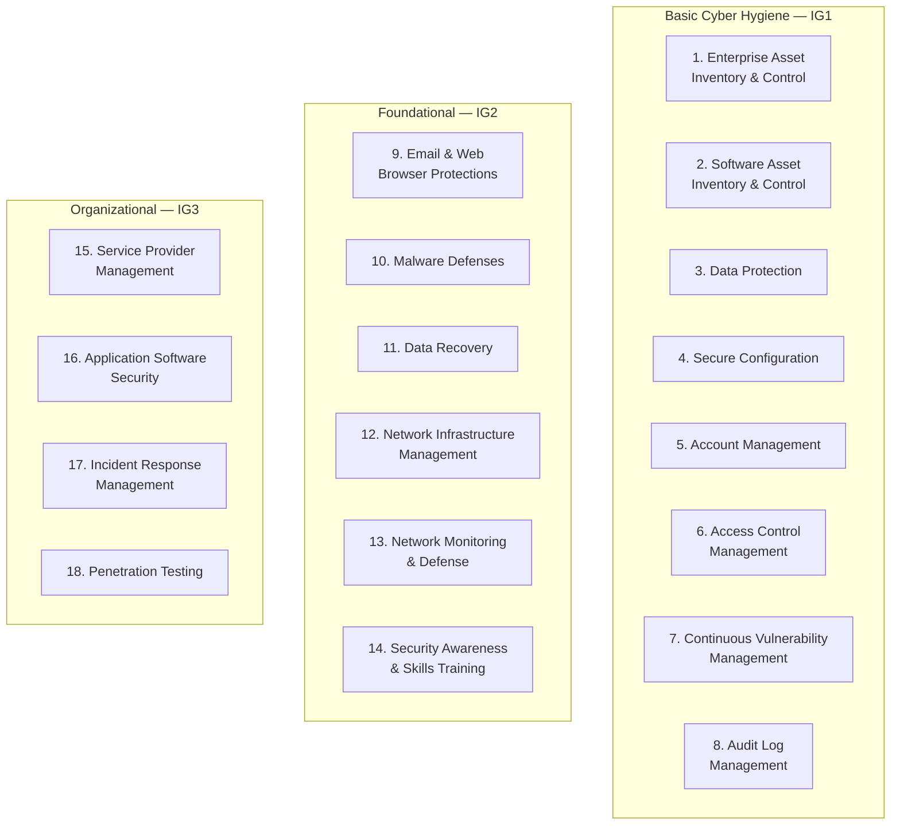
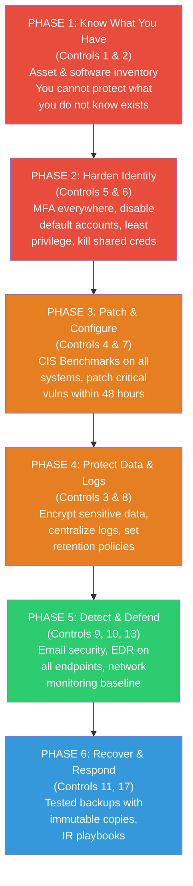

# CIS Critical Security Controls v8

## What It Is

The CIS Critical Security Controls (CIS Controls) are a prioritized, prescriptive set of 18 cybersecurity actions that map to the most common real-world attack patterns. Unlike NIST CSF which provides a strategic framework, CIS Controls tell you exactly *what* to implement and in *what order*. They are maintained by the Center for Internet Security and updated based on actual threat data, making them one of the most actionable security control sets available.

## Why It Matters

CIS Controls solve the "where do I start?" problem. When a security architect walks into a new organization and needs to build a security program from scratch — or assess an existing one — CIS Controls provide the prioritized playbook. They are organized into three Implementation Groups (IG1, IG2, IG3) based on organizational complexity, which means you can right-size your effort. Insurance companies increasingly reference CIS Controls in their questionnaires. The Australian Signals Directorate's Essential Eight, the UK's Cyber Essentials, and many state-level regulations map directly to CIS Controls.

The hard truth: if you cannot fully implement IG1 (the 56 safeguards in the basic hygiene tier), you have no business spending money on advanced security tools. IG1 stops the vast majority of commodity attacks. Everything else is optimization.

## Key Concepts

### The 18 Controls at a Glance

### Implementation Groups Explained

Implementation Groups are the real genius of CIS Controls v8. They allow you to tailor implementation based on your organization's risk profile, resources, and data sensitivity.

| Implementation Group | Org Profile | Data Sensitivity | Staff | Safeguard Count |
|---------------------|-------------|-----------------|-------|----------------|
| **IG1 — Basic Hygiene** | Small/medium, limited IT staff | Non-sensitive, general business data | Little to no dedicated security staff | **56 safeguards** |
| **IG2 — Foundational** | Medium/large, some dedicated security | Sensitive client or enterprise data | Small security team, some expertise | **74 additional** (130 total) |
| **IG3 — Organizational** | Large, regulated, or high-value targets | Highly sensitive, regulatory obligations | Mature security team, specialized roles | **23 additional** (153 total) |

**The critical insight:** IG1 is not optional. It is the minimum viable security program for any organization connected to the internet. If a breach occurs and you haven't implemented IG1, it's negligence, not bad luck.

### All 18 Controls with Tools and IG Mapping

| # | Control | IG1 | IG2 | IG3 | Key Technologies / Tools |
|---|---------|:---:|:---:|:---:|--------------------------|
| 1 | Enterprise Asset Inventory & Control | X | X | X | AWS Config, Azure Resource Graph, Rumble/runZero, Axonius, Snipe-IT, nmap discovery scans |
| 2 | Software Asset Inventory & Control | X | X | X | SCCM/Intune, Jamf, SBOM tools (Syft), osquery, AWS SSM Inventory |
| 3 | Data Protection | X | X | X | Microsoft Purview DLP, AWS Macie, encryption at rest (AES-256), TLS 1.3, data classification policies |
| 4 | Secure Configuration of Enterprise Assets & Software | X | X | X | CIS Benchmarks, Ansible/Chef/Puppet hardening playbooks, AWS Security Hub, Azure Policy, Terraform |
| 5 | Account Management | X | X | X | Entra ID, Okta, Active Directory, automated provisioning/deprovisioning (SCIM), service account inventory |
| 6 | Access Control Management | X | X | X | RBAC policies, conditional access, PAM (CyberArk, Delinea), JIT access, least privilege reviews |
| 7 | Continuous Vulnerability Management | X | X | X | Tenable, Qualys, Rapid7, Trivy (containers), Dependabot, Snyk, EPSS scoring for prioritization |
| 8 | Audit Log Management | X | X | X | SIEM (Splunk, Sentinel, Elastic), CloudTrail, Azure Monitor, centralized syslog, log retention policies |
| 9 | Email & Web Browser Protections | | X | X | Proofpoint, Mimecast, DMARC/DKIM/SPF, browser isolation (Menlo, Island), web proxy (Zscaler) |
| 10 | Malware Defenses | | X | X | EDR (CrowdStrike Falcon, Defender for Endpoint, SentinelOne), application allowlisting, AMSI |
| 11 | Data Recovery | | X | X | Veeam, AWS Backup, Azure Recovery Services, immutable backups, air-gapped copies, tested restores |
| 12 | Network Infrastructure Management | | X | X | Network segmentation (VLANs, NSGs), firewall rule reviews, infrastructure-as-code, config backups |
| 13 | Network Monitoring & Defense | | X | X | NDR (Zeek, Darktrace), IDS/IPS (Suricata, Snort), netflow analysis, DNS monitoring, packet capture |
| 14 | Security Awareness & Skills Training | | X | X | KnowBe4, phishing simulations, role-based training, security champions program, tabletop exercises |
| 15 | Service Provider Management | | | X | Vendor risk assessments, SecurityScorecard, BitSight, contractual security requirements, SLA monitoring |
| 16 | Application Software Security | | | X | SAST (Semgrep, SonarQube), DAST (Burp, ZAP), SCA (Snyk), secure SDLC, threat modeling, code review |
| 17 | Incident Response Management | | | X | IR playbooks, SOAR (XSOAR, Tines), forensics toolkit (Velociraptor, KAPE), communication templates |
| 18 | Penetration Testing | | | X | Cobalt Strike, Caldera, Atomic Red Team, purple team exercises, assumed breach testing, bug bounties |

### Prioritization: What to Implement First

Not all controls within IG1 are equal. Here is a ruthlessly prioritized order based on maximum risk reduction per effort:

**The uncomfortable truth about prioritization:** most breaches in 2024-2025 trace back to one of three root causes: (1) unpatched public-facing system, (2) stolen credentials without MFA, or (3) unknown asset connected to the network. Controls 1, 2, 5, 6, and 7 directly address all three.

### How CIS Controls Complement NIST CSF

CIS Controls and NIST CSF are complementary, not competing. Use them together:

| NIST CSF Function | CIS Controls That Map |
|-------------------|-----------------------|
| **Govern** | Control 15 (Service Provider Management), organizational policies across all controls |
| **Identify** | Controls 1 (Asset Inventory), 2 (Software Inventory), 3 (Data Protection — classification aspect), 7 (Vulnerability Management) |
| **Protect** | Controls 3 (Data Protection), 4 (Secure Configuration), 5 (Account Management), 6 (Access Control), 9 (Email/Web), 12 (Network Infrastructure), 14 (Awareness Training), 16 (App Security) |
| **Detect** | Controls 8 (Audit Log Management), 10 (Malware Defenses), 13 (Network Monitoring & Defense) |
| **Respond** | Control 17 (Incident Response Management) |
| **Recover** | Control 11 (Data Recovery) |

**The pattern:** NIST CSF tells you *why* and *what outcome* you need. CIS Controls tell you *what specifically* to implement. SP 800-53 tells you the detailed *how*. Use all three in layers.

### Measuring CIS Controls Effectiveness

Implementing controls is not enough — you need to measure whether they actually work. CIS provides Community Defense Model (CDM) data showing which controls are most effective against real attack patterns.

| Attack Type | Most Effective CIS Controls | Why |
|------------|---------------------------|-----|
| **Ransomware** | 4 (Secure Config), 7 (Vuln Mgmt), 8 (Audit Logs), 11 (Data Recovery) | Hardened configs block initial exploitation, patching closes entry points, logs enable detection, backups enable recovery without paying ransom |
| **Web Application Attacks** | 4 (Secure Config), 7 (Vuln Mgmt), 16 (App Security) | Secure defaults, timely patching of web frameworks, and secure SDLC prevent the most common web attack vectors |
| **Insider Threat** | 3 (Data Protection), 5 (Account Mgmt), 6 (Access Control), 8 (Audit Logs) | Data classification limits exposure, least privilege restricts access, audit trails create accountability |
| **Supply Chain Compromise** | 2 (Software Inventory), 4 (Secure Config), 15 (Service Provider Mgmt) | Know what software you run, harden it, and hold vendors accountable |
| **Credential Theft / Phishing** | 5 (Account Mgmt), 6 (Access Control), 9 (Email Protections), 14 (Awareness) | MFA, least privilege, email filtering, and trained users form defense in depth against credential attacks |

**Key metric to track:** For each control, measure both *implementation coverage* (what percentage of assets are covered) and *effectiveness* (when tested, does the control actually work). A control deployed to 30% of assets at high quality is less valuable than a control deployed to 95% of assets at moderate quality. Coverage beats perfection.

## Common Mistakes

1. **Jumping to IG2/IG3 before IG1 is solid.** Buying a SOAR platform when you don't have an asset inventory is spending money to be confused faster. Nail the fundamentals first.
2. **Treating CIS Controls as binary (done/not done).** Each control has multiple safeguards. "We have antivirus" does not mean Control 10 is implemented — you need centralized management, behavioral detection, and automated response.
3. **Ignoring the safeguard-level detail.** Each of the 153 safeguards has specific measurable outcomes. Assessing at the control level (18 items) is too coarse to be useful. You need to score at the safeguard level.
4. **No continuous measurement.** Implementing a control once and never reassessing is how drift happens. Asset inventories go stale. Configurations drift. Accounts accumulate. Build automated validation where possible.
5. **Confusing CIS Controls with CIS Benchmarks.** CIS Controls are the strategic framework (18 controls, 153 safeguards). CIS Benchmarks are the detailed hardening guides for specific technologies (Windows Server, Ubuntu, AWS, etc.). Benchmarks are one tool for implementing Control 4 (Secure Configuration).
6. **Not mapping to your actual threat landscape.** CIS Controls are prioritized based on general threat data. If you are in healthcare, your prioritization might differ from a tech startup. Use CIS Controls as a baseline, then adjust based on your sector-specific threats.

## Interview Angle

**What to emphasize:** Show that you understand Implementation Groups and why prioritization matters. Demonstrate that you can build a security program roadmap using CIS Controls as the backbone. The most impressive thing you can do in an interview is connect specific controls to specific attack scenarios — "Control 5 prevents the initial access that led to the SolarWinds breach because automated deprovisioning would have caught the dormant account."

**Sample answer structure for "How would you build a security program from scratch?"**

> "I'd start with CIS Controls organized by Implementation Groups. First priority is IG1 — the 56 basic hygiene safeguards that stop most commodity attacks. Specifically, I'd begin with asset and software inventory (Controls 1 and 2) because you cannot protect what you don't know exists. Then I'd lock down identity — MFA on everything, least privilege access, kill shared accounts (Controls 5 and 6). Next, patch management and hardening using CIS Benchmarks (Controls 4 and 7). Only after that foundation is solid would I invest in detection capabilities (Controls 8, 10, 13) and incident response (Control 17). I'd map this entire program to NIST CSF for executive communication and use the CSF profile mechanism for quarterly gap analysis. The key principle is that every dollar spent on IG2 or IG3 controls before IG1 is complete is a dollar wasted."

**Follow-up you should be ready for:** "What's the difference between CIS Controls and ISO 27001?" Answer: CIS Controls are prescriptive and prioritized — they tell you what to do and in what order. ISO 27001 is a management system standard — it tells you to have policies, processes, and continuous improvement around information security, but it's less prescriptive about specific technical controls. CIS Controls are a great way to implement the technical requirements of an ISO 27001 ISMS.

## Further Reading

- [CIS Controls v8 Official (Free PDF)](https://www.cisecurity.org/controls/v8)
- [CIS Controls v8 Safeguard Mapping to NIST CSF](https://www.cisecurity.org/insights/white-papers/cis-controls-v8-mapping-to-nist-csf-2-0)
- [CIS Benchmarks (Free Tier)](https://www.cisecurity.org/cis-benchmarks)
- [CIS Controls Implementation Guide for Small Enterprises](https://www.cisecurity.org/controls/implementation-groups)
- [CIS Controls Navigator (Interactive)](https://www.cisecurity.org/controls/cis-controls-navigator)
- [CISA Cross-Sector Cybersecurity Performance Goals (mapped to CIS)](https://www.cisa.gov/cross-sector-cybersecurity-performance-goals)
