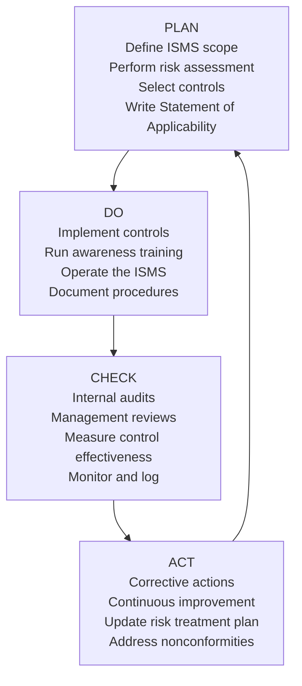
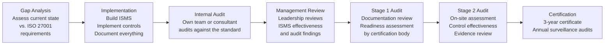

# ISO 27001 / 27002

## What It Is

ISO 27001 is the international standard for establishing, implementing, maintaining, and continually improving an **Information Security Management System (ISMS)**. It defines the management framework — governance, risk assessment, and continuous improvement. ISO 27002 is its companion — a detailed reference of security controls with implementation guidance. Think of 27001 as "what you must do" and 27002 as "how to do it." Together, they form the most widely recognized international security certification for organizations.

## Why It Matters

ISO 27001 certification is a business requirement in many markets. European, Asian, and multinational companies often require it from vendors. It is the security standard that shows up in RFPs, M&A due diligence, and enterprise sales conversations. Unlike NIST CSF (which is voluntary and U.S.-centric), ISO 27001 certification is audited by accredited third parties and results in a formal certificate that proves compliance. As a security architect, you need to understand how ISO 27001 shapes the organizational security program and how your architecture decisions map to its controls.

## Key Concepts

### ISMS and the PDCA Cycle

ISO 27001 is built on the **Plan-Do-Check-Act (PDCA)** cycle, which ensures the ISMS evolves with the organization's risk landscape.

**Key ISMS components:**
- **Scope definition** — What parts of the organization the ISMS covers (can be the whole org or a specific business unit/service)
- **Risk assessment** — Identify assets, threats, and vulnerabilities; evaluate likelihood and impact; assign risk owners
- **Statement of Applicability (SoA)** — The master document listing all Annex A controls with justification for inclusion or exclusion
- **Risk treatment plan** — How each identified risk will be treated (mitigate, accept, transfer, avoid) with assigned owners and timelines

### ISO 27002:2022 Control Categories

The 2022 revision reorganized controls from 14 domains into 4 streamlined categories. It also added 11 new controls to address modern threats.

| Category | # Controls | Examples |
|----------|-----------|---------|
| **Organizational** (5.x) | 37 | Information security policies, threat intelligence, asset management, access control policies, supplier security, information classification |
| **People** (6.x) | 8 | Screening, security awareness training, disciplinary process, responsibilities after termination |
| **Physical** (7.x) | 14 | Physical entry controls, securing offices, equipment maintenance, clear desk policy, cabling security |
| **Technological** (8.x) | 34 | User endpoint devices, privileged access management, malware protection, logging, network security, secure development lifecycle, data masking, DLP |

**New controls added in 2022:**
- Threat intelligence (5.7)
- Information security for cloud services (5.23)
- ICT readiness for business continuity (5.30)
- Physical security monitoring (7.4)
- Configuration management (8.9)
- Information deletion (8.10)
- Data masking (8.11)
- DLP (8.12)
- Monitoring activities (8.16)
- Web filtering (8.23)
- Secure coding (8.28)

### Certification Process

**Timeline reality:** For a mid-size organization starting from scratch, expect 6-12 months for implementation and 2-3 months for the audit process. Organizations that already have NIST CSF or SOC 2 programs will move faster because significant control overlap exists.

**Certification maintenance:** The certificate is valid for 3 years, with annual surveillance audits in years 2 and 3. Recertification audits in year 3 start the cycle again.

### NIST CSF vs. ISO 27001 Comparison

| Dimension | NIST CSF | ISO 27001 |
|-----------|----------|-----------|
| **Origin** | U.S. government (NIST) | International (ISO/IEC) |
| **Type** | Voluntary framework | Certifiable standard |
| **Certification** | No formal certification | Third-party audited certification |
| **Structure** | 6 functions, categories, subcategories | ISMS management clauses + Annex A controls |
| **Risk approach** | Risk-informed, flexible | Formal risk assessment methodology required |
| **Scope** | Any organization | Any organization (scoped to ISMS boundary) |
| **Cost** | Free to access | Standard must be purchased; certification costs $10K-100K+ |
| **Prescriptiveness** | Outcomes-based, choose your controls | More prescriptive control set in Annex A |
| **Best for** | Risk communication, gap analysis, program structure | Demonstrating compliance to customers and regulators |
| **Mapping** | Maps to 800-53, CIS, ISO 27001 | Maps to NIST CSF, SOC 2, CIS Controls |

**They complement, not compete.** NIST CSF provides the strategic framework for understanding your risk posture. ISO 27001 provides the operational ISMS and a certifiable proof point. Many organizations use CSF internally for gap analysis and pursue ISO 27001 certification for external credibility.

### When Organizations Choose ISO 27001

- **International business** — ISO is the globally recognized standard; NIST is U.S.-centric
- **Enterprise sales** — ISO 27001 appears in RFPs and vendor assessments more than any other standard
- **Regulatory pressure** — GDPR doesn't mandate ISO 27001, but it's the most common way to demonstrate "appropriate technical and organizational measures"
- **Customer trust** — The certificate is a tangible, audited proof of security commitment
- **M&A readiness** — Acquirers look for ISO 27001 as evidence of security program maturity

## Common Mistakes

- **Treating it as a documentation exercise** — ISO 27001 requires controls to be implemented and effective, not just written down. Auditors look for evidence of operation, not shelf-ware policies
- **Scoping too broadly** — Trying to certify the entire organization on the first pass. Start with a defined scope (a product, a business unit) and expand
- **Ignoring management commitment** — ISO 27001 clause 5 requires top management involvement. If leadership treats it as "the security team's project," the ISMS will fail
- **Copy-pasting policies** — Generic template policies that don't reflect actual organizational practices will be caught in audit. Policies must match reality
- **Forgetting continuous improvement** — The ISMS is not a project with an end date. It requires ongoing risk assessment, internal audits, corrective actions, and management reviews
- **Not mapping Annex A to existing controls** — If you already have SOC 2 or NIST-aligned controls, map them to Annex A instead of building from scratch. Significant overlap exists

## Interview Angle

When asked about ISO 27001:
- Explain the **ISMS concept** — it's a management system, not a control checklist. The PDCA cycle is the core
- Know the **difference between 27001 and 27002** — 27001 is the certifiable standard (requirements), 27002 is the implementation guidance (controls reference)
- Discuss the **Statement of Applicability** — it's the central document that maps Annex A controls to your organization with justification for each inclusion/exclusion
- Compare with **NIST CSF** — show you understand when each is appropriate and how they complement each other

**Sample answer structure**: "ISO 27001 is the international standard for information security management systems. What makes it different from frameworks like NIST CSF is that it's certifiable — an accredited third party audits your ISMS and issues a formal certificate. The standard is built on a Plan-Do-Check-Act cycle: you define scope, perform risk assessments, select controls from Annex A with justification in the Statement of Applicability, implement those controls, and continuously improve through internal audits and management reviews. The 2022 revision of 27002 reorganized controls into four categories — organizational, people, physical, and technological — and added new controls for cloud security, threat intelligence, and DLP. I see ISO 27001 and NIST CSF as complementary: CSF for strategic risk management and gap analysis, ISO 27001 for operational ISMS and external certification."

**Follow-up you should be ready for:** "How would you scope an ISO 27001 implementation?" Answer: Start with the crown jewels — the product or service that generates the most customer trust requirements. Define clear ISMS boundaries (which systems, locations, and people are in scope), document interfaces with out-of-scope systems, and expand scope in subsequent certification cycles. A narrow, well-implemented scope is better than a broad, poorly implemented one.

## Further Reading

- [ISO/IEC 27001:2022 — Information Security Management Systems](https://www.iso.org/standard/27001)
- [ISO/IEC 27002:2022 — Information Security Controls](https://www.iso.org/standard/75652.html)
- [NIST CSF to ISO 27001 Mapping](https://www.nist.gov/cyberframework/informative-references)
- [ISO 27001 Annex A Controls Explained (IT Governance)](https://www.itgovernance.co.uk/iso-27001-annex-a)
