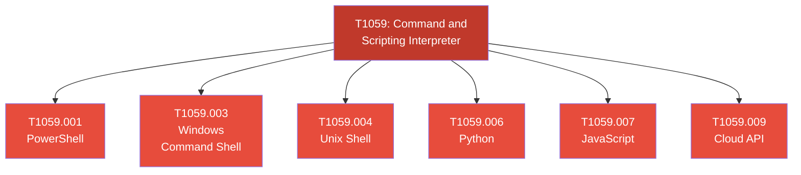
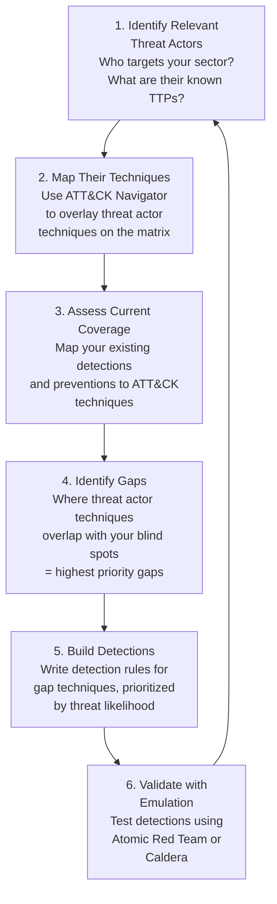
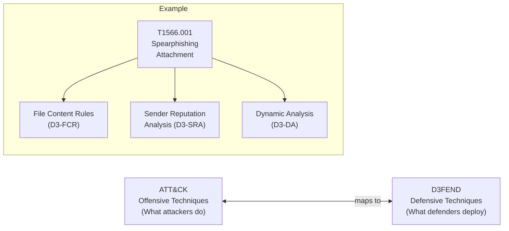

# MITRE ATT&CK Framework

## What It Is

MITRE ATT&CK (Adversarial Tactics, Techniques, and Common Knowledge) is a globally accessible knowledge base of adversary behavior based on real-world observations. It catalogs the tactics (the *why*) and techniques (the *how*) that threat actors use across the attack lifecycle, from initial reconnaissance through final impact. Unlike theoretical models, every technique in ATT&CK is backed by documented threat intelligence from actual campaigns.

ATT&CK covers four matrices: Enterprise (Windows, macOS, Linux, Cloud, Network, Containers), Mobile, ICS, and the newer Containers matrix integrated into Enterprise.

## Why It Matters

ATT&CK has become the common language of modern cybersecurity. Detection engineers write rules mapped to ATT&CK technique IDs. Red teams structure their engagements around ATT&CK tactics. Threat intelligence reports reference ATT&CK to describe adversary TTPs. Security vendors map their product coverage to ATT&CK. When your CISO asks "are we covered against APT29?", the answer comes from mapping APT29's known techniques against your detection and prevention capabilities using ATT&CK.

For a security architect, ATT&CK is the foundation of threat-informed defense. Instead of guessing what to protect against, you use ATT&CK to systematically identify which techniques are most relevant to your environment, assess your coverage gaps, and prioritize investments. This is the difference between building security based on fear and building security based on evidence.

## Key Concepts

### The 14 Enterprise Tactics

Tactics represent the adversary's objective at each stage. They are the columns in the ATT&CK matrix.

```mermaid
flowchart LR
    subgraph Pre-Attack
        TA1["Reconnaissance\nTA0043"]
        TA2["Resource\nDevelopment\nTA0042"]
    end

    subgraph Attack Lifecycle
        TA3["Initial\nAccess\nTA0001"]
        TA4["Execution\nTA0002"]
        TA5["Persistence\nTA0003"]
        TA6["Privilege\nEscalation\nTA0004"]
        TA7["Defense\nEvasion\nTA0005"]
        TA8["Credential\nAccess\nTA0006"]
        TA9["Discovery\nTA0007"]
        TA10["Lateral\nMovement\nTA0008"]
        TA11["Collection\nTA0009"]
    end

    subgraph Objective
        TA12["Command &\nControl\nTA0011"]
        TA13["Exfiltration\nTA0010"]
        TA14["Impact\nTA0013"]
    end

    TA1 --> TA2 --> TA3 --> TA4 --> TA5
    TA5 --> TA6 --> TA7 --> TA8
    TA8 --> TA9 --> TA10 --> TA11
    TA11 --> TA12 --> TA13 --> TA14
```



| Tactic | ID | Adversary Goal | Example |
|--------|-----|---------------|---------|
| **Reconnaissance** | TA0043 | Gather information to plan the attack | Scraping LinkedIn for employee names, scanning for exposed services |
| **Resource Development** | TA0042 | Establish resources to support the operation | Registering look-alike domains, purchasing VPS infrastructure, compromising third-party infrastructure |
| **Initial Access** | TA0001 | Get into the network | Phishing with a malicious attachment, exploiting a public-facing application, supply chain compromise |
| **Execution** | TA0002 | Run malicious code | PowerShell scripts, WMI execution, scheduled tasks, exploiting scripting interpreters |
| **Persistence** | TA0003 | Maintain foothold across restarts | Registry run keys, scheduled tasks, implant in startup folder, create new accounts |
| **Privilege Escalation** | TA0004 | Gain higher-level permissions | Exploiting sudo misconfig, token impersonation, exploiting kernel vulnerabilities |
| **Defense Evasion** | TA0005 | Avoid detection | Obfuscated scripts, clearing event logs, disabling security tools, process injection |
| **Credential Access** | TA0006 | Steal credentials | LSASS dumping, Kerberoasting, brute force, keylogging, credential stuffing |
| **Discovery** | TA0007 | Learn about the environment | Network scanning, enumeration of shares, querying Active Directory, cloud service discovery |
| **Lateral Movement** | TA0008 | Move through the network | Pass-the-Hash, RDP, SMB/Windows Admin Shares, SSH hijacking |
| **Collection** | TA0009 | Gather target data | Clipboard data, screen capture, email collection, data from network shared drives |
| **Command and Control** | TA0011 | Communicate with compromised systems | HTTPS beaconing, DNS tunneling, encrypted channels, protocol tunneling |
| **Exfiltration** | TA0010 | Steal data out of the network | Exfil over C2 channel, exfil to cloud storage, exfil over alternative protocol |
| **Impact** | TA0013 | Manipulate, disrupt, or destroy | Data encryption (ransomware), data destruction, defacement, resource hijacking (cryptomining) |

### Techniques vs. Sub-Techniques

This hierarchy is critical to understand:

- **Technique:** A general method the adversary uses (e.g., T1566 — Phishing)
- **Sub-technique:** A specific variation of that method (e.g., T1566.001 — Spearphishing Attachment, T1566.002 — Spearphishing Link, T1566.003 — Spearphishing via Service)



As of 2025, the Enterprise matrix contains approximately 200+ techniques and 400+ sub-techniques. You will never have full coverage. The goal is *informed prioritization*, not completeness.

### Using ATT&CK for Threat-Informed Defense

This is the core use case for security architects. The process:



### ATT&CK Navigator Mapping Example

The ATT&CK Navigator is a web-based tool for visualizing coverage. Here is what a practical mapping looks like for a mid-size enterprise:

| Technique | ID | Detection Source | Detection Rule | Coverage Level |
|-----------|----|-----------------|----------------|---------------|
| Spearphishing Attachment | T1566.001 | Email gateway + EDR | Sigma: `win_susp_office_child_process` | High |
| PowerShell Execution | T1059.001 | Endpoint logs (4104) | Sigma: `win_powershell_suspicious_commands` | High |
| LSASS Memory Dump | T1003.001 | EDR + Sysmon | Sigma: `win_lsass_access`, EDR behavioral | High |
| Kerberoasting | T1558.003 | Domain controller logs | Sigma: `win_kerberoasting` (4769 events) | Medium |
| Pass-the-Hash | T1550.002 | Auth logs + EDR | Sigma: `win_pass_the_hash`, NTLM anomaly | Medium |
| DNS Tunneling | T1071.004 | DNS logs + NDR | Custom: DNS query entropy + length analysis | Low |
| Scheduled Task Persistence | T1053.005 | Sysmon (Event 1) | Sigma: `win_schtask_creation_suspicious` | High |
| Process Injection | T1055 | EDR + Sysmon | Sigma: `win_process_injection`, EDR behavioral | Medium |
| Data Encrypted for Impact | T1486 | EDR + file integrity | Canary files, rapid file modification detection | Medium |

**Color coding convention for Navigator layers:**
- **Red (no coverage):** No detection, no prevention, complete blind spot
- **Yellow (partial):** Some logging exists, but no dedicated detection rule or it has high false positive rate
- **Green (solid coverage):** Tested detection rule, validated with emulation, acceptable false positive rate

### Detection Engineering with ATT&CK

ATT&CK is the taxonomy that makes detection engineering systematic rather than ad hoc.

**Detection rule structure mapped to ATT&CK:**
```
Rule Name: Suspicious LSASS Access
ATT&CK Technique: T1003.001 (OS Credential Dumping: LSASS Memory)
ATT&CK Tactic: Credential Access (TA0006)
Data Source: Process access events (Sysmon Event 10)
Detection Logic: Process accessing lsass.exe with PROCESS_VM_READ
                 WHERE source process NOT IN known_legitimate_list
False Positive Sources: AV scanners, some legitimate admin tools
Severity: High
Response Action: Isolate endpoint, collect memory dump, alert SOC
```

**Sigma rule example with ATT&CK tags:**
```yaml
title: LSASS Memory Access by Non-System Process
status: stable
description: Detects processes accessing LSASS memory, indicating credential dumping
references:
    - https://attack.mitre.org/techniques/T1003/001/
tags:
    - attack.credential_access
    - attack.t1003.001
logsource:
    category: process_access
    product: windows
detection:
    selection:
        TargetImage|endswith: '\lsass.exe'
        GrantedAccess|contains:
            - '0x1010'
            - '0x1038'
    filter_legitimate:
        SourceImage|endswith:
            - '\MsMpEng.exe'
            - '\csrss.exe'
            - '\wmiprvse.exe'
    condition: selection and not filter_legitimate
level: high
```

### ATT&CK and D3FEND: The Defensive Mirror

MITRE D3FEND is the defensive counterpart to ATT&CK. While ATT&CK catalogs offensive techniques, D3FEND catalogs defensive techniques (countermeasures) and maps them to the ATT&CK techniques they mitigate.



| D3FEND Tactic | Purpose | Example Techniques |
|---------------|---------|-------------------|
| **Harden** | Reduce attack surface | Application hardening, credential hardening, platform hardening |
| **Detect** | Identify adversary activity | Network traffic analysis, process analysis, file analysis, identifier analysis |
| **Isolate** | Create logical/physical barriers | Execution isolation (sandboxing), network isolation (segmentation) |
| **Deceive** | Use deception to mislead adversaries | Decoy environments (honeypots), decoy credentials (honey tokens) |
| **Evict** | Remove adversary artifacts | Credential eviction (password reset), process eviction (kill process), file eviction (quarantine) |

### Using ATT&CK for Red Team Planning

Red teams use ATT&CK to structure engagements and ensure realistic adversary emulation:

1. **Select a threat actor profile** relevant to the target organization (e.g., FIN7 for financial sector)
2. **Map the actor's known techniques** using ATT&CK Navigator
3. **Build an attack plan** that follows the actor's TTPs — not just any techniques that work
4. **Execute and document** each technique used with ATT&CK IDs
5. **Report findings** mapped to ATT&CK, showing which techniques succeeded and which were detected/blocked
6. **Produce a coverage heat map** comparing pre-engagement vs. post-engagement detection capabilities

**Tools for ATT&CK-based adversary emulation:**
- **Atomic Red Team** — Individual technique tests, lightweight, scriptable
- **MITRE Caldera** — Full adversary emulation platform, automated attack chains
- **Prelude Operator** — Lightweight agent-based emulation
- **AttackIQ / SafeBreach** — Commercial breach and attack simulation platforms

## Common Mistakes

1. **Trying to cover every technique.** There are 400+ sub-techniques. Full coverage is impossible and unnecessary. Focus on the techniques used by threat actors relevant to your industry and the techniques that align with your crown jewels.
2. **Mapping detections without testing them.** Saying "we have a detection for T1003.001" means nothing if it has never been validated against actual LSASS dumping. Use adversary emulation to test every claimed detection.
3. **Ignoring data source requirements.** Every ATT&CK technique lists required data sources. If you claim coverage for a technique but don't collect the necessary telemetry, your "detection" is imaginary. Check your data sources first.
4. **Using ATT&CK as a maturity metric.** "We cover 80% of ATT&CK" is a meaningless statement. Coverage quality varies enormously — a single high-fidelity detection is worth more than ten rules that fire on every process creation.
5. **Treating ATT&CK as static.** The matrix is updated regularly with new techniques and revised groupings. Your coverage assessment from 6 months ago is already stale. Build re-assessment into your quarterly cycle.
6. **Conflating prevention with detection.** ATT&CK coverage means you can either *prevent* the technique (block execution) or *detect* it (alert on execution). These are different capabilities with different reliability profiles. Track them separately.

## Interview Angle

**What to emphasize:** Show that you use ATT&CK as a practical tool for decision-making, not just as a vocabulary list. Describe how you would use ATT&CK to prioritize detection engineering work, structure a red team engagement, or evaluate vendor claims. The strongest signal you can send is describing a specific scenario where ATT&CK guided an architectural decision.

**Sample answer structure for "How do you use MITRE ATT&CK?"**

> "I use ATT&CK in three main ways. First, for threat-informed defense — I identify which threat actors target our sector, map their known techniques in ATT&CK Navigator, and compare that against our current detection coverage to find the highest-risk gaps. Second, for detection engineering — every detection rule we write is tagged with an ATT&CK technique ID, which gives us a systematic way to measure and communicate coverage. Third, for validating our defenses — we run adversary emulation exercises using tools like Atomic Red Team, executing specific ATT&CK techniques and verifying that our detections actually fire. The key insight is that ATT&CK turns security from a guessing game into an evidence-based practice. Instead of asking 'are we secure?', I can ask 'which specific attack techniques can we detect, and which ones are blind spots?'"

**Follow-up you should be ready for:** "How would you prioritize which ATT&CK techniques to cover first?" Answer: Start with your threat profile — which actors target your industry and what techniques do they use? Then prioritize by technique prevalence (common techniques like T1059 PowerShell over rare ones), detection feasibility (can you get the data sources?), and impact potential (credential access and lateral movement techniques are high-value because they enable everything else). MITRE's own Top Techniques methodology is a good starting point.

## Further Reading

- [MITRE ATT&CK Official](https://attack.mitre.org/)
- [ATT&CK Navigator (Visualization Tool)](https://mitre-attack.github.io/attack-navigator/)
- [MITRE D3FEND](https://d3fend.mitre.org/)
- [Atomic Red Team (Adversary Emulation)](https://github.com/redcanaryco/atomic-red-team)
- [MITRE Caldera](https://caldera.mitre.org/)
- [Sigma Rules Project (ATT&CK-tagged detections)](https://github.com/SigmaHQ/sigma)
- [Center for Threat-Informed Defense](https://ctid.mitre-engenuity.org/)
- [ATT&CK Top Techniques Methodology](https://top-attack-techniques.mitre-engenuity.org/)
