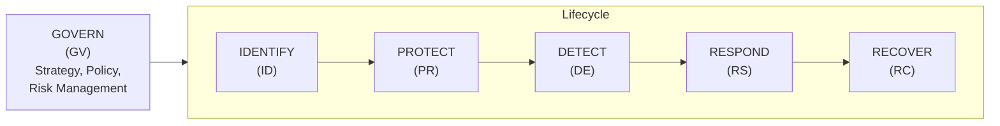
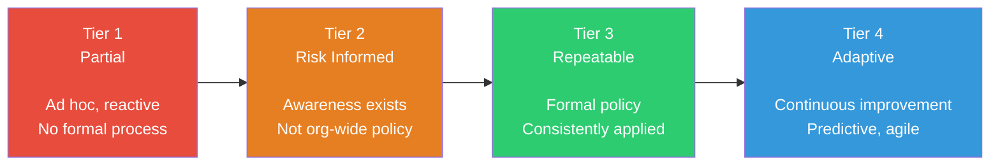
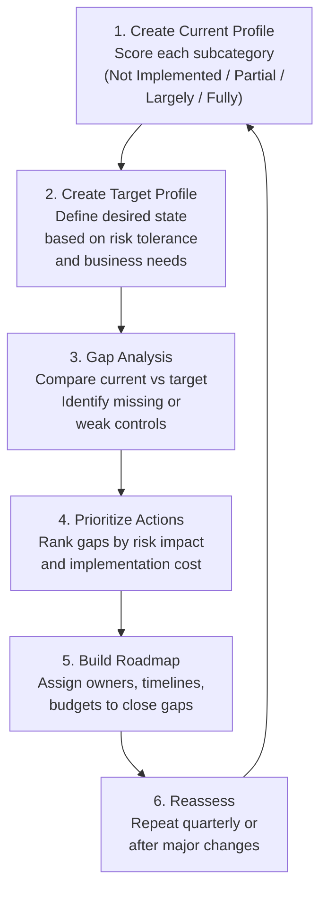

# NIST Cybersecurity Framework (CSF)

## What It Is

The NIST Cybersecurity Framework is a voluntary risk-based framework that provides organizations with a common language for managing cybersecurity risk. Originally released in 2014 (updated to CSF 2.0 in February 2024), it organizes cybersecurity activities into six core functions that map the entire lifecycle of cyber risk management. It is not a checklist — it is a strategic lens for understanding where your security posture has gaps and how mature your program actually is.

## Why It Matters

NIST CSF is the de facto standard that boards, regulators, and auditors reference when asking "how secure are we?" If you work in any U.S.-adjacent organization — or any company that does business with the federal government — CSF fluency is table stakes. Insurance underwriters use CSF-aligned questionnaires. M&A due diligence teams evaluate targets against CSF functions. When a CISO presents to the board, they are almost always mapping their program to CSF. As a security architect, you need to be able to translate technical controls into CSF language and vice versa.

Beyond compliance, CSF is genuinely useful for gap analysis. It forces you to ask: "Do we have detection capabilities? Do we have a tested recovery plan?" Most orgs over-invest in Protect and under-invest in Detect, Respond, and Recover. CSF makes that imbalance visible.

## Key Concepts

### The 6 Core Functions (CSF 2.0)

CSF 2.0 added **Govern (GV)** as a new top-level function that wraps around the original five. This was a significant change — it elevated governance from being buried in subcategories to being a first-class function.

| Function | Purpose | Key Question It Answers |
|----------|---------|------------------------|
| **Govern (GV)** | Establish and monitor cybersecurity risk management strategy, expectations, and policy | "Who owns risk and how do we make decisions?" |
| **Identify (ID)** | Understand the organization's assets, risks, and business context | "What do we need to protect and what are the threats?" |
| **Protect (PR)** | Implement safeguards to ensure delivery of critical services | "What controls prevent or limit incidents?" |
| **Detect (DE)** | Identify the occurrence of a cybersecurity event in a timely manner | "Can we see when something bad is happening?" |
| **Respond (RS)** | Take action regarding a detected cybersecurity incident | "What do we do when something bad happens?" |
| **Recover (RC)** | Restore capabilities impaired by a cybersecurity incident | "How do we get back to normal operations?" |

### CSF Categories Mapped to Real Controls and Tools

This is where CSF becomes actionable. Each function contains categories, and each category contains subcategories with specific outcomes.

| Category | Function | Real-World Controls & Tools |
|----------|----------|-----------------------------|
| Asset Management (ID.AM) | Identify | CMDB (ServiceNow), cloud asset inventory (AWS Config, Azure Resource Graph), Snipe-IT |
| Risk Assessment (ID.RA) | Identify | Qualys VMDR, Tenable, FAIR risk quantification, threat modeling (STRIDE) |
| Supply Chain Risk (ID.SC) | Identify | SBOM tools (Syft, Grype), vendor risk platforms (SecurityScorecard, BitSight) |
| Identity Management (PR.AA) | Protect | Entra ID, Okta, CyberArk PAM, FIDO2/passkeys, conditional access policies |
| Data Security (PR.DS) | Protect | AES-256 encryption at rest, TLS 1.3 in transit, DLP (Microsoft Purview), key management (AWS KMS, HashiCorp Vault) |
| Awareness & Training (PR.AT) | Protect | KnowBe4, phishing simulations, security champions program |
| Continuous Monitoring (DE.CM) | Detect | SIEM (Splunk, Sentinel, Elastic), EDR (CrowdStrike, Defender for Endpoint), NDR (Zeek, Darktrace) |
| Detection Processes (DE.AE) | Detect | Sigma rules, YARA rules, custom detection engineering, anomaly baselines |
| Incident Analysis (RS.AN) | Respond | SOAR (Palo Alto XSOAR, Tines), forensics (Velociraptor, KAPE), IR playbooks |
| Communications (RS.CO) | Respond | Incident communication templates, Statuspage, stakeholder notification workflows |
| Recovery Planning (RC.RP) | Recover | DR runbooks, backup validation (Veeam, AWS Backup), RTO/RPO testing, tabletop exercises |
| Improvements (RC.IM) | Recover | Post-incident reviews, lessons-learned databases, control gap tracking |

### Implementation Tiers

Tiers describe the degree of rigor in an organization's cybersecurity risk management practices. They are **not** maturity levels — NIST is explicit about this. However, in practice, everyone uses them as maturity indicators.

| Tier | Risk Management | Integration | External Participation |
|------|-----------------|-------------|----------------------|
| **Tier 1 — Partial** | Ad hoc, no formal process | Irregular, reactive | No supply chain awareness |
| **Tier 2 — Risk Informed** | Management-approved but not org-wide policy | Some awareness of role in ecosystem | Informal awareness of supply chain risk |
| **Tier 3 — Repeatable** | Formal policy, regularly updated | Org-wide, informed by threat intelligence | Formal agreements with partners |
| **Tier 4 — Adaptive** | Continuous adaptation based on lessons learned and predictive indicators | Agile, part of organizational culture | Active collaboration and sharing |

### CSF Functions Mapped to Architecture Decisions

This is where CSF becomes directly relevant to security architects. Every function implies specific architectural decisions:

| CSF Function | Architecture Decision | Example |
|-------------|----------------------|---------|
| **Govern** | Risk management integration into SDLC | Threat modeling gates in CI/CD, risk register tied to architecture review board |
| **Identify** | Asset visibility architecture | Deploying cloud-native inventory (AWS Config + Azure Resource Graph) vs. third-party CMDB, choosing agent-based vs. agentless discovery |
| **Protect** | Defense-in-depth layering | WAF placement (CDN edge vs. origin), encryption architecture (envelope encryption vs. field-level), network segmentation strategy (VLANs vs. micro-segmentation) |
| **Detect** | Telemetry pipeline design | Centralized SIEM architecture, log routing (agent vs. syslog vs. API), detection-as-code pipeline, retention policy by data tier |
| **Respond** | Incident response automation | SOAR playbook architecture, automated containment (isolate host via EDR API), evidence preservation chain (snapshot + memory dump) |
| **Recover** | Resilience architecture | Multi-region DR strategy, immutable backup architecture, RTO-driven recovery tier classification, chaos engineering program |

### CSF Profiles — The Most Underused Feature

CSF Profiles are the mechanism for tailoring the framework to your specific organization. A Profile is a selection of CSF outcomes (subcategories) customized to your business requirements, risk tolerance, and resources.

**Current Profile:** "This is where we are today." Score each relevant subcategory as Not Implemented, Partially Implemented, Largely Implemented, or Fully Implemented.

**Target Profile:** "This is where we need to be." Defined by your risk appetite, regulatory requirements, and business objectives. Not every subcategory needs to reach Fully Implemented — right-size based on risk.

**Community Profiles (new in 2.0):** Pre-built profiles for specific sectors or use cases. These save enormous effort because sector peers have already agreed on which subcategories matter most. Examples include profiles for small businesses, elections infrastructure, and manufacturing.

**Pro Tip:** The gap between Current and Target profiles is your security roadmap. Each gap becomes a project with an owner, timeline, and budget. This is how you translate CSF into actionable work — and how you justify budget to leadership.

### CSF 2.0 Key Changes

- **Govern function added** — risk management strategy, organizational context, supply chain risk, roles/responsibilities, and policy are now elevated to a core function
- **Scope expanded** — explicitly applies to all organizations, not just critical infrastructure
- **CSF Profiles improved** — current state vs. target state comparison refined as a formal tool
- **Community Profiles** — sector-specific templates now part of the framework (e.g., healthcare, manufacturing)
- **References updated** — explicit mapping to NIST SP 800-53 Rev 5, ISO 27001:2022, CIS Controls v8
- **Informative References** — CSF 2.0 introduces a formal mapping system to connect CSF outcomes to specific controls in other frameworks (800-53, CIS, ISO 27001), making cross-framework navigation practical

### Using CSF for Gap Analysis

This is the most practical use of the framework for a security architect.

**Pro Tip:** When doing a gap analysis, don't score everything at once. Start with the crown jewels — your most critical business processes and the assets that support them. Score those first, build a roadmap, and expand scope over time.

## Common Mistakes

1. **Treating CSF as a compliance checklist.** CSF is risk-based, not prescriptive. Checking boxes without understanding the underlying risk posture is security theater.
2. **Ignoring Detect, Respond, and Recover.** Most organizations pour resources into Protect (firewalls, antivirus, access controls) and neglect the right side of the lifecycle. Breaches are inevitable — what matters is how fast you detect and recover.
3. **Skipping the Govern function.** CSF 2.0 added Govern for a reason. Without clear ownership, risk appetite definition, and policy governance, the other five functions operate without strategic direction.
4. **Confusing Tiers with maturity levels.** Tier 4 is not always the goal. A small startup might be appropriately at Tier 2. The right tier depends on your risk environment.
5. **Never building profiles.** The Current Profile / Target Profile exercise is the core value of CSF. If you never do this comparison, you are not actually using the framework.
6. **Not mapping to specific controls.** CSF functions and categories are abstract on purpose. You must map them to concrete, implementable controls (SP 800-53, CIS Controls, or your own control set) to get actual security value.

## Interview Angle

**What to emphasize:** Show that you understand CSF as a risk management and communication tool, not just a list of security activities. Demonstrate that you can translate between CSF language and real technical controls. Highlight the gap analysis workflow — interviewers love candidates who can describe a structured approach to assessing and improving security posture.

**Sample answer structure for "How would you use NIST CSF in an organization?"**

> "I'd start by understanding the business context — what are the critical services, what's the risk appetite, who are the stakeholders. Then I'd build a Current Profile by assessing our existing capabilities against each CSF function and category. I'd pay particular attention to the Detect and Respond functions because that's where most organizations have the biggest gaps. From there, I'd define a Target Profile aligned with our risk tolerance and regulatory requirements, conduct a gap analysis, and build a prioritized roadmap. The Govern function in CSF 2.0 is critical because it ensures executive ownership and policy alignment across the entire program. I'd present this to leadership using CSF tiers to communicate our current maturity and the investment needed to reach our target state."

**Follow-up you should be ready for:** "How does CSF relate to NIST SP 800-53?" Answer: CSF provides the strategic framework (what functions and outcomes you need), while SP 800-53 provides the detailed control catalog (how to implement those outcomes). CSF is the map; 800-53 is the detailed driving directions.

## Further Reading

- [NIST CSF 2.0 Official Document](https://www.nist.gov/cyberframework)
- [NIST CSF 2.0 Quick Start Guides](https://www.nist.gov/cyberframework/getting-started)
- [CSF 2.0 Reference Tool (Searchable)](https://csrc.nist.gov/Projects/Cybersecurity-Framework/Filters)
- [NIST SP 800-53 Rev 5 — Security and Privacy Controls](https://csrc.nist.gov/publications/detail/sp/800-53/rev-5/final)
- [CSF to ATT&CK Mapping (CTID)](https://center-for-threat-informed-defense.github.io/mappings-explorer/)
