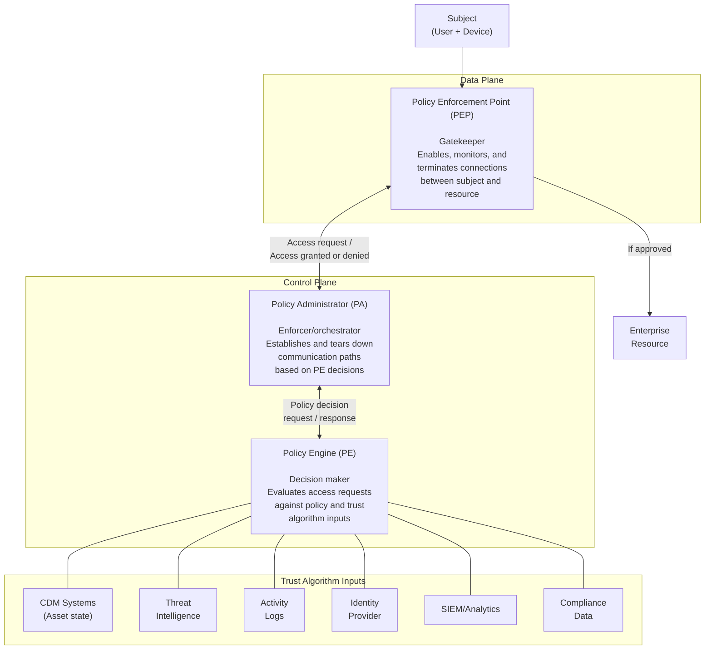
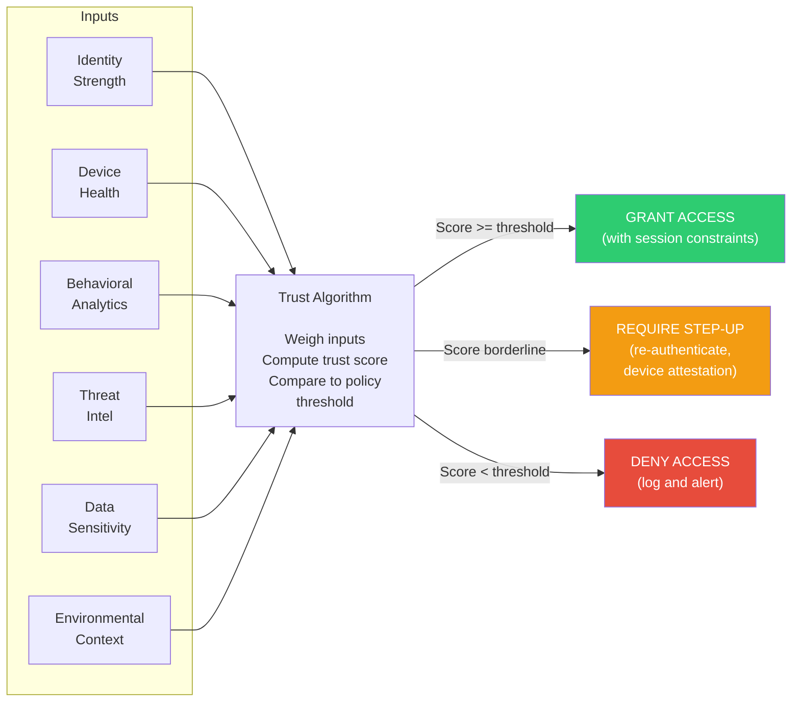
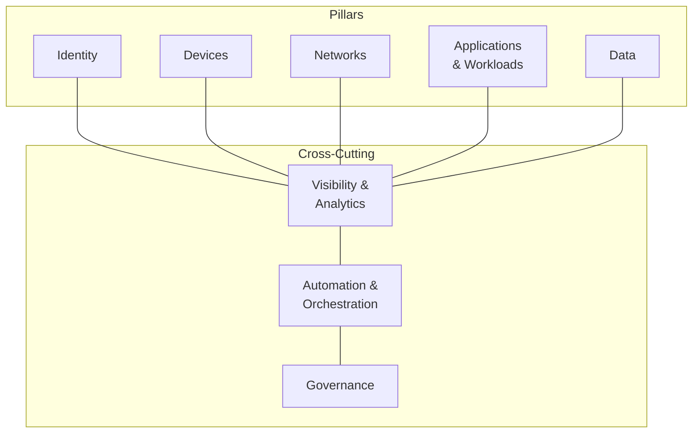
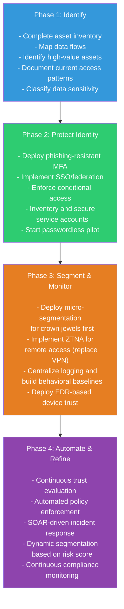

# Zero Trust Architecture — NIST SP 800-207

## What It Is

Zero Trust Architecture (ZTA) is a security paradigm that eliminates implicit trust from network architecture. Instead of assuming that anything inside the corporate perimeter is safe, ZTA requires continuous verification of every user, device, and workload before granting access to any resource. NIST SP 800-207, published in August 2020, formalized ZTA from a marketing buzzword into an actionable architectural standard with defined components, deployment models, and trust algorithms.

The core principle is simple and absolute: never trust, always verify. Every access request is treated as if it originates from an untrusted network, regardless of where the request comes from or what network segment it is on.

## Why It Matters

The traditional perimeter-based security model is dead. Remote work, cloud migration, BYOD, SaaS adoption, and supply chain integration have dissolved the network perimeter. Attackers who breach the perimeter — through phishing, compromised credentials, or supply chain compromise — move laterally with minimal friction because internal networks are flat and trust is implicit.

Zero Trust is not optional anymore. Executive Order 14028 (May 2021) mandated ZTA adoption for U.S. federal agencies. CISA published the Zero Trust Maturity Model to guide implementation. Every major cloud provider has built ZTA capabilities into their platforms. Insurance underwriters are asking about Zero Trust posture. When an interviewer asks about your security architecture philosophy, "Zero Trust" is the expected foundation — but they want to hear specifics, not slogans.

For security architects, understanding NIST 800-207 is the difference between saying "we do Zero Trust" (meaningless) and explaining exactly which components you would deploy, how the trust algorithm works, and which migration approach fits the organization (credible).

## Key Concepts

### ZTA Logical Components

NIST 800-207 defines three core logical components that form the control plane for every access decision:

| Component | Role | Real-World Implementation |
|-----------|------|--------------------------|
| **Policy Engine (PE)** | Makes the access decision — grant, deny, or require step-up authentication | Azure Conditional Access engine, Google BeyondCorp access policy, AWS IAM policy evaluation |
| **Policy Administrator (PA)** | Acts on the PE's decision — creates session tokens, configures the path | Entra ID token service, Zscaler Private Access broker, cloud IAM role assumption |
| **Policy Enforcement Point (PEP)** | The gateway that subjects must pass through — first and last point of contact | Reverse proxy (Envoy, Cloudflare Access), API gateway, identity-aware proxy, micro-segmentation agent |

### The Trust Algorithm

The Policy Engine does not make binary yes/no decisions. It evaluates a set of inputs and computes a trust score (or confidence level) for each access request. NIST 800-207 defines these input categories:

| Trust Algorithm Input | What It Provides | Example Data Points |
|----------------------|------------------|---------------------|
| **Access request** | What is being requested | Resource ID, requested action, time of request, source location |
| **Subject identity** | Who is requesting | User identity (from IdP), authentication strength (MFA method, FIDO2 vs. SMS), role/group membership |
| **Device health** | State of the requesting device | Patch level, EDR status, encryption enabled, managed vs. unmanaged, compliance posture |
| **Behavioral analytics** | Historical patterns | Typical access times, usual locations, peer group behavior, anomaly score |
| **Threat intelligence** | External risk signals | Known-bad IP ranges, compromised credential feeds, active campaign indicators |
| **Data sensitivity** | Value of the target resource | Data classification level, regulatory requirements (PCI, HIPAA), business criticality |
| **Environmental context** | Situational factors | Time of day, network segment, geolocation, concurrent session count |

**Key insight:** the trust score is not static. It is re-evaluated continuously throughout the session. If a device's EDR status changes mid-session, or threat intelligence flags the source IP, the session can be downgraded or terminated in real time.

### Three Deployment Approaches

NIST 800-207 describes three primary approaches to deploying ZTA. Most real-world implementations combine elements of all three.

| Approach | Core Mechanism | Best For | Real-World Examples |
|----------|---------------|----------|---------------------|
| **Enhanced Identity Governance** | Strong identity as the primary control plane — access decisions driven by identity attributes and authentication strength | Cloud-first organizations, SaaS-heavy environments | Entra ID + Conditional Access, Okta + ZTNA, Google BeyondCorp |
| **Micro-Segmentation** | Network divided into fine-grained segments with policy enforcement at each boundary | Data centers, legacy environments, east-west traffic control | Illumio, Guardicore (Akamai), VMware NSX, Cisco ACI, cloud NSGs/security groups |
| **Software-Defined Perimeters (SDP)** | Network infrastructure hidden from unauthorized users — resources are invisible until access is granted | Remote access replacement (VPN alternative), protecting sensitive applications | Zscaler Private Access, Cloudflare Access, Appgate SDP, Tailscale |

```mermaid
graph TD
    subgraph "Approach 1: Enhanced Identity Governance"
        U1["User"] -->|"Authenticate + MFA"| IDP1["Identity Provider\n(Entra ID, Okta)"]
        IDP1 -->|"Token with\nclaims/attributes"| APP1["Application\n(SaaS, Cloud)"]
    end

    subgraph "Approach 2: Micro-Segmentation"
        W1["Workload A"] -->|"Policy check\nat segment boundary"| FW["Segmentation\nGateway"]
        FW -->|"Allowed by policy"| W2["Workload B"]
    end

    subgraph "Approach 3: Software-Defined Perimeter"
        U2["User + Agent"] -->|"Authenticate"| CTRL["SDP Controller"]
        CTRL -->|"Provision\nencrypted tunnel"| GW["SDP Gateway"]
        GW -->|"Access granted"| APP2["Hidden\nApplication"]
    end
```

### Real-World ZTA Implementation Mapping

| ZTA Component | Implementation Option | Product/Technology Examples |
|---------------|----------------------|---------------------------|
| Identity Provider | Cloud IdP with MFA | Entra ID, Okta, Google Workspace Identity, Ping Identity |
| Device Trust | Endpoint posture assessment | Intune compliance, Jamf compliance, CrowdStrike Falcon Zero Trust Assessment, Google Endpoint Verification |
| Policy Engine | Conditional access / ZTNA policy | Entra Conditional Access, Zscaler ZTNA, Cloudflare Access policies |
| Policy Enforcement Point | Reverse proxy / identity-aware proxy | Cloudflare Access, Zscaler Private Access, Azure AD App Proxy, Envoy + OPA |
| Micro-segmentation | Workload-level segmentation | Illumio, Guardicore, Calico (Kubernetes), AWS Security Groups + VPC |
| Encryption in transit | mTLS between services | Istio service mesh, Linkerd, AWS App Mesh, Consul Connect |
| Continuous monitoring | Session analytics and anomaly detection | Microsoft Sentinel, CrowdStrike, Splunk UBA, Exabeam |
| Data classification | Sensitivity-aware access | Microsoft Purview, BigID, AWS Macie |

### CISA Zero Trust Maturity Model

CISA published the Zero Trust Maturity Model (ZTMM) to help federal agencies (and any organization) plan their ZTA migration. It defines five pillars, each with maturity stages.

| Pillar | Traditional (Pre-ZT) | Initial | Advanced | Optimal |
|--------|-----------------------|---------|----------|---------|
| **Identity** | Passwords, limited MFA | Phishing-resistant MFA, basic SSO | Continuous validation, risk-based auth, passwordless | Real-time identity risk scoring, fully passwordless, cross-org federation |
| **Devices** | Perimeter-based trust | Device inventory, basic compliance checks | EDR-informed posture, managed + BYOD policies | Continuous device health as trust input, automated remediation |
| **Networks** | Flat internal network, VPN for remote | Initial segmentation, DNS filtering | Micro-segmentation, encrypted east-west, software-defined | Fully software-defined, dynamic segmentation, no implicit trust zones |
| **Applications & Workloads** | On-prem monoliths, network-based access | Cloud migration started, some identity-aware access | Workload identity, automated pipelines, ZTNA for all apps | Immutable infrastructure, continuous verification, service mesh mTLS |
| **Data** | Perimeter-based data protection | Data inventory started, basic classification | Automated classification, DLP policies, encryption everywhere | Real-time data-level access control, attribute-based, automated response |

### ZTA Migration Patterns for Enterprises

No organization goes from flat network to full Zero Trust overnight. NIST 800-207 acknowledges this and describes a phased migration approach.

**Practical migration priorities (opinionated):**

1. **Start with identity.** Deploy phishing-resistant MFA (FIDO2, passkeys) and conditional access. This is the single highest-impact ZT control and can be deployed without touching network architecture.
2. **Replace VPN with ZTNA.** Traditional VPN grants broad network access after authentication. ZTNA grants per-application access with continuous verification. This is a straight upgrade in both security and user experience.
3. **Segment around crown jewels.** Do not try to micro-segment everything at once. Start with your most sensitive assets — databases, key management systems, CI/CD pipelines — and build outward.
4. **Instrument everything.** Zero Trust without visibility is just Zero Access. You need comprehensive logging, behavioral analytics, and the ability to detect anomalous access patterns.
5. **Tackle data last (but plan first).** Data-level Zero Trust (attribute-based access, real-time DLP, sensitivity-aware policy) requires all other pillars to be functional. Plan your data classification early, but implement the controls after identity and network controls are solid.

## Common Mistakes

1. **Treating Zero Trust as a product you can buy.** Zero Trust is an architecture and a strategy. No single vendor delivers "Zero Trust" in a box. Vendors that claim otherwise are selling you one component and calling it the whole thing.
2. **Equating Zero Trust with "no VPN."** Replacing VPN with ZTNA is one part of ZTA. If you deploy Zscaler Private Access but still have a flat internal network with no segmentation, you have not achieved Zero Trust.
3. **Ignoring device health.** Identity without device trust is half a solution. If you authenticate a user with FIDO2 but their device is unpatched and running no EDR, you are granting access from a compromised endpoint. Both inputs must feed the trust algorithm.
4. **Boiling the ocean.** Trying to Zero Trust everything simultaneously leads to analysis paralysis and project failure. Start with high-value assets and expand. A phased approach with early wins builds organizational momentum.
5. **Forgetting about service-to-service (east-west) traffic.** Most ZTA discussions focus on user-to-application access. But workload-to-workload communication (east-west traffic) is where lateral movement happens. Service mesh, workload identity, and mTLS address this blind spot.
6. **No continuous evaluation.** If your "Zero Trust" checks identity once at session establishment and never again, you have built a slightly better perimeter, not Zero Trust. Continuous evaluation of trust signals throughout the session is a core requirement.
7. **Skipping data classification.** The trust algorithm needs to know what it is protecting. Without data sensitivity as an input, every resource gets the same access policy, which defeats the purpose of risk-based access decisions.

## Interview Angle

**What to emphasize:** Demonstrate that you understand ZTA at the component level (PE, PA, PEP), not just the slogan. Show that you can describe a realistic migration path for an enterprise with legacy systems. Interviewers want to hear you acknowledge that Zero Trust is a journey, not a destination, and that you would prioritize based on risk and feasibility.

**Sample answer structure for "How would you implement Zero Trust in an enterprise?"**

> "I'd approach Zero Trust implementation in phases aligned with NIST 800-207 and the CISA Zero Trust Maturity Model. Phase one is foundational: complete asset inventory, map data flows, and classify data sensitivity. You cannot protect what you don't understand. Phase two is identity — this is the highest-impact control. I'd deploy phishing-resistant MFA (FIDO2/passkeys) with conditional access policies that factor in device health, location, and risk signals. Phase three is replacing VPN with ZTNA for remote access and deploying micro-segmentation around crown jewels. I would not try to segment the entire network at once — start with databases, key management systems, and CI/CD pipelines.
>
> The architecture follows the NIST 800-207 pattern: an Identity Provider as the foundation, conditional access as the Policy Engine, an identity-aware proxy or ZTNA broker as the Policy Enforcement Point, and comprehensive telemetry feeding back into the trust algorithm for continuous evaluation. The critical point is that trust is never static — every session is continuously evaluated against device health, behavioral baselines, and threat intelligence. If any input changes, the session is re-evaluated in real time.
>
> For east-west traffic, I'd deploy a service mesh with mTLS between workloads and workload identity instead of network-based trust. The hardest part is legacy systems that cannot participate in modern auth flows — for those, I'd use identity-aware proxies that sit in front of the legacy application and handle authentication on its behalf."

**Follow-up you should be ready for:** "What is the biggest challenge with Zero Trust adoption?" Answer: Cultural and organizational resistance. Zero Trust requires every team (network, identity, application, data) to collaborate on a unified architecture. It also changes the user experience — users accustomed to VPN-and-done will push back on continuous verification. The technical challenges are solvable; the organizational change management is where most implementations stall. Start with quick wins that improve user experience (ZTNA is faster than VPN) to build buy-in.

## Further Reading

- [NIST SP 800-207 — Zero Trust Architecture (PDF)](https://csrc.nist.gov/publications/detail/sp/800-207/final)
- [CISA Zero Trust Maturity Model v2.0](https://www.cisa.gov/zero-trust-maturity-model)
- [DOD Zero Trust Reference Architecture](https://dodcio.defense.gov/Portals/0/Documents/Library/ZTReferenceArchitecture.pdf)
- [Google BeyondCorp Papers](https://cloud.google.com/beyondcorp)
- [Microsoft Zero Trust Deployment Guide](https://learn.microsoft.com/en-us/security/zero-trust/)
- [Cloudflare Zero Trust Architecture](https://www.cloudflare.com/zero-trust/)
- [NIST SP 800-207A — Zero Trust Architecture Model for Access Control in Cloud-Native Applications](https://csrc.nist.gov/publications/detail/sp/800-207a/final)
