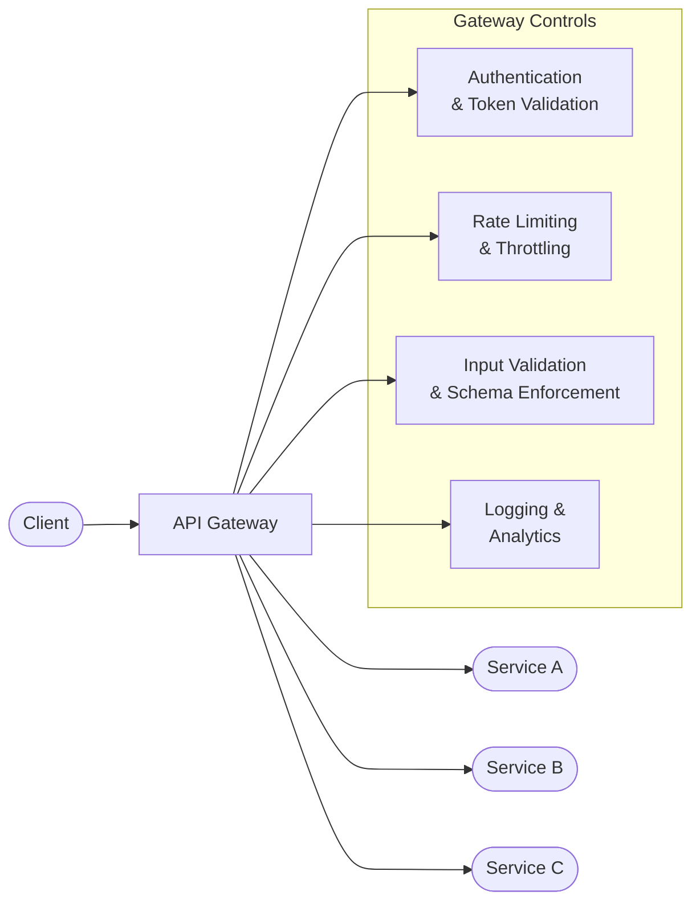

# API Security

## What It Is

API security is the practice of protecting application programming interfaces from abuse, unauthorized access, and exploitation. As applications shift to microservices and cloud-native architectures, APIs become the primary attack surface — they expose business logic directly and often carry sensitive data. Securing APIs means controlling who can call them, what data flows through them, and how they behave under adversarial conditions.

## Why It Matters

APIs are the connective tissue of modern applications. Every mobile app, SaaS integration, partner connection, and microservice communicates through APIs. This makes them a high-value target — and a common blind spot. Gartner predicted APIs would become the most frequent attack vector for enterprise applications, and that prediction has held up. A single misconfigured API endpoint can expose millions of records. As a security architect, you need to design API security into the architecture from the start, not bolt it on after a breach.

## Key Concepts

### OWASP API Security Top 10 (2023)

The OWASP API Security Top 10 is the definitive reference for API-specific threats. It differs significantly from the traditional OWASP Web Top 10 because APIs have different attack patterns.

| # | Threat | What Goes Wrong | Mitigation |
|---|--------|----------------|------------|
| API1 | **Broken Object Level Authorization (BOLA)** | API returns objects the caller shouldn't access by manipulating IDs | Server-side authorization checks on every object access |
| API2 | **Broken Authentication** | Weak or missing authentication on API endpoints | OAuth 2.0 / OIDC, token expiration, credential rotation |
| API3 | **Broken Object Property Level Authorization** | API exposes or accepts properties the caller shouldn't see/modify | Response filtering, explicit allow-lists for writable fields |
| API4 | **Unrestricted Resource Consumption** | No rate limiting or resource controls | Rate limiting, pagination, payload size limits |
| API5 | **Broken Function Level Authorization (BFLA)** | Regular users can call admin-level API functions | Role-based access control enforced at the API layer |
| API6 | **Unrestricted Access to Sensitive Business Flows** | Automated abuse of legitimate business functions (scraping, scalping) | Bot detection, business logic rate limiting, CAPTCHA |
| API7 | **Server-Side Request Forgery (SSRF)** | API fetches attacker-controlled URLs | URL allowlisting, disable redirects, network segmentation |
| API8 | **Security Misconfiguration** | Default configs, verbose errors, missing security headers | Hardened defaults, automated config scanning, error sanitization |
| API9 | **Improper Inventory Management** | Shadow APIs, deprecated endpoints still exposed | API discovery tools, version management, API gateway enforcement |
| API10 | **Unsafe Consumption of APIs** | Blindly trusting data from third-party APIs | Validate and sanitize all external API responses |

### API Authentication Patterns

| Pattern | How It Works | Best For | Security Considerations |
|---------|-------------|----------|------------------------|
| **API Keys** | Static shared secret in header or query param | Server-to-server, low-sensitivity | Easily leaked, no identity context, rotate regularly |
| **OAuth 2.0** | Token-based delegated authorization | User-facing APIs, third-party integrations | Use authorization code + PKCE flow, validate scopes |
| **OpenID Connect (OIDC)** | Identity layer on top of OAuth 2.0 | SSO, user identity verification | Validate ID tokens, check issuer and audience claims |
| **mTLS** | Both client and server present certificates | Zero-trust service-to-service | Certificate lifecycle management is complex but strong |
| **JWT Bearer** | Signed token with claims | Stateless API authentication | Validate signature, expiration, issuer; avoid `alg: none` |

### API Gateway Architecture

An API gateway is the policy enforcement point for your API surface. It centralizes cross-cutting security concerns so individual services don't have to implement them independently.

**What the gateway should enforce:**
- **Authentication** — Validate tokens/keys before requests reach backend services
- **Rate limiting** — Per-client, per-endpoint, and global limits
- **Input validation** — Schema enforcement against OpenAPI specs, payload size limits
- **Request/response transformation** — Strip internal headers, sanitize error responses
- **TLS termination** — Enforce HTTPS, manage certificates centrally
- **Logging** — Centralized audit trail of all API calls

### Common API Attack Vectors

**BOLA (Broken Object Level Authorization)** — The #1 API vulnerability. The attacker changes an object ID in the request (`/api/users/123` to `/api/users/124`) and gets another user's data. Fix: always check authorization against the authenticated user, not just authentication.

**Mass Assignment** — The attacker sends extra fields in a request body that the server blindly accepts. Example: adding `"role": "admin"` to a profile update request. Fix: explicit allowlists for accepted fields, never bind request bodies directly to data models.

**Injection** — SQL, NoSQL, and command injection through API parameters. Fix: parameterized queries, input validation, principle of least privilege on database accounts.

**Excessive Data Exposure** — The API returns full objects when the client only needs a few fields, leaking sensitive data. Fix: response filtering, field-level access control, purpose-built DTOs.

### API Inventory and Shadow APIs

You cannot secure what you do not know exists. Shadow APIs — undocumented, forgotten, or deprecated endpoints still exposed in production — are a major risk. They bypass gateway controls, lack monitoring, and often run with outdated security.

**API discovery approaches:**
- **Traffic analysis** — Inspect API gateway and load balancer logs for undocumented endpoints
- **Code scanning** — Static analysis of source code for route definitions
- **Runtime discovery** — Tools that observe live traffic to build an API inventory
- **API specification management** — Enforce that every API has an OpenAPI/Swagger spec before deployment

## Common Mistakes

- **Relying on API keys as the only security control** — API keys identify callers but don't provide fine-grained authorization. They're credentials, not access control
- **Authorization checks only at the gateway** — The gateway handles authentication, but object-level and function-level authorization must happen in the service logic
- **No rate limiting** — Every API needs rate limits. Without them, attackers can enumerate data, brute force credentials, or DoS your service
- **Exposing internal APIs to the internet** — Internal service-to-service APIs should never be reachable from external networks. Separate internal and external API gateways
- **Versioning by path with no sunset plan** — `/v1/`, `/v2/`, `/v3/` piling up with nobody decommissioning old versions creates a sprawl of unmaintained attack surface
- **Trusting client-side validation** — Always re-validate on the server. Client-side checks are UX, not security

## Cloud Context

| API Security Control | AWS | Azure | GCP |
|---------------------|-----|-------|-----|
| API Gateway | API Gateway (REST/HTTP) | API Management (APIM) | Apigee, Cloud Endpoints |
| Authentication | Cognito + Lambda authorizers | Entra ID + APIM policies | Firebase Auth + ESPv2 |
| Rate limiting | Usage plans + API keys | APIM rate-limit policies | Apigee spike arrest |
| WAF integration | AWS WAF on API Gateway | Azure WAF on Front Door | Cloud Armor |
| mTLS | ACM + API Gateway mutual TLS | APIM client certificates | Certificate-based auth |
| API discovery | N/A (use third-party) | APIM API Center | Apigee API hub |

## Interview Angle

When asked about API security:
- Lead with the **OWASP API Security Top 10** — it shows you understand API-specific threats, not just generic web security
- Explain the **API gateway pattern** and what it should vs. shouldn't enforce (authentication yes, business logic authorization no)
- Discuss **BOLA** specifically — it's the #1 API vulnerability and interviewers want to know you understand object-level authorization
- Mention **API inventory** as a governance challenge — shadow APIs are a real problem in large organizations

**Sample answer structure**: "API security starts with knowing what APIs you have — shadow APIs are a significant risk in most enterprises. I'd architect API security around a gateway that handles cross-cutting concerns like authentication, rate limiting, and input validation. But the critical piece that the gateway can't solve is authorization — BOLA and BFLA are the top API vulnerabilities, and those checks have to happen in the service logic. I'd enforce OAuth 2.0 with scoped tokens for external APIs and mTLS for internal service-to-service communication. Every API gets an OpenAPI spec, and we use that spec for automated contract testing and input validation."

**Follow-up you should be ready for:** "How would you handle API security for a microservices architecture?" Answer: Use a service mesh (Istio, Linkerd) for mTLS between services, an API gateway for north-south traffic, and a centralized identity provider. Each service validates JWTs locally but delegates authentication to the gateway. Authorization is always service-side.

## Further Reading

- [OWASP API Security Top 10 (2023)](https://owasp.org/API-Security/)
- [NIST SP 800-204: Security Strategies for Microservices-based Application Systems](https://csrc.nist.gov/publications/detail/sp/800-204/final)
- [OAuth 2.0 Security Best Current Practice (RFC 9700)](https://datatracker.ietf.org/doc/html/rfc9700)
- [Google API Design Guide](https://cloud.google.com/apis/design)
