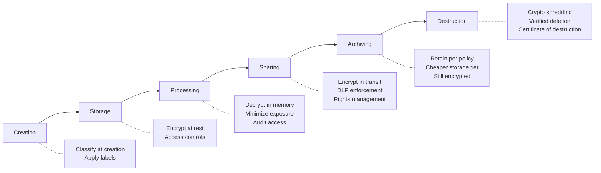
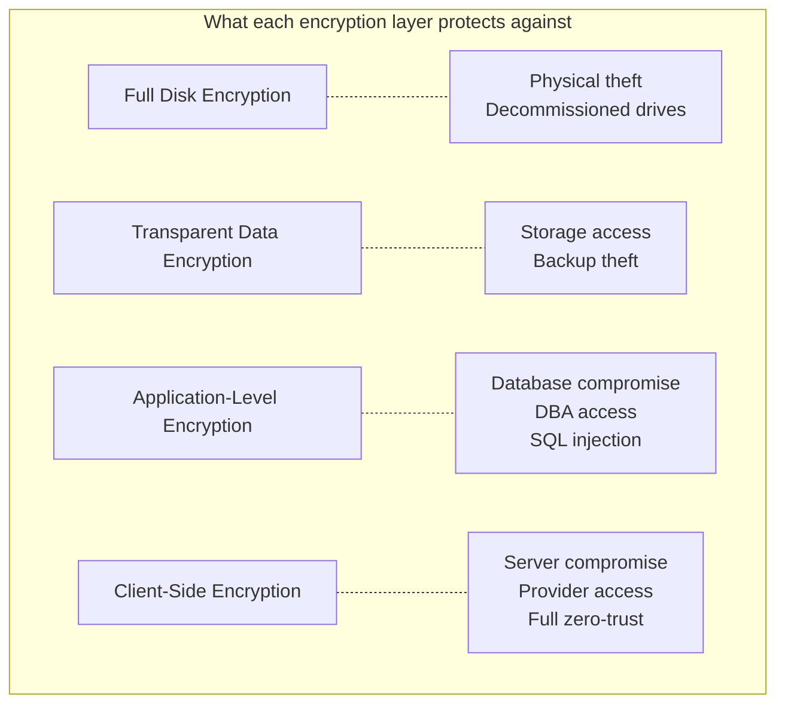
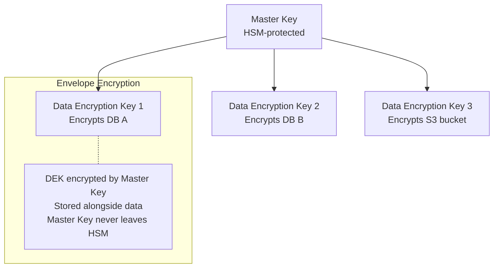

# Data Protection

## What It Is

Data protection architecture covers how data is classified, encrypted, controlled, and managed throughout its lifecycle — from creation to destruction. It's the set of design decisions that ensure sensitive data is only accessible to authorized entities, in authorized contexts, for authorized purposes.

## Why It Matters

Data is what attackers actually want. Servers, networks, and applications are just the path to get there. Every other security control exists to protect data. If you don't know where your sensitive data is, how it flows, and who can access it, your other security controls are guessing.

## Key Concepts

### Data Classification

Before you can protect data, you need to know what you have and how sensitive it is:

| Classification | Description | Examples | Controls |
|---------------|-------------|----------|----------|
| **Public** | No damage if disclosed | Marketing content, public docs | Integrity protection |
| **Internal** | Minor impact if disclosed | Internal policies, org charts | Access controls, no public sharing |
| **Confidential** | Significant impact if disclosed | Customer PII, financial data, source code | Encryption, access logging, DLP |
| **Restricted** | Severe impact if disclosed | Credentials, health records, payment card data, trade secrets | Field-level encryption, strict access control, audit everything |

**The hard part isn't defining the levels — it's consistently applying them.** Automated classification (DLP tools, data scanners) helps, but requires tuning.

### Data Lifecycle

Security controls must cover every phase. A common failure: data is encrypted in the database but exposed in plaintext in log files, backups, or analytics pipelines.

### Encryption Architecture

#### Encryption at Rest

| Approach | Description | Key Management | Use Case |
|----------|-------------|---------------|----------|
| Full disk encryption | Entire volume encrypted | OS-managed (BitLocker, LUKS) | Endpoints, protects against physical theft |
| Database encryption (TDE) | Database engine encrypts data files | DB-managed or external KMS | Databases, protects against storage theft |
| Application-level encryption | App encrypts before storing | App-managed via KMS | Field-level encryption for sensitive columns |
| Client-side encryption | Data encrypted before it leaves the client | Client-managed | Zero-knowledge architectures, max protection |

**Key insight**: Each layer protects against different threats.

#### Encryption in Transit

| Protocol | Use Case | Notes |
|----------|----------|-------|
| TLS 1.3 | Web traffic, API calls | Current standard. Disable TLS 1.0/1.1 |
| mTLS | Service-to-service | Both sides authenticate with certificates |
| IPsec | Site-to-site VPN, network tunnels | Layer 3 encryption |
| WireGuard | Modern VPN | Simpler than IPsec, excellent performance |
| SSH | Admin access, file transfer | Key-based auth, disable password auth |

**Architecture recommendation**: TLS 1.3 everywhere. mTLS for service-to-service inside the network. Disable all legacy protocols.

#### Key Management

Key management is harder than encryption itself. The algorithm is standard — the keys are the variable:

| Principle | Implementation |
|-----------|---------------|
| Separation of duties | Key admins can't access encrypted data. Data admins can't access keys |
| Rotation | Automated rotation on schedule (90 days typical). Re-encryption with new key |
| Backup | Key backup in separate, secure location. Test restore process |
| Audit | Log every key usage event. Alert on anomalous access patterns |
| Hardware protection | HSM (Hardware Security Module) for master keys. Cloud: AWS KMS, Azure Key Vault, GCP Cloud KMS |

**Envelope encryption**: Encrypt data with a Data Encryption Key (DEK). Encrypt the DEK with a Master Key (stored in HSM/KMS). This way the master key never touches the data directly, and key rotation only re-encrypts the DEK, not all the data.

### Data Loss Prevention (DLP)

DLP prevents sensitive data from leaving authorized boundaries:

| DLP Type | Monitors | Examples |
|----------|----------|---------|
| Network DLP | Data in transit over the network | Email attachments, web uploads, API calls |
| Endpoint DLP | Data on user devices | Copy to USB, print, screenshot, clipboard |
| Cloud DLP | Data in SaaS and cloud storage | Sharing outside org, public links, download to unmanaged device |
| Storage DLP | Data at rest in repos and storage | Scan S3 buckets, file shares, databases for exposed PII |

**Architecture pattern**: DLP works best as a layered control — network DLP catches bulk exfiltration, endpoint DLP catches individual actions, cloud DLP catches SaaS sprawl.

### Data Residency & Sovereignty

Where data physically lives matters legally:

| Requirement | Description | Architecture Impact |
|-------------|-------------|-------------------|
| GDPR (EU) | EU personal data processed under EU rules, transfer restrictions | Region-pinned deployments, data processing agreements |
| Data sovereignty laws | Some countries require data to remain in-country | Separate deployments per jurisdiction |
| Industry regulations | HIPAA (US health), PCI DSS (payment cards) | Specific encryption, access, and audit requirements |

**Architecture approach**: Tag data with residency requirements at classification time. Enforce via infrastructure (region-locked storage, replication controls) and policy (SCPs, organization policies).

### Tokenization vs Encryption

| | Tokenization | Encryption |
|---|-------------|-----------|
| **How it works** | Replace sensitive data with a random token. Original stored in a secure vault | Transform data using algorithm + key. Reversible with key |
| **Output format** | Same format as original (useful for PCI) | Different format/length than original |
| **Reversibility** | Only via token vault lookup | With the key |
| **Best for** | PCI DSS scope reduction, preserving format | General data protection, compliance |
| **Example** | Card number 4111...1111 -> tok_abc123 | Card number -> AES-encrypted blob |

## Common Mistakes

- **Encrypting data but storing keys next to it** — Encryption without key management is security theater. If the attacker gets the data and the key, encryption did nothing
- **Only protecting the database** — Data copies exist in logs, backups, caches, analytics pipelines, developer environments. Protect all copies, not just the primary store
- **Ignoring data in dev/test** — Production data copied to development environments without masking or anonymization. Dev environments usually have weaker controls
- **Classification without enforcement** — Labeling data as "Confidential" means nothing if there's no control that behaves differently based on the label
- **Encrypting everything the same way** — Public marketing content doesn't need the same encryption architecture as health records. Classify first, then match controls to sensitivity
- **No data destruction process** — GDPR right to erasure, retention policy compliance. If you can't prove data was destroyed, it wasn't

## Cloud Context

| Concept | AWS | Azure | GCP |
|---------|-----|-------|-----|
| KMS | AWS KMS (SSE-KMS) | Azure Key Vault | Cloud KMS |
| HSM | CloudHSM | Dedicated HSM / Managed HSM | Cloud HSM |
| Storage encryption | S3 SSE (default on), EBS encryption | Storage Service Encryption | Default encryption |
| DLP | Macie | Purview | Cloud DLP API |
| Data classification | Macie (auto-discovery) | Purview (sensitivity labels) | Cloud DLP (infoTypes) |
| Secrets management | Secrets Manager | Key Vault Secrets | Secret Manager |
| Certificate management | ACM | App Service Certificates / Key Vault | Certificate Manager |

### Cloud-Specific Considerations

- **Default encryption**: All three clouds now encrypt storage at rest by default. But default != sufficient — consider customer-managed keys (CMK) for restricted data
- **Cross-region replication**: Convenient for DR but may violate data residency. Disable for regulated data
- **Shared responsibility**: Provider encrypts the infrastructure. You encrypt the data, manage keys, and control access
- **Object storage ACLs**: S3 bucket policies, Azure blob access tiers, GCS IAM — misconfiguration is the #1 cause of cloud data breaches

## Interview Angle

When asked about data protection:
- Start with **classification** — "You can't protect what you haven't classified"
- Walk through **encryption layers** — at rest, in transit, in use. Explain what each protects against
- Explain **envelope encryption and key management** — this separates architects from practitioners
- Discuss **DLP as a layered control** — not just one product
- Address the **full lifecycle** — especially data destruction, which most people forget
- Know **tokenization vs encryption** — when to use each, especially for PCI scope reduction

**Sample answer**: "My approach to data protection starts with classification — every data element gets a sensitivity label that drives the controls applied to it. For restricted data, I'd use application-level encryption with KMS-managed keys and envelope encryption, so even a database compromise doesn't expose plaintext. DLP covers the exfiltration vectors — network, endpoint, and cloud. The piece most orgs miss is lifecycle management — data in dev environments, backups, and logs needs the same protection as production, and there must be a verified destruction process for data that's reached end of life."

## Further Reading

- [NIST SP 800-57: Key Management Recommendations](https://csrc.nist.gov/publications/detail/sp/800-57-part-1/rev-5/final)
- [NIST SP 800-175B: Guideline for Using Crypto Standards](https://csrc.nist.gov/publications/detail/sp/800-175b/rev-1/final)
- [OWASP Cryptographic Storage Cheat Sheet](https://cheatsheetseries.owasp.org/cheatsheets/Cryptographic_Storage_Cheat_Sheet.html)
- [AWS Encryption Best Practices](https://docs.aws.amazon.com/prescriptive-guidance/latest/encryption-best-practices/welcome.html)
