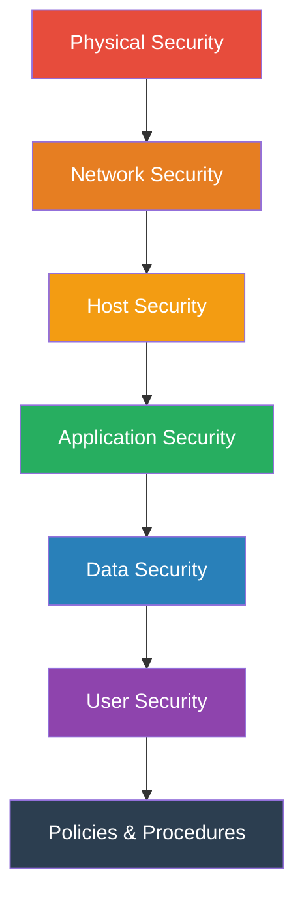
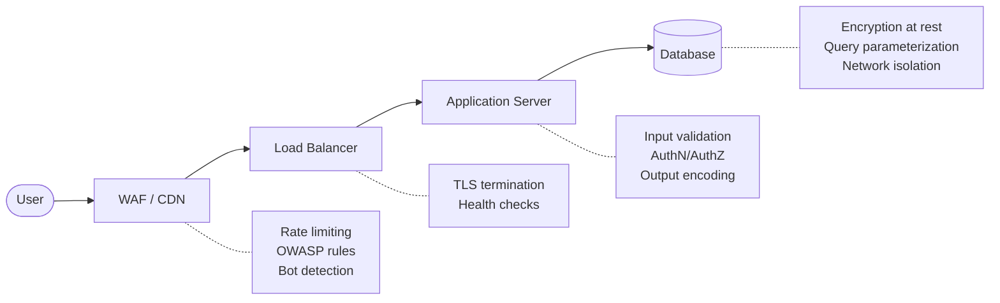

# Defense in Depth

## What It Is

Defense in depth is a security strategy that layers multiple independent controls so that if one fails, others still protect the system. It comes from military doctrine — multiple defensive lines are harder to breach than a single fortified wall.

## Why It Matters

No single security control is perfect. Firewalls get misconfigured. Passwords get stolen. Patches get delayed. Defense in depth ensures that a single failure doesn't mean total compromise. Every security architecture decision you make should consider: *what happens if this control fails?*

## Key Concepts

### The Layers

| Layer | Controls | Examples |
|-------|----------|----------|
| **Physical** | Prevent physical access to infrastructure | Badge access, cameras, locked server rooms |
| **Network** | Control traffic flow and detect intrusions | Firewalls, IDS/IPS, network segmentation |
| **Host** | Harden individual systems | OS patching, endpoint protection, host firewalls |
| **Application** | Secure the software layer | Input validation, authentication, secure coding |
| **Data** | Protect data at rest and in transit | Encryption, DLP, access controls |
| **User** | Reduce human risk | MFA, security training, least privilege |
| **Policy** | Govern behavior and response | Incident response plans, acceptable use policies |

### Principles

1. **Independence** — Each layer should work independently. If your application security depends entirely on your firewall, you don't have defense in depth — you have one layer with extra steps.

2. **Diversity** — Use different types of controls. If all your layers are detection-only, an attacker just needs to be stealthy. Mix preventive, detective, and corrective controls.

3. **Redundancy with purpose** — Overlapping coverage is intentional, not wasteful. A WAF and input validation both catch injection attacks, but they catch different variations.

## Architecture Example

A web application with proper defense in depth:

If the WAF misses a crafted SQL injection payload:
- The application's input validation catches it
- If that also fails, parameterized queries prevent execution
- If somehow data is exfiltrated, encryption at rest protects the raw data
- Monitoring and alerting detect the anomalous behavior

## Common Mistakes

- **Security theater layers** — Adding controls that look good on paper but don't actually provide independent protection (e.g., two firewalls with identical rules)
- **All prevention, no detection** — If every control is preventive, you'll never know when something slips through
- **Ignoring the human layer** — Technical controls mean nothing if an admin with full access gets phished
- **Complexity explosion** — Too many layers without clear ownership leads to misconfigurations and gaps. Each layer needs an owner

## Cloud Context

In cloud environments, defense in depth maps to:

| Traditional Layer | Cloud Equivalent |
|-------------------|------------------|
| Physical | Provider responsibility (you trust AWS/Azure/GCP) |
| Network | VPC, security groups, NACLs, PrivateLink |
| Host | AMI hardening, instance profiles, SSM patching |
| Application | Container security, runtime protection, WAF |
| Data | KMS encryption, bucket policies, DLP |
| User | IAM policies, SSO/federation, CloudTrail |
| Policy | SCPs, Config rules, compliance frameworks |

## Interview Angle

When asked about defense in depth:
- Don't just list layers — explain **why** each one exists and what it catches that others don't
- Give a concrete example of a breach where one layer failed but another caught it
- Mention that defense in depth also applies to **detection** (multiple monitoring sources) and **response** (playbooks, automation, manual escalation)
- Show you understand the tradeoff: more layers = more operational complexity. A good architect knows when enough is enough

## Further Reading

- [NIST SP 800-53: Security and Privacy Controls](https://csrc.nist.gov/publications/detail/sp/800-53/rev-5/final)
- [CISA: Defense in Depth](https://www.cisa.gov/topics/cyber-threats-and-advisories)
- [AWS Well-Architected Security Pillar](https://docs.aws.amazon.com/wellarchitected/latest/security-pillar/welcome.html)
