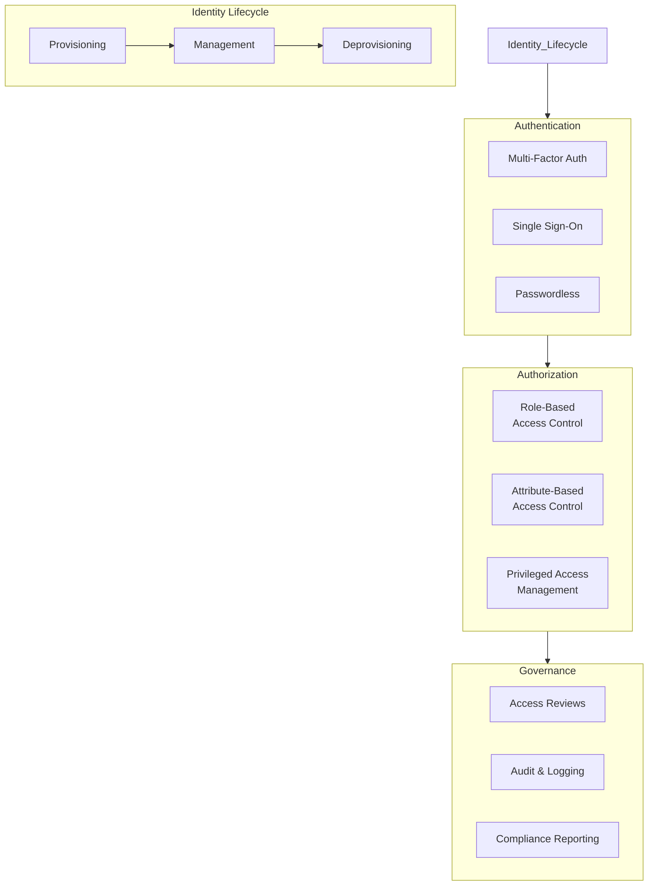
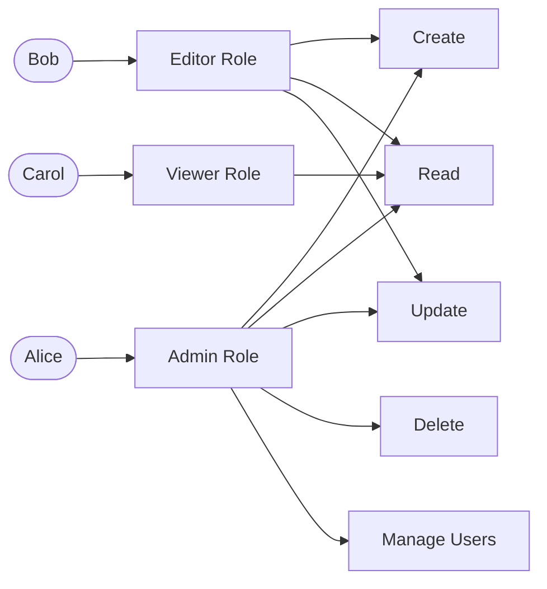
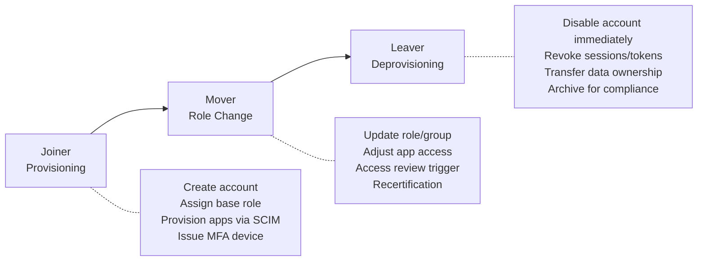
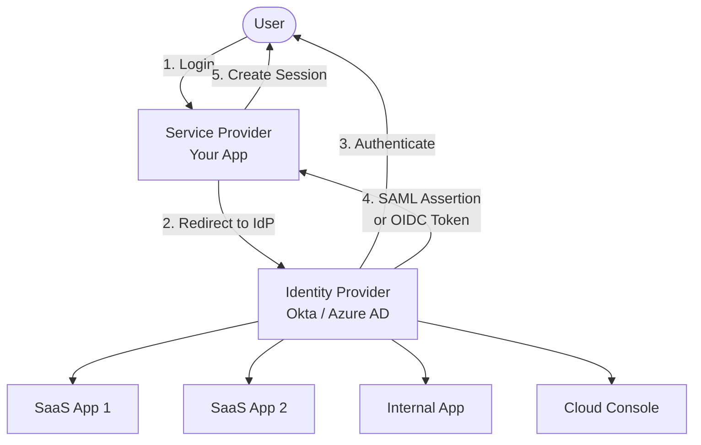

# Identity & Access Management

## What It Is

Identity and Access Management (IAM) is the framework of policies, processes, and technologies that manages digital identities and controls what those identities can access. It answers two fundamental questions: **who are you?** (authentication) and **what can you do?** (authorization).

IAM is the most critical security architecture domain. Get it wrong, and nothing else matters — the attacker is already authenticated.

## Why It Matters

Identity is the new perimeter. With cloud, remote work, and SaaS adoption, network location no longer implies trust. Every access decision now starts with identity. Compromised credentials are the #1 attack vector in breaches (Verizon DBIR, year after year). Strong IAM architecture is the single highest-impact investment an organization can make.

## Key Concepts

### The IAM Stack



### Authentication — Proving Identity

| Method | Strength | Use Case |
|--------|----------|----------|
| Password only | Weak | Legacy systems (avoid for new designs) |
| Password + TOTP (app-based MFA) | Good | Standard user access |
| Password + hardware key (FIDO2/WebAuthn) | Strong | High-privilege users, phishing-resistant |
| Passwordless (biometric + device key) | Strong | Modern consumer and enterprise apps |
| Certificate-based (mTLS) | Strong | Service-to-service, machine identity |
| API keys | Variable | Programmatic access (rotate regularly) |

#### Multi-Factor Authentication (MFA)

The factors:
- **Something you know** — password, PIN
- **Something you have** — phone, hardware key, smart card
- **Something you are** — fingerprint, face scan

Not all MFA is equal:

| MFA Method | Phishing Resistant? | Notes |
|------------|-------------------|-------|
| SMS OTP | No | SIM swapping, SS7 interception. Better than nothing, but barely |
| TOTP (authenticator app) | No | Phishable via real-time proxy (Evilginx). Still commonly used |
| Push notification | Partially | MFA fatigue attacks (spam approve requests). Add number matching |
| FIDO2 / WebAuthn | Yes | Hardware-bound, origin-checked. Gold standard |
| Certificate-based | Yes | PKI infrastructure required. Best for machine identity |

**Architecture recommendation**: FIDO2 for high-value accounts, TOTP as minimum baseline, SMS only as last resort for accounts that can't support anything else.

### Authorization — Controlling Access

#### RBAC (Role-Based Access Control)



**When to use**: Access maps cleanly to job functions. Small-medium number of roles. Most internal tools.

**Watch out for**: Role explosion — when you end up with "Admin-But-Not-Billing-East-Region-Temp" roles, you've outgrown RBAC.

#### ABAC (Attribute-Based Access Control)

Decisions based on attributes of the user, resource, action, and environment:

```
ALLOW if:
  user.department == resource.department
  AND user.clearance >= resource.classification
  AND environment.time BETWEEN 08:00 AND 18:00
  AND user.device.compliant == true
```

**When to use**: Multi-tenant systems, complex data ownership rules, context-dependent access (location, time, device).

**Trade-off**: More flexible than RBAC but harder to audit. "Who has access to X?" becomes a complex query.

#### Policy-as-Code

Modern authorization frameworks express policies as code:

| Framework | Description |
|-----------|-------------|
| OPA (Open Policy Agent) | General-purpose policy engine. Rego language. Works with K8s, APIs, Terraform |
| Cedar (AWS) | Policy language built for fine-grained permissions. Used in AWS Verified Permissions |
| Zanzibar (Google) | Relationship-based access control. Powers Google Drive permissions. Open-source: SpiceDB, OpenFGA |

### Identity Lifecycle



**The biggest IAM risk is deprovisioning.** When someone leaves or changes roles, orphaned access lingers. Automated lifecycle management (SCIM provisioning, HR-system-triggered deprovisioning) is critical.

### Privileged Access Management (PAM)

Privileged accounts (admin, root, DBA) are the keys to the kingdom:

| Principle | Implementation |
|-----------|---------------|
| No standing privileges | Just-in-time elevation — request access, auto-revoke after time window |
| Approval workflows | Human approval for sensitive access, with audit trail |
| Session recording | Record all privileged sessions for forensic review |
| Break glass | Emergency access bypasses normal approval, triggers immediate alerts |
| Credential vaulting | Privileged passwords stored in vault (CyberArk, Vault), checked out per-session |
| Service account governance | Inventory all service accounts, assign owners, rotate credentials automatically |

### Federation & SSO Architecture



| Protocol | Use Case | Token Format |
|----------|----------|-------------|
| SAML 2.0 | Enterprise SSO, legacy apps | XML assertion |
| OIDC (OpenID Connect) | Modern apps, APIs, SPAs | JWT (ID token + access token) |
| OAuth 2.0 | API authorization (not authentication) | Access token (opaque or JWT) |

**Key insight**: OAuth 2.0 is for **authorization** (can this app access my photos?), not authentication. OIDC is built on top of OAuth 2.0 to add authentication.

### Machine Identity

Non-human identities often outnumber human ones 10:1. They need the same rigor:

| Identity Type | Authentication | Management |
|---------------|---------------|-----------|
| Service accounts | API keys, client credentials | Rotate regularly, assign owner, least privilege |
| Containers/pods | Service mesh mTLS (SPIFFE/SPIRE) | Automatic certificate rotation |
| Serverless functions | IAM roles, temp credentials | No long-lived keys, scoped per function |
| CI/CD pipelines | OIDC federation (GitHub Actions -> AWS) | No stored secrets, short-lived tokens |
| IoT devices | X.509 certificates, device attestation | Revocation via CRL/OCSP, secure boot |

## Common Mistakes

- **Shared accounts** — "Everyone uses the admin account." No auditability, no accountability, no access control. Every identity should be individual
- **Over-permissioned service accounts** — Service accounts with admin access that nobody owns and nobody rotates. These are breach goldmines
- **MFA rollout without fallback planning** — Users locked out, no recovery path, help desk overwhelmed. Plan the edge cases
- **SSO without deprovisioning** — SSO lets users into 50 apps with one login. But if you don't auto-deprovision, a terminated employee still has access until someone remembers to remove them from each app
- **Confusing authentication with authorization** — "They're logged in, so they can see everything." Authentication proves identity. Authorization proves permission. They're separate decisions
- **Ignoring machine identities** — You enforce MFA for humans but have service accounts with static API keys and admin access

## Cloud Context

Each cloud provider has its own IAM model, but the principles are the same:

| Concept | AWS | Azure | GCP |
|---------|-----|-------|-----|
| Root/global admin | Root account (lock it down) | Global Administrator | Organization Admin |
| Human access | IAM Identity Center (SSO) | Azure AD + Conditional Access | Cloud Identity + BeyondCorp |
| Service identity | IAM Roles + STS | Managed Identities | Service Accounts + Workload Identity |
| Policy model | JSON policies (allow/deny) | Azure RBAC + Entra Roles | IAM policies (allow only, deny via org policy) |
| Cross-account | AssumeRole + SCPs | Azure Lighthouse | Cross-project IAM bindings |
| Audit | CloudTrail | Azure AD Audit Logs + Activity Log | Cloud Audit Logs |

### Cloud IAM Best Practices

1. **Never use root/owner accounts for daily work** — Federate from your IdP
2. **Use temporary credentials everywhere** — STS AssumeRole, not long-lived access keys
3. **Scope permissions to the resource level** — `s3:GetObject` on one bucket, not `s3:*` on everything
4. **Enable and review audit logs** — CloudTrail, Azure Activity Log, GCP Audit Logs
5. **Use organization-level guardrails** — SCPs (AWS), Azure Policy, Organization Policies (GCP)
6. **Tag resources with ownership** — So you can answer "who is responsible for this role?"

## Interview Angle

When asked about IAM:
- Start with the **problem**: "Identity is the #1 attack vector. Strong IAM is the highest-ROI security investment"
- Walk through the **stack**: authentication, authorization, lifecycle, governance
- Show you understand **protocols**: SAML vs OIDC vs OAuth 2.0 — when to use each
- Discuss **machine identity** — this separates senior architects from junior ones
- Address the **hard problems**: deprovisioning at scale, role explosion, legacy apps that can't do SSO
- Know **PAM**: just-in-time access, break glass, session recording

**Sample answer**: "I'd build IAM around a central IdP — Okta or Azure AD — with OIDC for modern apps and SAML for legacy. MFA enforced everywhere, FIDO2 for privileged users. Authorization starts with RBAC and evolves to ABAC as complexity grows. The piece most orgs miss is lifecycle management — automated provisioning via SCIM and immediate deprovisioning triggered by HR systems. For cloud, zero long-lived credentials — everything through STS with scoped roles."

## Further Reading

- [NIST SP 800-63: Digital Identity Guidelines](https://pages.nist.gov/800-63-3/)
- [OWASP Authentication Cheat Sheet](https://cheatsheetseries.owasp.org/cheatsheets/Authentication_Cheat_Sheet.html)
- [Google BeyondCorp](https://cloud.google.com/beyondcorp)
- [FIDO Alliance - WebAuthn](https://fidoalliance.org/fido2-2/fido2-web-authentication-webauthn/)
