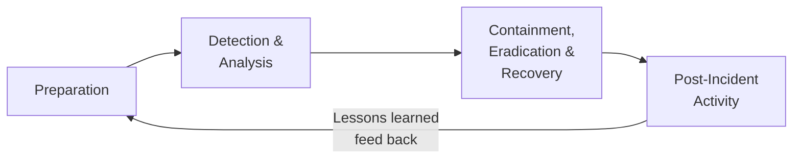
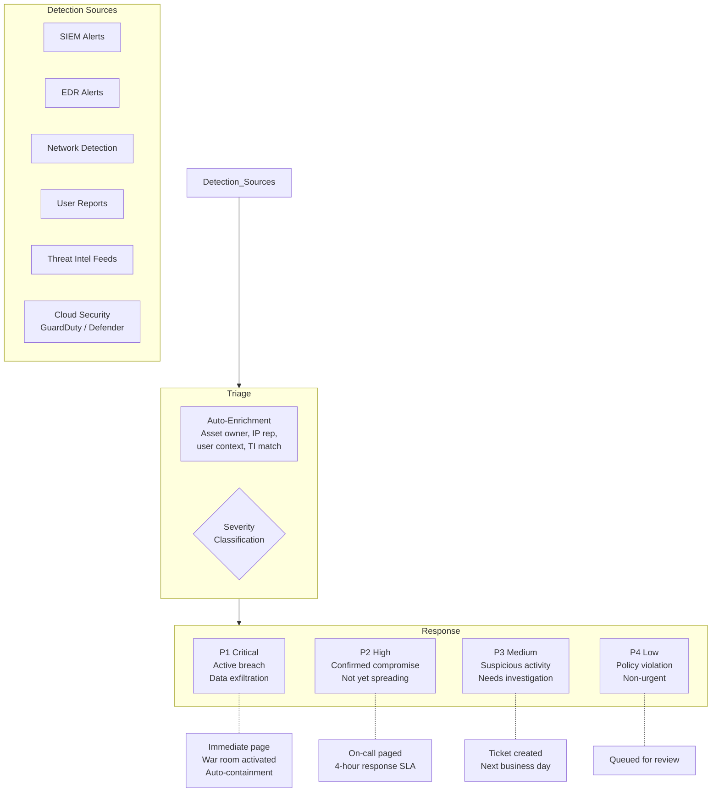
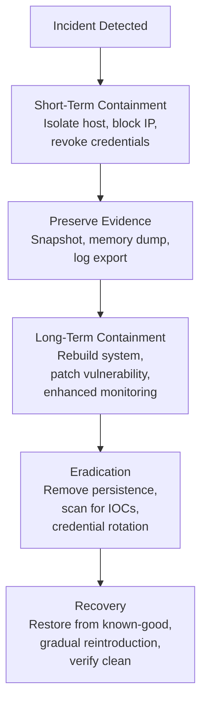
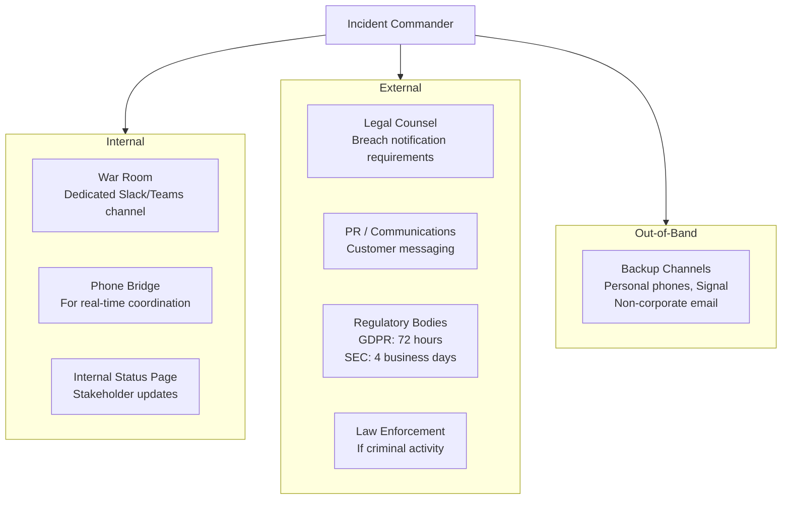
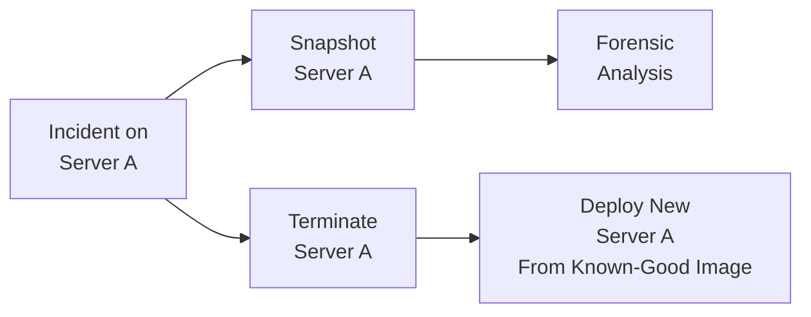
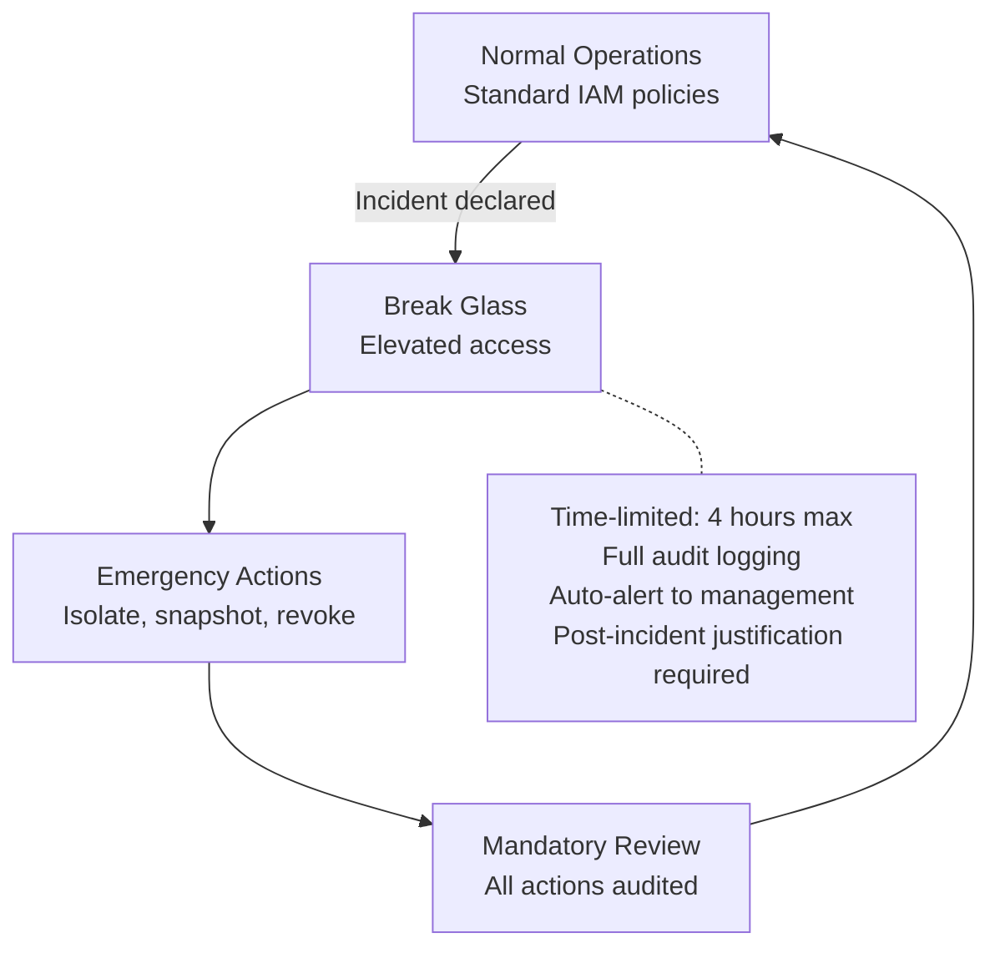

# Incident Response Architecture

## What It Is

Incident response (IR) architecture is the design of systems, processes, and infrastructure that enable an organization to detect, contain, investigate, and recover from security incidents. It's not just a document in a binder — it's how your infrastructure is built to support fast, effective response when something goes wrong.

A good security architect doesn't just prevent attacks. They design systems that assume breach and make response fast, effective, and evidence-preserving.

## Why It Matters

Every organization will face a security incident. The difference between a contained incident and a catastrophic breach is **how quickly you detect, how effectively you contain, and how thoroughly you investigate**. IR architecture determines whether your team spends hours or months on response.

## Key Concepts

### The IR Lifecycle (NIST SP 800-61)

### Architecture That Supports Each Phase

#### 1. Preparation — Build Before You Need It

| Architecture Decision | Why |
|----------------------|-----|
| Centralized logging with immutable storage | Can't investigate if logs are missing or tampered with |
| Network segmentation with kill switches | Need to isolate compromised segments quickly |
| Automated asset inventory | "What was affected?" requires knowing what you have |
| Pre-authorized forensic tooling | Installing tools during an incident wastes time and contaminates evidence |
| Runbook automation (SOAR) | Repeatable, fast response to common scenarios |
| Communication channels (out-of-band) | Assume primary channels may be compromised. Have a backup |
| Evidence collection infrastructure | Forensic workstations, storage for disk images, chain of custody tools |

#### 2. Detection & Analysis — Know Something Is Wrong

**Architecture enablers:**
- **Auto-enrichment** reduces analyst time from minutes to seconds per alert
- **Severity classification** should be automated based on asset criticality, data sensitivity, and attack type
- **Context** is everything — an alert on a dev server is different from the same alert on the payment database

#### 3. Containment — Stop the Bleeding

Containment strategies depend on what your architecture supports:

| Containment Action | Architecture Requirement |
|-------------------|------------------------|
| Isolate a host from network | EDR with network isolation capability, or SDN/security group modification |
| Revoke user credentials | Centralized IdP with session invalidation (not just password reset) |
| Block malicious IP/domain | Firewall API, DNS sinkholing, WAF rule push |
| Disable compromised service | Immutable infrastructure — kill and replace, don't patch |
| Quarantine email | Email gateway API, auto-quarantine rules |
| Freeze cloud resources | IAM deny policy, security group lockdown, snapshot before action |

**Short-term vs long-term containment:**
- **Short-term**: Stop the immediate damage. Isolate the host, block the IP, revoke the credential
- **Long-term**: Address the root cause while maintaining business operations. May involve rebuilding systems, changing architecture

#### 4. Investigation & Forensics

| Evidence Source | What It Provides | Architecture Requirement |
|----------------|-----------------|------------------------|
| SIEM logs | Timeline of events, correlation | Centralized logging with retention |
| EDR telemetry | Process execution, file changes, network connections | EDR deployed to all endpoints |
| Memory dump | Running processes, network connections, decrypted data | Remote memory capture capability |
| Disk image | Full filesystem analysis, deleted files, artifacts | Forensic imaging tools, storage for images |
| Network capture | Full packet data, exfiltration evidence | PCAP capability at key network points |
| Cloud audit logs | API calls, config changes, access patterns | CloudTrail/Activity Log enabled in all accounts/regions |

**Evidence preservation principles:**
- **Don't modify the source** — image first, analyze the copy
- **Chain of custody** — document who handled evidence, when, and what they did
- **Timestamps** — synchronized NTP across all systems. Inconsistent time kills investigations
- **Immutability** — evidence stored in write-once storage

#### 5. Post-Incident — Learn and Improve

The most undervalued phase. Architecture improvements from incidents are the highest-confidence security investments you'll ever make.

**Blameless postmortem structure:**
1. **Timeline** — what happened, when, in what order
2. **Detection** — how was it found? Could we have found it faster?
3. **Response** — what went well? What was slow or broken?
4. **Root cause** — not "who made the mistake" but "what system allowed the mistake"
5. **Action items** — specific, assigned, deadline. Detection rules, architecture changes, process improvements
6. **Metrics** — MTTD, MTTR, blast radius, data impact

### IR Communication Architecture

**Why out-of-band matters**: If the attacker has access to your corporate email and Slack, your IR coordination is visible to them. Always have a backup communication channel.

### SOAR (Security Orchestration, Automation, and Response)

Automate the repeatable parts of IR so humans focus on judgment calls:

| Playbook | Trigger | Automated Actions |
|----------|---------|-------------------|
| Compromised credential | Impossible travel alert | Disable account, revoke sessions, notify user, collect auth logs, create ticket |
| Malware on endpoint | EDR detection | Isolate host, collect forensic package, check for lateral movement, block IOCs |
| Phishing email | User report or filter detection | Extract IOCs (URLs, hashes), check other mailboxes, block sender domain, quarantine related messages |
| Cloud resource compromise | GuardDuty/Defender alert | Snapshot resource, restrict IAM, collect CloudTrail, page on-call |
| Data exfiltration | DLP alert + network anomaly | Block egress, identify data scope, preserve network capture, escalate to P1 |

### IR Metrics

| Metric | What It Measures | Target |
|--------|-----------------|--------|
| MTTD (Mean Time to Detect) | How fast you notice something is wrong | < 24 hours for most orgs, < 1 hour for critical assets |
| MTTR (Mean Time to Respond) | How fast you contain the incident | < 4 hours for P1, < 24 hours for P2 |
| MTTC (Mean Time to Contain) | Time from detection to containment complete | Subset of MTTR — the faster the better |
| Blast radius | How many systems/users/records affected | Measures segmentation effectiveness |
| False positive rate | Percentage of alerts that aren't real incidents | < 20% for critical alert rules |
| Playbook coverage | Percentage of common scenarios with automated playbooks | > 80% of P1/P2 scenarios |

## Architecture Design Patterns

### Immutable Infrastructure for IR

With immutable infrastructure, containment and recovery are fast — kill the compromised instance, deploy a fresh one from a known-good image. The snapshot preserves evidence. No need to "clean" a compromised server.

### Break Glass Architecture

## Common Mistakes

- **IR plan exists only as a document** — If the infrastructure doesn't support the plan, the plan is fiction. "Isolate the host" requires the ability to actually isolate the host
- **No practice** — Tabletop exercises and red team engagements validate that IR actually works. An untested plan fails under pressure
- **Deleting evidence during containment** — Reimaging a server without preserving it first destroys forensic evidence
- **No out-of-band communication** — Coordinating IR on the same systems the attacker compromised
- **Slow credential rotation** — "We'll rotate credentials after the investigation." Meanwhile, the attacker is still using them
- **Skipping the postmortem** — The incident is over, everyone's tired, and nobody wants to write the report. But the postmortem is where you prevent the next one

## Cloud Context

Cloud environments change IR significantly:

| Aspect | Traditional | Cloud |
|--------|------------|-------|
| Evidence collection | Disk imaging, memory dumps | API snapshots, CloudTrail, flow logs |
| Containment | Unplug from network | Security group change, IAM deny policy |
| Eradication | Clean or reimage | Terminate and redeploy from known-good AMI |
| Scalability | Limited by physical access | API-driven, automatable at scale |
| Jurisdiction | Data in your data center | Data could be in any region — know where |
| Third-party | You own the infrastructure | Shared responsibility — provider may need to be involved |

### Cloud IR Runbook Essentials

1. **Snapshot first, act second** — EBS snapshot, RDS snapshot before any changes
2. **Isolate via IAM, not just network** — Revoke IAM roles, not just security group changes
3. **CloudTrail is your best friend** — Every API call is logged. Start the investigation there
4. **Automate with Lambda/Functions** — GuardDuty finding triggers Lambda that auto-isolates
5. **Cross-account IR role** — Pre-provisioned role in every account that the security team can assume during incidents

## Interview Angle

When asked about incident response architecture:
- Don't just describe the process (detect, contain, eradicate, recover) — explain the **infrastructure that makes it possible**
- Emphasize **preparation**: "The best IR happens before the incident — centralized logging, network segmentation, forensic tooling pre-deployed, playbooks tested"
- Discuss **automation**: SOAR playbooks for common scenarios reduce MTTR from hours to minutes
- Mention **evidence preservation** — snapshot before containment, immutable log storage, chain of custody
- Talk about **communication**: war rooms, out-of-band channels, regulatory notification timelines
- Know the **cloud difference**: API-driven containment, immutable infrastructure, auto-scaling response

**Sample answer**: "I design IR architecture around three principles: preparation, speed, and evidence. Preparation means centralized immutable logging, pre-authorized forensic tooling, and tested runbooks. Speed comes from SOAR automation — when GuardDuty detects a compromised instance, a Lambda automatically snapshots it, isolates it via security group, and pages the on-call engineer with full context. Evidence preservation is built in — immutable infrastructure means we never modify a compromised system, we snapshot it for forensics and deploy a clean replacement. The postmortem feeds back into architecture improvements, which is how we get better over time."

## Further Reading

- [NIST SP 800-61: Computer Security Incident Handling Guide](https://csrc.nist.gov/publications/detail/sp/800-61/rev-2/final)
- [NIST SP 800-86: Guide to Integrating Forensic Techniques](https://csrc.nist.gov/publications/detail/sp/800-86/final)
- [AWS Security Incident Response Guide](https://docs.aws.amazon.com/whitepapers/latest/aws-security-incident-response-guide/welcome.html)
- [SANS Incident Handler's Handbook](https://www.sans.org/white-papers/33901/)
- [Incident Response Consortium](https://www.incidentresponse.org/)
