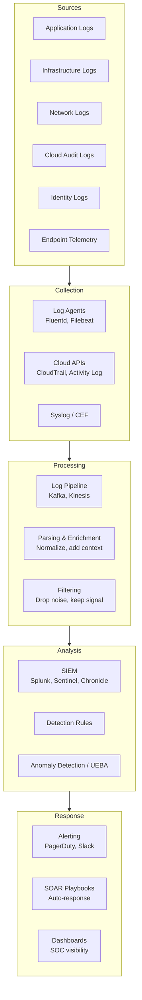
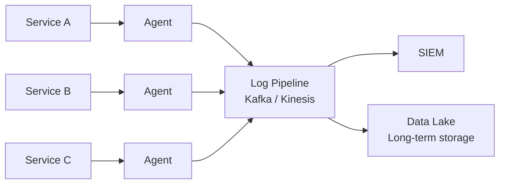
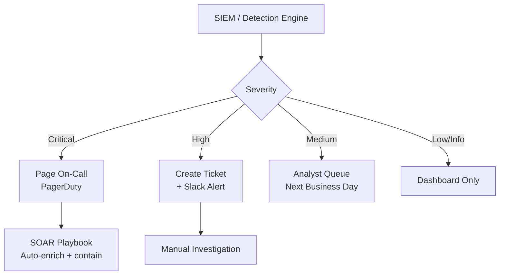

# Logging & Monitoring

## What It Is

Logging and monitoring architecture is the design of systems that collect, store, analyze, and alert on security-relevant events. It provides **visibility** — the ability to know what's happening in your environment, detect threats, investigate incidents, and prove compliance.

Without logging and monitoring, every other security control is flying blind. You might have the best firewall in the world, but if nobody's watching the logs, you won't know when it fails.

## Why It Matters

The median time to detect a breach is still measured in months, not minutes (IBM Cost of a Breach Report). The difference between a minor incident and a catastrophic breach is usually **how fast you detect and respond**. Logging and monitoring architecture directly determines your Mean Time to Detect (MTTD) and Mean Time to Respond (MTTR).

## Key Concepts

### The Monitoring Stack



### What to Log

Not all logs are equal. Focus on security-relevant events:

| Category | Events | Why It Matters |
|----------|--------|---------------|
| **Authentication** | Login success/failure, MFA events, password changes, token issuance | Detect credential attacks, brute force, account takeover |
| **Authorization** | Access granted/denied, privilege escalation, role changes | Detect unauthorized access, privilege abuse |
| **Data access** | Database queries on sensitive tables, file access, API data retrieval | Detect data exfiltration, insider threats |
| **Configuration changes** | Firewall rules, IAM policies, security group changes, DNS modifications | Detect tampering, unauthorized changes |
| **Network** | Connection logs, DNS queries, flow data, blocked traffic | Detect lateral movement, C2 communication, exfiltration |
| **Application** | Errors, input validation failures, business logic anomalies | Detect exploitation attempts, application abuse |
| **System** | Process execution, service starts/stops, file integrity changes | Detect malware, persistence mechanisms |

### What NOT to Log

| Don't Log | Why |
|-----------|-----|
| Passwords / secrets | Obvious — but check your error logs, they often capture request bodies |
| Full credit card numbers | PCI DSS violation. Log last 4 only |
| Session tokens / API keys | A log breach becomes a session hijack |
| Excessive PII | Log the minimum needed for investigation. User ID, not full SSN |
| Health check noise | Thousands of "200 OK" from load balancers clutter analysis |

### Structured Logging

Unstructured logs are nearly useless at scale. Always use structured logging:

**Bad** (unstructured):
```
2026-03-10 14:32:01 User john failed to login from 192.168.1.50
```

**Good** (structured JSON):
```json
{
  "timestamp": "2026-03-10T14:32:01.000Z",
  "level": "warn",
  "event": "auth.login.failure",
  "user_id": "john",
  "source_ip": "192.168.1.50",
  "user_agent": "Mozilla/5.0...",
  "failure_reason": "invalid_password",
  "attempt_count": 3,
  "geo": "US-TX",
  "request_id": "req-abc-123"
}
```

**Why structured matters:**
- Parseable by SIEM without regex gymnastics
- Consistent field names enable correlation across services
- Filterable and aggregatable
- Machine-readable for automated detection

### Log Architecture Patterns

#### Centralized Logging



#### Tiered Retention

| Tier | Retention | Storage | Use Case |
|------|-----------|---------|----------|
| Hot | 30 days | SIEM (fast query) | Active investigation, real-time detection |
| Warm | 90 days | Indexed storage (Elasticsearch, S3 + Athena) | Recent incident investigation |
| Cold | 1-7 years | Cheap object storage (S3 Glacier, Azure Archive) | Compliance, legal holds, forensics |

**Cost management**: SIEM licensing is expensive per GB ingested. Route high-volume, low-value logs directly to the data lake. Only send security-relevant logs to the SIEM.

### Detection Engineering

Logs without detection rules are just expensive storage. Detection engineering turns logs into alerts:

#### Detection Types

| Type | Description | Example |
|------|-------------|---------|
| **Signature / rule-based** | Match specific known patterns | "Alert when >10 failed logins from same IP in 5 minutes" |
| **Threshold** | Alert when metric exceeds normal range | "Alert when data egress exceeds 10GB in 1 hour" |
| **Anomaly / behavioral** | ML-based deviation from baseline | "User normally logs in from US, now logging in from Russia at 3 AM" |
| **Correlation** | Multiple events combined indicate threat | "Failed login + successful login + sensitive data access within 10 minutes" |
| **Threat intelligence** | Match against known IOCs | "Connection to known C2 domain" |

#### Detection-as-Code

Modern detection rules are version-controlled, tested, and deployed like software:

```yaml
# Example: Sigma rule format
title: Brute Force Login Attempt
status: stable
description: Detects multiple failed login attempts from a single source
logsource:
  category: authentication
detection:
  selection:
    event: auth.login.failure
  condition: selection | count(source_ip) > 10 within 5m
level: high
tags:
  - attack.credential_access
  - attack.t1110
```

**Detection-as-code benefits:**
- Version controlled — track changes, roll back bad rules
- Testable — validate against sample logs before deployment
- Portable — Sigma rules translate to Splunk SPL, KQL, Chronicle YARA-L
- Reviewable — code review process catches false positive risks

### Alerting Architecture



**Alert fatigue is the #1 killer of monitoring programs.** If analysts see 500 alerts/day and 490 are false positives, they stop looking. Tune aggressively:
- Start with high-confidence, low-volume rules
- Every alert must be actionable — if there's no action to take, it's not an alert
- Track false positive rates per rule, tune or retire noisy rules
- Automate enrichment so analysts get context, not just raw events

### Correlation & Context

A single log event rarely tells the full story. Correlation connects the dots:

| Correlation Type | Example |
|-----------------|---------|
| User-based | Same user: failed VPN login (US) -> successful login (Brazil) -> admin console access |
| IP-based | Same IP: port scan -> web exploit attempt -> successful login |
| Time-based | 2 AM data access + large outbound transfer + new firewall rule added |
| Asset-based | Same server: new process spawned -> network connection to unusual IP -> data access |

**Correlation requires common identifiers across log sources**: user ID, IP address, hostname, request ID. This is why structured logging with consistent field names is critical.

## Common Mistakes

- **Logging everything, analyzing nothing** — Petabytes of logs with no detection rules. You're paying for storage, not security
- **No log protection** — Attacker compromises a server and deletes the logs. Logs should be shipped immediately to immutable storage
- **Alert fatigue** — 1,000 alerts/day means zero effective monitoring. Tune or die
- **Missing the basics** — No auth logging, no DNS logging, no cloud audit trail. Start with the high-value sources
- **Ignoring log integrity** — If an attacker can modify logs, your investigation is compromised. Use append-only storage, hash chains, or write-once media
- **No baseline** — You can't detect "anomalous" if you don't know what "normal" looks like. Establish baselines before writing anomaly rules
- **Cost explosion** — SIEM licensing at $2,000/GB/day adds up fast. Architect your pipeline to filter and route efficiently

## Cloud Context

| Capability | AWS | Azure | GCP |
|-----------|-----|-------|-----|
| Audit trail | CloudTrail | Activity Log + Entra ID Audit | Cloud Audit Logs |
| Threat detection | GuardDuty | Defender for Cloud | Security Command Center |
| SIEM | Security Lake + OpenSearch | Microsoft Sentinel | Chronicle |
| Log aggregation | CloudWatch Logs | Log Analytics Workspace | Cloud Logging |
| Network flow | VPC Flow Logs | NSG Flow Logs | VPC Flow Logs |
| DNS logs | Route 53 Query Logs | DNS Analytics | Cloud DNS Logging |
| Storage | S3 (tiered: Standard -> Glacier) | Blob Storage (tiered: Hot -> Archive) | Cloud Storage (tiered: Standard -> Archive) |

### Cloud Logging Best Practices

1. **Enable everything at the organization level** — CloudTrail in all regions, all accounts. Don't rely on individual teams
2. **Centralize to a dedicated security account** — Separate from production, restricted access, cross-account log delivery
3. **Immutable storage** — S3 Object Lock, Azure immutable blob, GCS retention policies
4. **Real-time streaming** — CloudWatch -> Kinesis -> SIEM for near-real-time detection. Don't batch
5. **Tag everything** — Log sources tagged with environment, team, criticality for filtering and cost allocation

## Interview Angle

When asked about logging and monitoring:
- Start with **what to log** — authentication, authorization, data access, configuration changes. Show you know the high-value sources
- Explain the **pipeline architecture** — collection, processing, analysis, response. Not just "we use Splunk"
- Mention **detection-as-code** — version-controlled, tested detection rules. This is the modern approach
- Address **alert fatigue** — "The biggest risk in monitoring isn't missing a rule, it's having so many alerts that analysts ignore them"
- Discuss **cost management** — not everything goes to the SIEM. Route by value
- Know **MTTD and MTTR** — these are the metrics that matter

**Sample answer**: "I'd architect logging around a centralized pipeline — agents on hosts shipping structured JSON logs through Kafka to both a SIEM for real-time detection and a data lake for retention. The critical log sources are authentication events, cloud audit trails, network flow data, and application security events. Detection rules are managed as code — version controlled, tested against sample data, and reviewed like any other code change. The key architectural decision is what goes to the SIEM vs the data lake, because SIEM licensing drives cost. High-value, low-volume security events go to the SIEM. Everything else goes to the lake where it's queryable but cheaper."

## Further Reading

- [NIST SP 800-92: Guide to Computer Security Log Management](https://csrc.nist.gov/publications/detail/sp/800-92/final)
- [MITRE ATT&CK Data Sources](https://attack.mitre.org/datasources/)
- [Sigma Rules (detection-as-code)](https://github.com/SigmaHQ/sigma)
- [Elastic Detection Rules](https://github.com/elastic/detection-rules)
- [AWS Security Logging Best Practices](https://docs.aws.amazon.com/prescriptive-guidance/latest/logging-monitoring-for-application-owners/aws-services-for-logging-and-monitoring.html)
