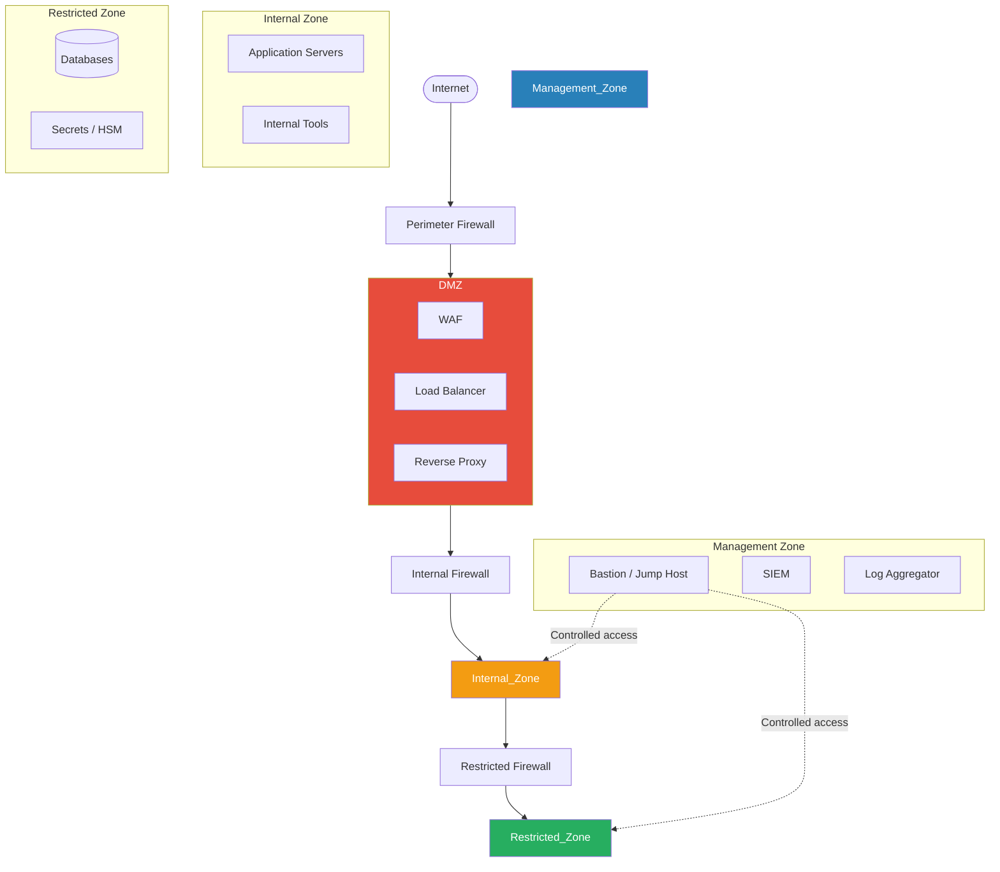
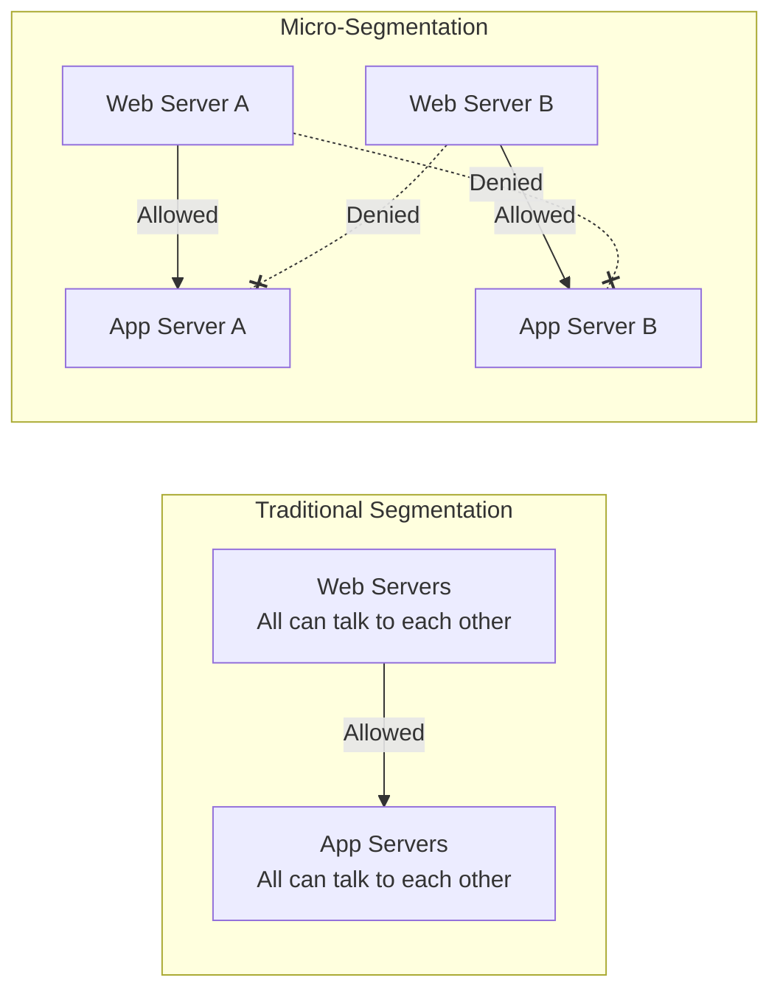
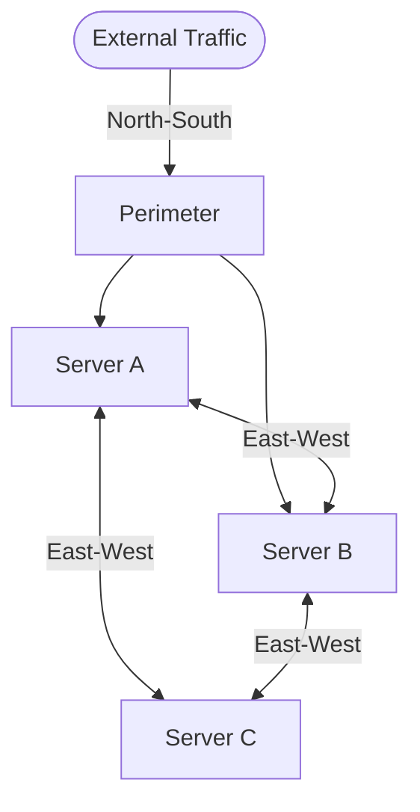
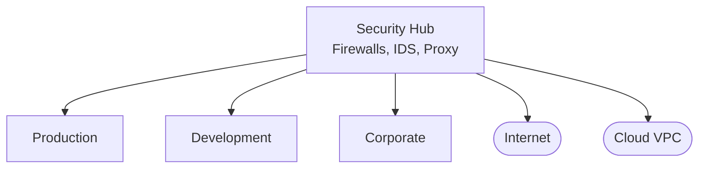
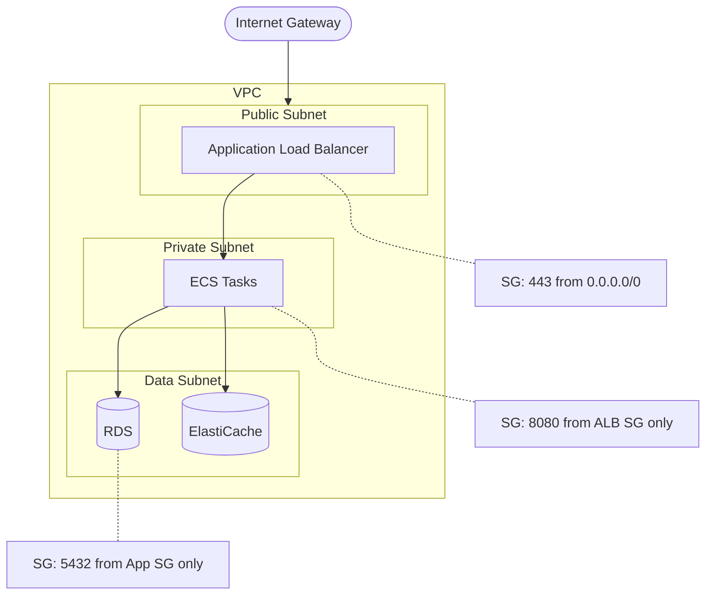

# Network Security Architecture

## What It Is

Network security architecture is the design of network infrastructure to control traffic flow, isolate systems by trust level, and detect/prevent malicious activity. It defines where security boundaries exist, what can talk to what, and how traffic is inspected.

## Why It Matters

Networks are how attackers move. Even if they compromise a single endpoint, network architecture determines whether they can reach the database, pivot to other systems, or exfiltrate data. Good network security architecture limits blast radius — a compromised web server shouldn't mean a compromised everything.

## Key Concepts

### Network Zones and Segmentation

The foundation of network security is dividing the network into zones based on trust level:

| Zone | Trust Level | Purpose | Access Rules |
|------|-------------|---------|-------------|
| **DMZ** | Low | Internet-facing services | Inbound from internet (restricted ports), outbound to internal (specific services only) |
| **Internal** | Medium | Application servers, business logic | No direct internet access, accepts traffic from DMZ |
| **Restricted** | High | Databases, secrets, sensitive data | Only accepts traffic from specific internal hosts on specific ports |
| **Management** | High | Admin tools, logging, monitoring | Isolated from all other zones except via bastion/jump host |

### Firewall Architecture

#### Types of Firewalls

| Type | OSI Layer | Capability | Use Case |
|------|-----------|-----------|----------|
| Packet filter | L3-L4 | IP, port, protocol rules | Basic perimeter, high throughput |
| Stateful inspection | L3-L4 | Tracks connection state | Standard perimeter firewall |
| Application firewall (NGFW) | L3-L7 | Deep packet inspection, app awareness | Enterprise perimeter, internal segmentation |
| Web Application Firewall (WAF) | L7 | HTTP-specific rules (SQLi, XSS, etc.) | In front of web applications |
| Host-based firewall | L3-L4 | Per-host rules | Endpoint protection, micro-segmentation |

#### Firewall Rule Design Principles

1. **Default deny** — Block everything, then allow specific traffic. Never default allow
2. **Least privilege** — Allow only the minimum ports, protocols, and sources required
3. **Direction matters** — Ingress and egress rules serve different purposes. Don't forget egress filtering
4. **Log denied traffic** — Denied connections are security intelligence
5. **Review regularly** — Stale rules accumulate. Quarterly review minimum
6. **Rule order** — Most specific rules first, default deny last. One wrong order can bypass everything

### Micro-Segmentation

Traditional segmentation creates broad zones. Micro-segmentation controls traffic between individual workloads:

| Approach | Technology | Best For |
|----------|-----------|----------|
| VLAN-based | Network switches, 802.1Q | Traditional on-prem, broad segmentation |
| Software-defined | VMware NSX, Illumio | Data center micro-segmentation |
| Cloud-native | Security groups, NACLs, VPC firewall rules | Cloud workloads |
| Service mesh | Istio, Linkerd | Kubernetes, microservices |
| Host-based | iptables, Windows Firewall, eBPF | Per-host enforcement |

### North-South vs East-West Traffic

- **North-South**: Traffic entering or leaving the network (client to server). Traditionally where all security was focused
- **East-West**: Traffic moving laterally within the network (server to server). This is where modern attacks live — once an attacker gets in, they move laterally

**Key architectural insight**: Most organizations have excellent north-south visibility (perimeter firewalls, WAFs) but poor east-west visibility. An attacker who compromises one internal server can freely communicate with every other internal server. Micro-segmentation and east-west monitoring address this gap.

### DNS Security

DNS is often overlooked but critical:

| Threat | Description | Mitigation |
|--------|-------------|-----------|
| DNS spoofing/poisoning | Attacker redirects DNS responses to malicious IPs | DNSSEC validation, DNS over HTTPS/TLS |
| DNS tunneling | Data exfiltration through DNS queries | DNS monitoring, query length analysis, restrict external DNS |
| DNS as C2 channel | Malware uses DNS for command and control | DNS filtering, anomaly detection on query patterns |
| Typosquatting | Lookalike domains for phishing | DNS monitoring for brand variations, DMARC |

**Architecture recommendation**: Internal DNS resolvers that log all queries, forward to filtered upstream (Quad9, Cloudflare Gateway), block direct external DNS (port 53 egress), and alert on anomalous patterns.

### Network Monitoring & Detection

| Tool | Purpose | Placement |
|------|---------|-----------|
| IDS (Intrusion Detection System) | Passive monitoring, alerting | Network tap, span port |
| IPS (Intrusion Prevention System) | Inline blocking | Between network segments |
| Network TAP | Copy traffic for analysis | At key network boundaries |
| NetFlow/sFlow | Traffic metadata collection | Routers, switches |
| Full packet capture | Forensic analysis | High-value segments |
| NDR (Network Detection & Response) | ML-based anomaly detection | Core network |

### VPN vs ZTNA

The architectural shift from traditional VPN to Zero Trust Network Access:

| Aspect | Traditional VPN | ZTNA |
|--------|----------------|------|
| Trust model | Inside VPN = trusted network access | Per-application, per-request verification |
| Attack surface | Exposes entire network to VPN users | Exposes only authorized applications |
| Lateral movement | VPN user can scan/access internal network | No network-level access, only application-level |
| User experience | Tunnel all traffic, latency for cloud apps | Direct-to-cloud, split routing |
| Scalability | VPN concentrator bottleneck | Distributed edge, cloud-native |

## Architecture Patterns

### Hub-and-Spoke (On-Prem / Hybrid)

All traffic routes through the security hub for inspection. Simple but creates a bottleneck.

### Cloud-Native Segmentation (AWS Example)

## Common Mistakes

- **Flat networks** — Everything in one subnet with no segmentation. One compromise = total access
- **Security groups as the only control** — They're stateful and good, but combine with NACLs, WAF, and application-level auth for defense in depth
- **Forgetting egress filtering** — Everyone filters inbound traffic but lets everything out. Attackers exfiltrate through unrestricted egress
- **Over-trusting the management plane** — Management interfaces (SSH, RDP, admin consoles) often have weaker controls than production. Attackers target these
- **VPN = trusted** — VPN authenticates the user but shouldn't grant broad network access. Apply least privilege even for VPN users
- **Ignoring DNS** — DNS is the most common exfiltration and C2 channel, yet many organizations don't monitor DNS queries at all

## Cloud Context

| On-Prem Concept | AWS | Azure | GCP |
|-----------------|-----|-------|-----|
| Network zone | VPC + Subnets | VNet + Subnets | VPC + Subnets |
| Firewall rules | Security Groups + NACLs | NSGs + Azure Firewall | VPC Firewall Rules |
| Micro-segmentation | Security Groups per ENI | ASGs + NSGs | Network tags + Firewall rules |
| Load balancer | ALB/NLB | Azure Load Balancer / App Gateway | Cloud Load Balancing |
| Private connectivity | PrivateLink, VPC Endpoints | Private Endpoints | Private Service Connect |
| DNS | Route 53 Resolver | Azure DNS Private Zones | Cloud DNS |
| VPN / Direct | Site-to-Site VPN, Direct Connect | VPN Gateway, ExpressRoute | Cloud VPN, Interconnect |
| DDoS protection | Shield Standard/Advanced | DDoS Protection | Cloud Armor |

## Interview Angle

When asked about network security architecture:
- Start with **segmentation** — it's the foundation of everything else
- Explain **north-south vs east-west** — shows you think beyond the perimeter
- Discuss the **VPN to ZTNA transition** — relevant to every modern organization
- Mention **defense in depth** through layers: WAF -> firewall -> security groups -> host firewall -> application auth
- Address **cloud differences**: "In cloud, the network is software-defined, which means segmentation is easier to implement but also easier to misconfigure. Security groups are powerful but one overly permissive rule can expose a database to the internet"
- Know your **protocols**: TLS 1.3, IPsec, WireGuard, mTLS

## Further Reading

- [NIST SP 800-41: Guidelines on Firewalls and Firewall Policy](https://csrc.nist.gov/publications/detail/sp/800-41/rev-1/final)
- [NIST SP 800-125B: Secure Virtual Network Configuration](https://csrc.nist.gov/publications/detail/sp/800-125b/final)
- [AWS VPC Security Best Practices](https://docs.aws.amazon.com/vpc/latest/userguide/vpc-security-best-practices.html)
- [Zero Trust Network Access (Gartner)](https://www.gartner.com/en/information-technology/glossary/zero-trust-network-access-ztna)
