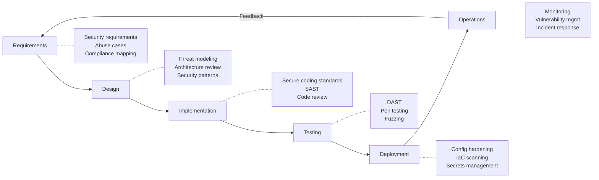
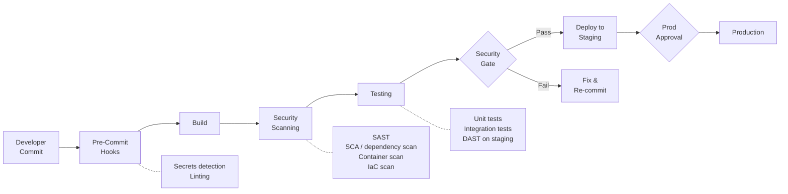

# Secure SDLC

## What It Is

The Secure Software Development Lifecycle (SSDLC) integrates security activities into every phase of software development — from requirements through deployment and maintenance. Instead of bolting security on at the end with a pen test, you build it in from day one.

## Why It Matters

Finding a security flaw in design costs almost nothing to fix. Finding it in production costs incident response, customer notification, reputation damage, and potentially regulatory fines. The math is simple: shift security left, and you spend less time, money, and stress fixing problems.

The industry calls this "shift left" — but the real goal is **shift everywhere**. Security doesn't belong in one phase. It belongs in all of them.

## Key Concepts

### Security Activities Per Phase

### Phase Breakdown

#### 1. Requirements

| Activity | Description |
|----------|-------------|
| Security requirements | Define what "secure" means for this feature — authentication, authorization, encryption, audit logging |
| Abuse cases | "As an attacker, I want to..." — the evil twin of user stories |
| Compliance mapping | Which regulations apply? GDPR, HIPAA, PCI DSS, SOC 2? Map requirements to controls |
| Data classification | What data will this feature handle? What's the sensitivity level? |

**Example**: A new user registration feature needs:
- Password complexity requirements (security req)
- Rate limiting on registration endpoint (abuse case: account spam)
- PII handling per GDPR (compliance)
- Email and name classified as PII (data classification)

#### 2. Design

| Activity | Description |
|----------|-------------|
| Threat modeling | STRIDE analysis of the proposed architecture. Identify threats at trust boundaries |
| Security architecture review | Does the design follow security patterns? Are there known anti-patterns? |
| Security design patterns | Apply patterns: input validation, output encoding, parameterized queries, least privilege |
| Dependency review | What libraries/services will be used? Are they maintained? Known vulnerabilities? |

#### 3. Implementation

| Activity | Description |
|----------|-------------|
| Secure coding standards | Language-specific rules the team follows (OWASP guidelines, no eval(), parameterized queries only) |
| SAST (Static Analysis) | Automated code scanning in IDE and CI — catches common bugs before code is merged |
| Peer code review | Security-focused review checklist: auth, input validation, error handling, logging |
| Secrets management | No hardcoded secrets. Use environment injection or secrets manager |

#### 4. Testing

| Activity | Description |
|----------|-------------|
| DAST (Dynamic Analysis) | Automated scanning of the running application — finds runtime vulnerabilities |
| Penetration testing | Manual testing by security professionals for complex logic flaws |
| Fuzzing | Throw random/malformed input at parsers and APIs to find crashes and edge cases |
| Security regression tests | Automated tests for previously found vulnerabilities — make sure they stay fixed |

#### 5. Deployment

| Activity | Description |
|----------|-------------|
| Infrastructure as Code scanning | Terraform/CloudFormation reviewed for misconfigurations before apply |
| Container image scanning | Scan for known CVEs in base images and dependencies |
| Configuration hardening | Production configs reviewed: TLS settings, headers, debug mode off, error messages generic |
| Deployment approval gates | Security sign-off for production deployments of high-risk changes |

#### 6. Operations

| Activity | Description |
|----------|-------------|
| Monitoring & alerting | Security-relevant events flowing to SIEM with detection rules |
| Vulnerability management | Continuous scanning, SLA-based patching (critical: 24h, high: 7d, medium: 30d) |
| Incident response | Runbooks for common scenarios, on-call rotation, communication plans |
| Post-incident review | Blameless postmortems that feed back into requirements for the next cycle |

### CI/CD Pipeline Security Integration

### Tooling by Phase

| Phase | Tool Category | Examples |
|-------|--------------|---------|
| Pre-commit | Secrets detection | Gitleaks, TruffleHog |
| Build | SAST | Semgrep, SonarQube, CodeQL |
| Build | SCA (dependency scan) | Snyk, Dependabot, Trivy |
| Build | Container scan | Trivy, Grype, Anchore |
| Build | IaC scan | Checkov, tfsec, KICS |
| Test | DAST | OWASP ZAP, Burp Suite, Nuclei |
| Test | Fuzzing | AFL++, libFuzzer, Atheris |
| Runtime | RASP / monitoring | Falco, Datadog ASM |

## Maturity Model

Not every org starts at the same level. Here's a realistic progression:

| Level | Characteristics | Typical Activities |
|-------|----------------|-------------------|
| **1 — Ad Hoc** | No formal security in SDLC. Pen test before launch (maybe) | Reactive only — fix vulns when found in production |
| **2 — Repeatable** | Some security activities defined but inconsistently applied | SAST in CI, annual pen test, basic secure coding training |
| **3 — Defined** | Security integrated into every phase with clear ownership | Threat modeling for new features, SCA enforced, security champions program |
| **4 — Managed** | Metrics-driven, security gates enforced, continuous improvement | Vulnerability SLA tracking, automated security regression tests, risk-based deployment gates |
| **5 — Optimizing** | Proactive, threat-informed, security as a competitive advantage | Red team exercises, bug bounty, security chaos engineering, industry contribution |

Most orgs should aim for **Level 3** as a baseline. Level 5 is aspirational for most.

## Common Mistakes

- **"We'll pen test it later"** — Pen testing catches implementation bugs, not design flaws. A pen test can't tell you that you chose the wrong authentication model
- **Tool overload** — Running 8 scanners that produce 5,000 findings nobody triages. Start with one good SAST and one SCA tool, triage everything, then expand
- **Security as a gate, not a partner** — If security only shows up to say "no" at the end, developers route around them. Embed security in the team
- **Ignoring the feedback loop** — Production incidents should feed back into requirements. If the same vulnerability class keeps appearing, fix the root cause (training, tooling, design patterns)
- **One-size-fits-all** — A prototype doesn't need the same rigor as a payment system. Risk-based approach: more security for higher-risk features

## Cloud Context

Cloud-native SDLC adds:
- **Infrastructure as Code** is code — scan it like application code (Checkov, tfsec)
- **Immutable deployments** — don't patch production, deploy a new version. This simplifies the security model
- **Ephemeral environments** — spin up a full environment per PR for DAST, tear it down after
- **Supply chain** — container base images and Lambda layers are dependencies too. Scan them
- **Serverless** — no OS to patch, but IAM permissions and function configurations become the attack surface

## Interview Angle

When asked about Secure SDLC:
- Don't just list phases — explain the **value of each** and what happens when you skip it
- Mention **shift left but also shift everywhere** — security in operations matters too
- Talk about **developer experience**: security tools should be fast, low-noise, and integrated into workflows devs already use
- Address **maturity**: "I'd assess where the org is today and build a roadmap to Level 3 within 12 months"
- Know the **economics**: "A design flaw caught in threat modeling costs a meeting to fix. The same flaw in production costs an incident response"

## Further Reading

- [OWASP SAMM (Software Assurance Maturity Model)](https://owaspsamm.org/)
- [NIST SSDF (Secure Software Development Framework)](https://csrc.nist.gov/Projects/ssdf)
- [Microsoft SDL](https://www.microsoft.com/en-us/securityengineering/sdl)
- [CISA Secure by Design](https://www.cisa.gov/securebydesign)
