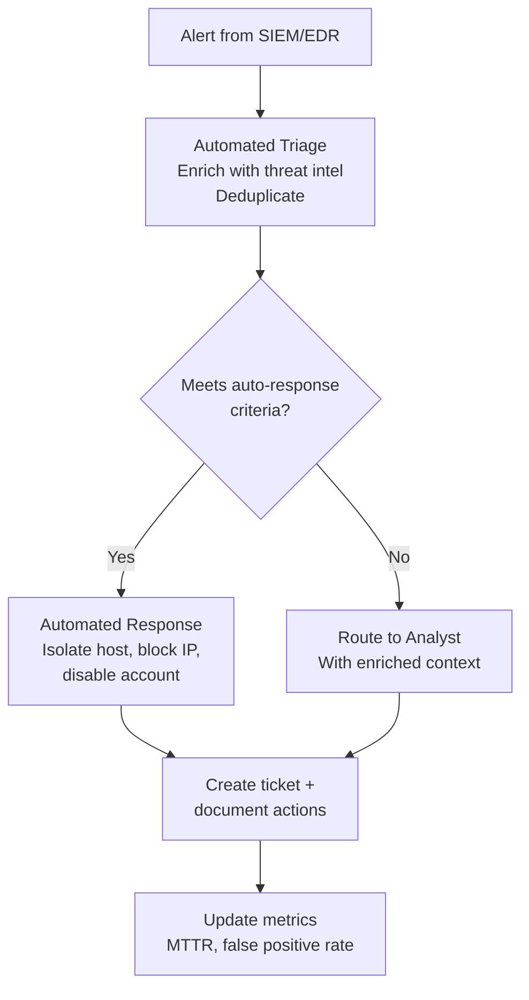
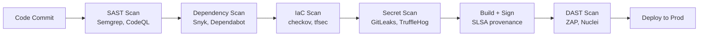

# Security Automation and Orchestration

## What It Is

Security automation and orchestration is the practice of using code, tools, and workflows to automate repetitive security tasks, coordinate response across tools, and enforce security policies programmatically. It spans three domains: **SOAR** (Security Orchestration, Automation, and Response) for incident workflows, **infrastructure-as-code security** for preventing misconfigurations before deployment, and **CI/CD pipeline security** for embedding security into the software delivery process.

## Why It Matters

Security teams are outnumbered. The ratio of security staff to developers at most organizations is 1:100 or worse. Manual security reviews, incident triage, and compliance checks do not scale. Automation is the force multiplier that lets a small security team cover an enterprise. Beyond efficiency, automation reduces human error — the #1 cause of security incidents. As a security architect, your job is to design systems where security controls execute automatically, consistently, and without human bottleneck.

## Key Concepts

### SOAR — Security Orchestration, Automation, and Response

SOAR platforms connect your security tools and automate incident response workflows. They turn manual runbooks into executable playbooks.

**Common SOAR playbooks:**
- **Phishing response** — Extract indicators from reported email, check reputation, block sender, remove from all mailboxes
- **Malware alert triage** — Pull EDR telemetry, check file hash against threat intel, isolate host if confirmed
- **Failed login spike** — Correlate with geo data, check against impossible travel, lock account if suspicious
- **Vulnerability notification** — New critical CVE published, scan for affected assets, create patching tickets automatically

**SOAR tools:** Palo Alto XSOAR, Tines, Shuffle (open source), Splunk SOAR, Microsoft Sentinel playbooks (Logic Apps)

### Infrastructure-as-Code Security

IaC security scanning catches misconfigurations before they reach production. Shift-left means finding the security issue in the pull request, not in a production audit.

| Tool | What It Scans | How It Works |
|------|--------------|-------------|
| **tfsec / Trivy** | Terraform | Static analysis of HCL for misconfigurations (public S3, open security groups) |
| **checkov** | Terraform, CloudFormation, Kubernetes, Dockerfiles | Policy-as-code checks against CIS benchmarks and custom rules |
| **cfn-nag** | CloudFormation | AWS-specific template linting for insecure patterns |
| **OPA / Rego** | Any structured data | General-purpose policy engine — write custom rules for anything |
| **Terraform Sentinel** | Terraform Enterprise | HashiCorp's policy-as-code framework for Terraform workflows |
| **KICS** | Multiple IaC formats | Open-source, broad format support, CWE-mapped findings |

**What to scan for:**
- Public cloud storage (S3 buckets, Azure blobs with public access)
- Overly permissive IAM policies (`*:*` actions or resources)
- Unencrypted storage and databases
- Security groups with `0.0.0.0/0` ingress on sensitive ports
- Missing logging and monitoring configuration
- Hardcoded secrets in templates

### CI/CD Pipeline Security

The CI/CD pipeline is both an attack surface and a control point. Compromise the pipeline, and you compromise everything it deploys.

**Pipeline security controls:**
- **Secret management** — Never store secrets in code or CI variables. Use Vault, AWS Secrets Manager, or OIDC for just-in-time credentials
- **Supply chain integrity** — Sign artifacts, verify dependencies, generate SBOMs, follow SLSA framework levels
- **Least privilege runners** — CI runners should have minimal permissions. Ephemeral runners are preferred over persistent ones
- **Branch protection** — Require reviews, status checks, and signed commits before merge to main
- **Audit logging** — Log all pipeline executions, who triggered them, and what was deployed

### Detection-as-Code and Policy-as-Code

These patterns treat security rules the same way developers treat application code: version-controlled, peer-reviewed, tested, and deployed through CI/CD.

| Pattern | What It Codifies | Tools |
|---------|-----------------|-------|
| **Detection-as-code** | SIEM detection rules, alert logic | Sigma rules, Splunk SPL in Git, Elastic detection rules |
| **Policy-as-code** | Infrastructure and access policies | OPA/Rego, Sentinel, AWS SCPs, Azure Policy |
| **Compliance-as-code** | Regulatory controls and benchmarks | InSpec, Prowler, ScoutSuite |
| **Response-as-code** | Incident response playbooks | SOAR playbooks, Lambda-based auto-remediation |

**Why this matters:** When detection logic lives in a wiki or a SIEM GUI, it has no version history, no peer review, and no testing. When it lives in Git, you get all three. A security team that treats its rules as code can move faster, make fewer mistakes, and audit changes over time.

## Common Mistakes

- **Automating without understanding** — If you don't understand the manual process, you'll automate the wrong thing. Document the runbook first, then automate it
- **No human-in-the-loop for destructive actions** — Auto-isolating a host is fine. Auto-deleting data or auto-blocking a CEO's account needs human approval
- **Ignoring false positive rates** — An automated playbook that fires 500 times a day on false positives trains the team to ignore it. Tune before automating
- **Pipeline security as an afterthought** — Adding security scans that block the pipeline without developer buy-in causes developers to find workarounds. Integrate early, provide clear fix guidance
- **Secret sprawl in CI/CD** — Long-lived credentials stored as pipeline variables are breach magnets. Use OIDC and short-lived tokens instead
- **One giant playbook** — Monolithic SOAR playbooks are hard to debug and maintain. Build modular, composable playbooks with clear inputs and outputs

## Cloud Context

| Automation Capability | AWS | Azure | GCP |
|----------------------|-----|-------|-----|
| SOAR / automated response | Lambda + EventBridge + Step Functions | Logic Apps + Sentinel playbooks | Cloud Functions + Pub/Sub |
| IaC policy enforcement | AWS Config rules, CloudFormation Guard | Azure Policy, Blueprints | Organization Policy, Config Connector |
| Secret management | Secrets Manager, Systems Manager Parameter Store | Key Vault | Secret Manager |
| CI/CD security | CodePipeline + CodeBuild, OIDC for GitHub Actions | Azure DevOps Pipelines, OIDC | Cloud Build, Workload Identity Federation |
| Compliance scanning | AWS Config conformance packs, Prowler | Microsoft Defender for Cloud | Security Command Center, Forseti |

## Interview Angle

When asked about security automation:
- Frame automation as a **scaling strategy**, not a technology choice — "How do 5 security engineers cover 2,000 developers?"
- Walk through a **concrete SOAR playbook** — phishing response is the most universally relatable example
- Discuss **shift-left IaC scanning** — show you understand that catching a misconfigured security group in a PR is cheaper than finding it in production
- Mention **detection-as-code** — it signals modern security engineering maturity

**Sample answer structure**: "I approach security automation at three layers. First, infrastructure-as-code security — scanning Terraform and CloudFormation in CI/CD with tools like checkov and tfsec so misconfigurations never reach production. Second, pipeline security — secret scanning, dependency analysis, artifact signing, and OIDC-based authentication so the pipeline itself isn't an attack vector. Third, SOAR for incident response — automated playbooks that enrich alerts with threat intelligence, take containment actions for high-confidence detections, and route complex cases to analysts with full context. The key principle is automating the repeatable parts so human analysts spend time on judgment calls, not copy-paste triage."

**Follow-up you should be ready for:** "How do you decide what to automate vs. keep manual?" Answer: Automate high-frequency, low-ambiguity tasks where the decision criteria are clear (known malware hash = isolate). Keep human-in-the-loop for low-frequency, high-impact decisions (terminating a VPN tunnel, revoking admin access) and for novel attack patterns that require investigation.

## Further Reading

- [NIST SP 800-204C: Implementation of DevSecOps for Microservices-based Applications](https://csrc.nist.gov/publications/detail/sp/800-204c/final)
- [SLSA Framework — Supply Chain Levels for Software Artifacts](https://slsa.dev/)
- [Open Policy Agent (OPA) Documentation](https://www.openpolicyagent.org/docs/latest/)
- [Sigma Rules — Generic Signature Format for SIEM Systems](https://github.com/SigmaHQ/sigma)
