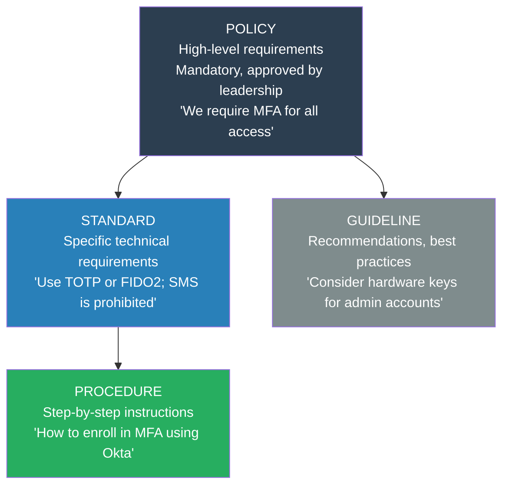
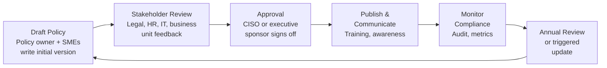

# Security Policy Development

## What It Is

Security policy development is the process of creating, maintaining, and governing the documents that define an organization's security expectations, requirements, and rules. Policies are the foundation of a security program — they establish what the organization requires, why, and what happens when requirements aren't met. Without formal policies, security controls lack authority and enforceability.

## Why It Matters

Policies are the connective tissue between business leadership and technical implementation. They translate executive risk decisions into actionable requirements that teams can implement. During audits (SOC 2, ISO 27001, PCI DSS), the first thing assessors ask for is your policy library. During incidents, policies define authority and escalation paths. During vendor negotiations, policies define your security requirements. A security architect who can write clear, enforceable policies bridges the gap between governance and engineering — a rare and valuable skill.

## Key Concepts

### The Policy Hierarchy

Security documentation follows a hierarchy from abstract to specific. Each level serves a different audience and purpose.

| Level | Audience | Authority | Change Frequency |
|-------|----------|-----------|-----------------|
| **Policy** | All employees, leadership | Mandatory — approved by CISO/executive | Annually or on major change |
| **Standard** | IT, security, engineering teams | Mandatory — defines specific implementations | Quarterly to annually |
| **Procedure** | Operators, support staff | Mandatory for covered tasks | As processes change |
| **Guideline** | Anyone seeking best practices | Advisory — recommended, not enforced | As needed |

### Core Security Policies

Every security program needs these foundational policies. The exact names vary by organization, but the coverage areas are universal.

| Policy | What It Covers | Why It Matters |
|--------|---------------|---------------|
| **Acceptable Use Policy (AUP)** | How employees may use company systems, data, and networks | Sets behavioral expectations; basis for disciplinary action |
| **Access Control Policy** | Who gets access to what, under what conditions, and how access is granted/revoked | Foundation for least privilege and zero trust |
| **Information Classification Policy** | Data categories (public, internal, confidential, restricted) and handling requirements per level | Without classification, you can't apply appropriate controls |
| **Incident Response Policy** | What constitutes an incident, who responds, escalation paths, communication requirements | Defines authority and expectations during crisis |
| **Data Retention and Disposal** | How long data is kept and how it's securely destroyed | Regulatory compliance (GDPR, HIPAA) and reducing breach impact |
| **Vendor/Third-Party Risk Policy** | Security requirements for third-party vendors and service providers | Supply chain risk management |
| **Change Management Policy** | How changes to production systems are requested, approved, tested, and deployed | Prevents unauthorized or untested changes |
| **Password and Authentication Policy** | Password requirements, MFA mandates, credential management | Most basic security control; still commonly misconfigured |
| **Encryption Policy** | What must be encrypted, which algorithms are approved, key management requirements | Ensures consistent data protection across the org |
| **Business Continuity / DR Policy** | RTO/RPO requirements, backup mandates, recovery testing cadence | Ensures the org can survive major incidents |

### Writing Effective Policies

**Good policies share these characteristics:**

- **Clear audience** — State who the policy applies to. "All employees" vs. "engineering staff" vs. "system administrators" — different policies target different groups
- **Enforceable requirements** — Use "must" and "shall" for mandatory items. Avoid vague language like "should consider" in policy documents (save that for guidelines)
- **Measurable compliance** — If you can't verify whether someone is following the policy, it's unenforceable. "MFA is required" is measurable. "Use strong passwords" is not
- **Exception process** — Every policy needs an exception mechanism. No security policy survives contact with every business use case. Define who can approve exceptions, for how long, and what compensating controls are required
- **Review cadence** — Specify when the policy will be reviewed. Annual review at minimum, with triggered reviews for regulatory changes, major incidents, or organizational changes

**Policy anti-patterns to avoid:**
- **Write-once-forget** — Policies written for an audit and never updated become shelf-ware. They drift from reality and become useless
- **Impossibly strict** — Policies that no one can realistically follow train people to ignore policies entirely. If everyone violates the policy, the policy is wrong
- **Copy-paste from templates** — Generic policies that don't reflect your actual organization, technology, or risk profile. Auditors spot this immediately
- **No enforcement mechanism** — A policy without consequences for non-compliance is a suggestion
- **Too granular** — Policies should state requirements, not implementation details. Implementation specifics belong in standards and procedures

### Policy Governance

**Governance elements:**
- **Policy owner** — Every policy must have a named individual (not a team) responsible for its accuracy and currency
- **Review board** — Cross-functional group (security, legal, HR, IT, business) that reviews and approves policies
- **Exception register** — Centralized log of all active policy exceptions with owner, justification, compensating controls, and expiration date
- **Compliance tracking** — How you measure whether the policy is being followed (audit results, automated checks, attestations)
- **Communication plan** — How new or updated policies are communicated to affected parties. A policy nobody reads is a policy nobody follows

## Common Mistakes

- **No executive sponsorship** — Security policies without leadership backing have no authority. The CISO or CTO must sign and sponsor them
- **Policies that don't match reality** — If your password policy says 16 characters but your systems enforce 8, the policy is fiction. Align policy with actual controls
- **Too many policies** — Policy bloat makes it impossible for employees to know what's expected. Consolidate where possible, keep the total manageable
- **No training or communication** — Publishing a policy on the intranet and assuming everyone has read it is negligent. Policies require active communication and periodic awareness reinforcement
- **Standards and procedures mixed into policies** — Policies should not contain technical implementation details. Those belong in standards and procedures. Mixing them creates documents that need updating every time a tool changes
- **Ignoring the exception process** — Treating exceptions as failures instead of managing them formally. Exceptions with compensating controls are better than shadow non-compliance

## Interview Angle

When asked about security policy:
- Start with the **policy hierarchy** — show you understand the difference between policies, standards, procedures, and guidelines
- Discuss **enforceability** — the difference between a policy that works and one that's shelf-ware
- Mention **governance** — review cadence, exception processes, and compliance tracking show organizational maturity
- Give a **concrete example** — walk through how you'd write or update a specific policy (access control is a good universal example)

**Sample answer structure**: "Security policies operate in a hierarchy: policies set the 'what' and 'why' at a leadership level, standards define the 'how' with specific technical requirements, procedures give step-by-step instructions, and guidelines offer recommendations. The critical properties of effective policies are enforceability, measurability, and a built-in review cycle. Every policy needs an exception process — because rigid policies with no escape valve get ignored. I focus on keeping policies concise and aligned with actual practice. A policy that says one thing while the organization does another is worse than no policy, because it creates a false sense of compliance. I've found that the most impactful improvement to any policy program is establishing a formal annual review cycle with cross-functional stakeholder input."

**Follow-up you should be ready for:** "How do you handle a situation where a business unit can't comply with a security policy?" Answer: Use the exception process. The business unit documents why they can't comply, proposes compensating controls, and gets approval from the policy owner with a defined expiration date. The exception goes into a tracked register and is reviewed at each policy review cycle. If a policy consistently generates exceptions from the same requirement, that's a signal the policy needs updating — not that the business is failing.

## Further Reading

- [NIST SP 800-12: An Introduction to Information Security (Policy Framework)](https://csrc.nist.gov/publications/detail/sp/800-12/rev-1/final)
- [SANS Information Security Policy Templates](https://www.sans.org/information-security-policy/)
- [ISO 27001 Clause 5.2: Information Security Policy](https://www.iso.org/standard/27001)
- [CIS Controls v8: Governance Safeguards](https://www.cisecurity.org/controls)
