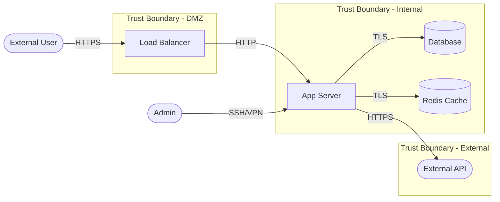
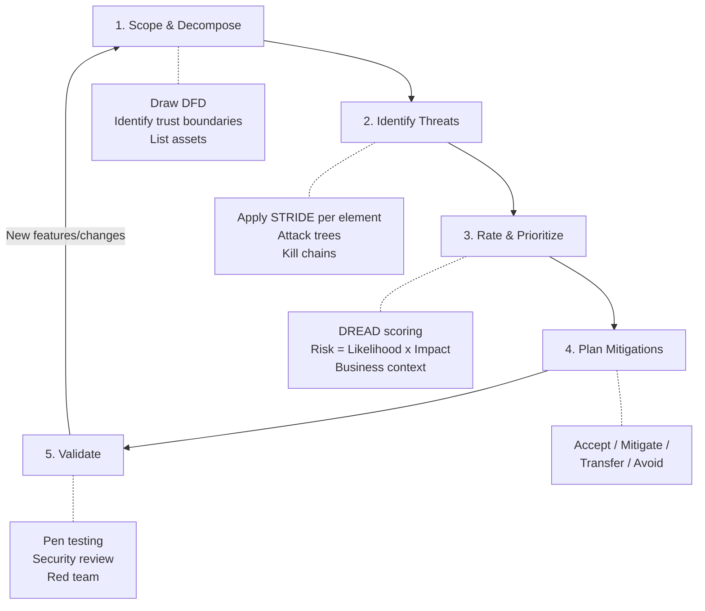

# Threat Modeling

## What It Is

Threat modeling is the structured process of identifying what can go wrong in a system, how likely it is, and what to do about it. It's how security architects turn vague concerns ("is this secure?") into concrete, prioritized action items.

## Why It Matters

You can't secure what you haven't analyzed. Threat modeling forces you to think like an attacker *before* you build — or before an attacker does it for you. It's the single highest-ROI security activity because finding a design flaw during architecture review is 100x cheaper than finding it in production.

## Key Concepts

### The Four Questions (Adam Shostack)

Every threat model answers these four questions:

1. **What are we working on?** — System diagram, data flows, trust boundaries
2. **What can go wrong?** — Threats, attack vectors, abuse cases
3. **What are we going to do about it?** — Mitigations, controls, risk acceptance
4. **Did we do a good enough job?** — Validation, testing, review

### STRIDE Threat Categories

STRIDE is the most widely used framework for categorizing threats:

| Category | Description | Example | Typical Mitigation |
|----------|-------------|---------|-------------------|
| **S**poofing | Pretending to be someone/something else | Stolen credentials, forged tokens | Authentication, MFA, certificate pinning |
| **T**ampering | Modifying data or code without authorization | SQL injection, MITM, binary patching | Integrity checks, signing, input validation |
| **R**epudiation | Denying an action took place | Deleting logs, unsigned transactions | Audit logging, digital signatures, timestamps |
| **I**nformation Disclosure | Exposing data to unauthorized parties | Data leaks, verbose errors, side channels | Encryption, access controls, data classification |
| **D**enial of Service | Making a system unavailable | DDoS, resource exhaustion, crash bugs | Rate limiting, redundancy, input validation |
| **E**levation of Privilege | Gaining higher access than authorized | Privilege escalation, IDOR, broken auth | Least privilege, RBAC, authorization checks |

### Data Flow Diagram (DFD)

The foundation of any threat model. Map your system's components and data flows:

**Key elements:**
- **External entities** (users, external APIs) — anything outside your control
- **Processes** (app server, workers) — where data is processed
- **Data stores** (databases, caches, file systems) — where data lives
- **Data flows** (arrows) — how data moves between components
- **Trust boundaries** (dotted lines) — where trust level changes. Threats cluster at these boundaries

### Threat Modeling Process

### Risk Rating: DREAD

For each identified threat, score 1-10 on:

| Factor | Question |
|--------|----------|
| **D**amage | How bad is it if the attack succeeds? |
| **R**eproducibility | How easy is it to reproduce? |
| **E**xploitability | How much skill/effort to exploit? |
| **A**ffected Users | How many users are impacted? |
| **D**iscoverability | How easy is it to find the vulnerability? |

**Risk Score** = Average of DREAD factors. Use it to prioritize, not as an absolute truth.

## Walkthrough: Threat Modeling a REST API

Let's threat model a user authentication API:

**System**: REST API with JWT authentication, PostgreSQL backend, Redis session cache

**Trust boundaries crossed**: Internet -> API Gateway -> App Server -> Database

| # | Threat (STRIDE) | Attack | Risk | Mitigation |
|---|----------------|--------|------|------------|
| 1 | Spoofing | Credential stuffing against /login | High | Rate limiting, MFA, breached password check |
| 2 | Spoofing | JWT token theft via XSS | High | HttpOnly cookies, short expiry, token binding |
| 3 | Tampering | JWT algorithm confusion (none/HS256) | Critical | Validate algorithm server-side, use RS256 |
| 4 | Tampering | Mass assignment on user update endpoint | Medium | Explicit allowlists on input fields |
| 5 | Repudiation | No logging of failed auth attempts | Medium | Structured auth event logging to SIEM |
| 6 | Info Disclosure | Username enumeration via login error messages | Low | Generic error messages, same response time |
| 7 | Info Disclosure | JWT payload contains sensitive data | Medium | Minimize claims, never put secrets in JWT |
| 8 | DoS | Account lockout abuse (lock legitimate users) | Medium | Progressive delays instead of hard lockout |
| 9 | Elevation of Privilege | IDOR on /users/{id} endpoint | High | Authorization check on every request, not just auth |

## Common Mistakes

- **Analysis paralysis** — Spending weeks on a perfect threat model instead of an actionable one. Time-box it. A 2-hour threat model is infinitely better than none
- **Only modeling new systems** — Existing systems accumulate risk. Threat model them too, especially before major changes
- **No follow-through** — A threat model without tracked mitigations is just a scary document. Every finding needs an owner and a deadline
- **Too abstract** — "An attacker could do bad things" isn't a threat. Be specific: who, what, how, and what's the impact
- **Skipping trust boundaries** — This is where most threats live. If you haven't identified trust boundaries, you haven't really threat modeled

## Cloud Context

Cloud threat modeling adds these considerations:

- **Shared responsibility boundaries** are trust boundaries — model them explicitly
- **IAM misconfigurations** are the #1 cloud threat. STRIDE them as Elevation of Privilege
- **Data residency and sovereignty** — where does your data physically live?
- **Supply chain** — your cloud provider's dependencies are your dependencies
- **Multi-tenancy** — can one tenant affect another? Data isolation is a trust boundary

## Interview Angle

When asked about threat modeling:
- Walk through the **four questions** or **STRIDE** — shows structured thinking
- Use a concrete example. "Let me threat model a basic e-commerce checkout flow..."
- Mention **when** to threat model: design phase (proactive), before major changes (reactive), and periodically (maintenance)
- Address the **human side**: getting engineering teams to participate, making it practical not bureaucratic
- Know the difference between **threat modeling** (architectural, design-time) and **vulnerability scanning** (implementation, runtime)

**Red flag answers to avoid**:
- "We use a tool for that" — tools help, but threat modeling is fundamentally a thinking exercise
- "We do it once during design" — it should be continuous
- "The security team does the threat model" — it should involve developers, architects, and product owners

## Further Reading

- [OWASP Threat Modeling](https://owasp.org/www-community/Threat_Modeling)
- [Adam Shostack - Threat Modeling: Designing for Security](https://shostack.org/books/threat-modeling-book)
- [Microsoft STRIDE](https://learn.microsoft.com/en-us/azure/security/develop/threat-modeling-tool-threats)
- [MITRE ATT&CK](https://attack.mitre.org/) — for mapping threats to real-world TTPs
