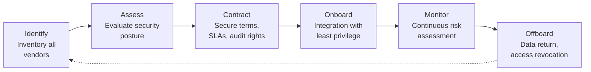

# Vendor Risk Management

## What It Is

Vendor risk management (VRM) is the process of identifying, assessing, monitoring, and mitigating security risks introduced by third-party vendors, suppliers, and service providers. Every external dependency — from your cloud provider to the SaaS tool your marketing team signed up for — extends your attack surface. VRM ensures that third-party risk is managed with the same rigor as internal risk.

## Why It Matters

You are only as secure as your weakest vendor. The most impactful breaches of the last decade — SolarWinds, Kaseya, MOVEit, Okta — were supply chain compromises. Attackers target vendors because one compromised vendor can unlock access to thousands of downstream organizations. Regulators know this too — SOC 2, ISO 27001, PCI DSS, and most cybersecurity frameworks now require formal third-party risk management. As a security architect, you need to design architectures that limit vendor blast radius and ensure contractual security obligations are enforceable.

## Key Concepts

### Third-Party Risk Lifecycle

### Vendor Assessment Methods

| Method | What It Covers | Depth | Effort |
|--------|---------------|-------|--------|
| **SIG Questionnaire** | Standardized assessment (Shared Assessments) — 18 risk domains, 800+ questions | Comprehensive | High — vendor must complete; you must review |
| **CAIQ (CSA)** | Cloud-specific controls, maps to CCM (Cloud Controls Matrix) | Cloud-focused | Medium — structured, good for SaaS evaluation |
| **SOC 2 Type II Report** | Independent auditor's assessment of controls over 6-12 months | Operational evidence | Low — read the report, focus on exceptions and complementary user controls |
| **ISO 27001 Certificate** | Confirms vendor has a certified ISMS | Broad but surface-level | Low — check scope, certification body, and recertification date |
| **Penetration Test Report** | Technical assessment of external/internal attack surface | Deep technical | Medium — review scope, findings severity, remediation status |
| **SecurityScorecard / BitSight** | External risk rating based on publicly observable signals | Continuous, shallow | Low — automated, good for monitoring, not sufficient alone |

### Tiered Assessment Model

Not every vendor needs the same level of scrutiny. Tier vendors based on data access and business criticality.

| Tier | Criteria | Assessment Depth | Review Cadence |
|------|----------|-----------------|----------------|
| **Critical (Tier 1)** | Access to sensitive data, critical business process dependency, direct network access | Full SIG + SOC 2 + pentest review + on-site/virtual assessment | Annual |
| **High (Tier 2)** | Access to internal data, important but not critical business function | Abbreviated SIG + SOC 2 review | Annual |
| **Medium (Tier 3)** | Limited data access, replaceable service | Security questionnaire + ISO/SOC cert review | Every 2 years |
| **Low (Tier 4)** | No data access, no system integration | Self-attestation or external risk score only | On renewal |

### Contractual Security Controls

The contract is your enforcement mechanism. Without security terms in the contract, you have no recourse when a vendor fails to protect your data.

**Must-have contract clauses:**
- **Data handling obligations** — How vendor stores, processes, transmits, and deletes your data
- **Breach notification SLA** — Mandatory notification within 24-72 hours of a confirmed breach
- **Right to audit** — Your right to assess the vendor's security controls (directly or via third party)
- **Subprocessor notification** — Vendor must inform you before engaging subcontractors who access your data
- **Data return and deletion** — On contract termination, vendor returns all data and certifies destruction
- **Compliance requirements** — Vendor must maintain specific certifications (SOC 2, ISO 27001) throughout the contract
- **Liability and indemnification** — Financial responsibility in the event of a vendor-caused breach
- **Insurance requirements** — Minimum cyber insurance coverage

### Continuous Monitoring

Assessment-once-forget is the biggest failure pattern in vendor risk management. Vendor risk is dynamic — it changes with acquisitions, employee turnover, infrastructure changes, and new vulnerabilities.

**Continuous monitoring signals:**
- **External risk scores** — BitSight, SecurityScorecard, RiskRecon provide ongoing risk ratings
- **Breach intelligence** — Monitor for vendor mentions in breach databases, dark web, and threat feeds
- **Certificate and domain monitoring** — Expiring TLS certs, DNS changes, new subdomains
- **Financial health** — Vendor financial instability increases risk of cost-cutting on security
- **Compliance status** — SOC 2 report delays, ISO certification lapses, regulatory actions

## Common Mistakes

- **Checkbox compliance** — Collecting vendor questionnaires and filing them without actually reading or acting on the answers
- **Assess once, forget forever** — Doing the assessment at onboarding and never revisiting. Vendor risk changes constantly
- **Same assessment for every vendor** — Applying a 200-question SIG to a vendor that only provides office supplies wastes everyone's time. Tier your vendors
- **No contractual teeth** — Assessing vendor risk but failing to put enforceable security requirements in the contract
- **Ignoring fourth-party risk** — Your vendor uses vendors (subprocessors). A breach at their cloud provider is your problem too
- **Over-relying on external scores** — BitSight and SecurityScorecard measure externally observable signals. They cannot see internal controls, culture, or incident response capability. Use them as one input, not the whole assessment
- **Shadow IT as shadow vendors** — When business units sign up for SaaS tools with a credit card, those vendors bypass the VRM process entirely

## Cloud Context

Cloud environments amplify vendor risk because the cloud provider is your most critical vendor — and your SaaS stack runs on shared infrastructure.

| VRM Control | AWS | Azure | GCP |
|------------|-----|-------|-----|
| Compliance artifacts | AWS Artifact (SOC, ISO reports) | Service Trust Portal | Compliance Reports Manager |
| Shared responsibility | Shared Responsibility Model documentation | Shared Responsibility Matrix | Shared Responsibilities documentation |
| Subprocessor transparency | AWS sub-processor list | Microsoft subprocessor list | Google subprocessor list |
| Data residency controls | Region selection, S3 Object Lock | Azure Policy (allowed regions) | Organization Policy constraints |
| API access auditing | CloudTrail | Azure Activity Log | Cloud Audit Logs |

## Interview Angle

When asked about vendor risk management:
- Start with the **business reality** — every organization relies on third parties, and supply chain attacks are accelerating
- Walk through the **tiered assessment model** — it shows you can prioritize and scale the program, not just throw questionnaires at everyone
- Emphasize **contractual controls and continuous monitoring** — these are what separate mature VRM from checkbox exercises
- Mention a **real supply chain incident** (SolarWinds, MOVEit) to ground the discussion in practical consequences

**Sample answer structure**: "I'd structure a vendor risk program around three pillars. First, tiered assessment — classify vendors by data access and business criticality, then match assessment depth to tier. Critical vendors get full SIG questionnaires and SOC 2 reviews; low-risk vendors get self-attestation. Second, contractual enforcement — every vendor agreement includes breach notification SLAs, right to audit, data handling obligations, and subprocessor notification requirements. Third, continuous monitoring — supplement periodic assessments with external risk scoring and breach intelligence feeds. The key lesson from incidents like SolarWinds and MOVEit is that point-in-time assessments aren't enough; vendor risk is a continuous function."

**Follow-up you should be ready for:** "How would you handle a critical vendor that fails a security assessment?" Answer: It depends on severity and replaceability. For a remediable issue, I'd set a timeline for remediation with compensating controls in the interim. For a fundamental gap with a critical vendor we can't replace quickly, I'd implement architectural controls to limit their blast radius — network segmentation, reduced data access, enhanced monitoring — while working on a longer-term migration plan or escalating for risk acceptance by leadership.

## Further Reading

- [NIST SP 800-161: Cybersecurity Supply Chain Risk Management](https://csrc.nist.gov/publications/detail/sp/800-161/rev-1/final)
- [Shared Assessments SIG Questionnaire](https://sharedassessments.org/sig/)
- [CSA CAIQ and Cloud Controls Matrix](https://cloudsecurityalliance.org/star)
- [CISA Supply Chain Risk Management Essentials](https://www.cisa.gov/supply-chain)
