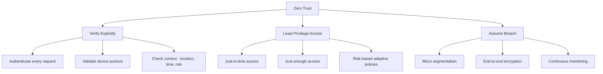
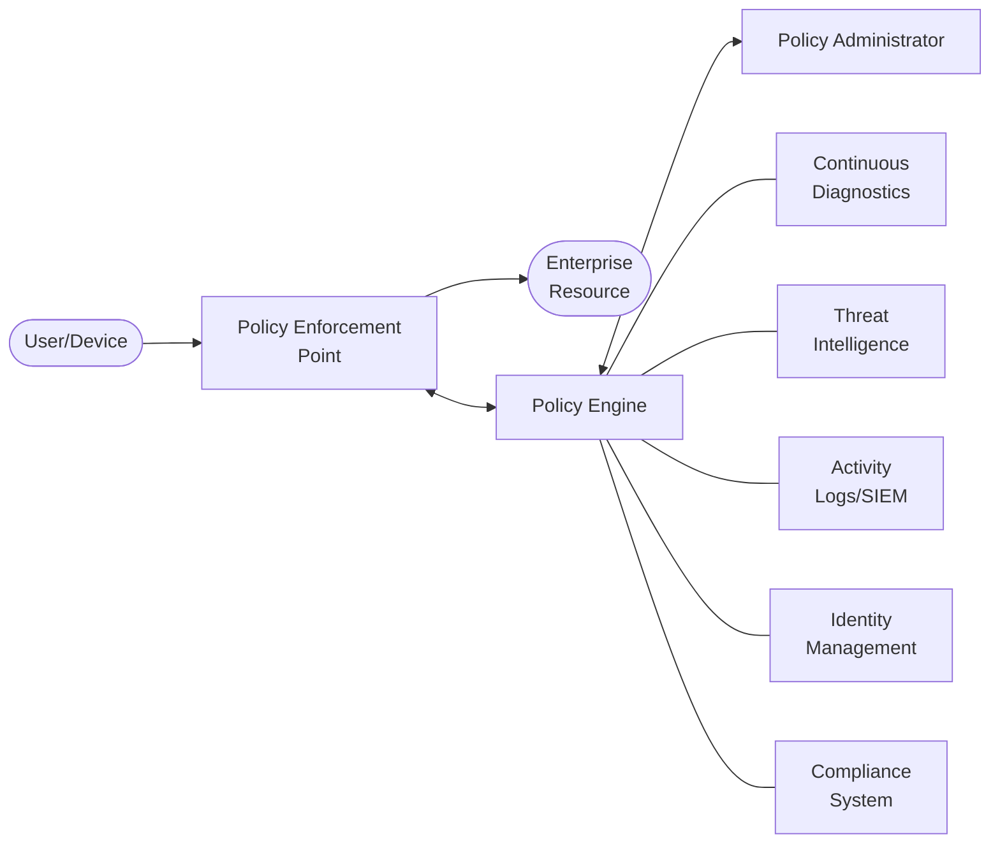

# Zero Trust

## What It Is

Zero trust is a security model that eliminates implicit trust from network architecture. Instead of "trust users inside the perimeter," zero trust assumes breach and verifies every request as if it originates from an untrusted network. The core principle: **never trust, always verify.**

## Why It Matters

The traditional perimeter model is dead. Remote work, cloud adoption, SaaS sprawl, and BYOD mean there's no longer a clear "inside" and "outside." VPNs gave us a false sense of security — once you're in, you're in. Zero trust acknowledges this reality and designs around it.

## Key Concepts

### The Three Pillars

### Core Components

| Component | Purpose | Implementation |
|-----------|---------|----------------|
| **Identity Provider (IdP)** | Single source of truth for identity | Azure AD, Okta, Google Workspace |
| **Policy Engine** | Makes access decisions | Conditional access policies, risk scoring |
| **Policy Enforcement Point** | Enforces decisions at the resource | Reverse proxy, API gateway, identity-aware proxy |
| **Device Trust** | Validates endpoint health | MDM enrollment, certificate-based auth, posture checks |
| **Micro-segmentation** | Limits lateral movement | Software-defined perimeter, service mesh |
| **Continuous Monitoring** | Detects anomalies post-authentication | UEBA, session monitoring, re-authentication triggers |

### Zero Trust Architecture (NIST 800-207)

The Policy Engine evaluates:
- **Who** is requesting (identity, role, group)
- **What** device they're on (managed, compliant, posture score)
- **Where** they're coming from (location, network, IP reputation)
- **When** they're requesting (business hours, unusual timing)
- **How sensitive** the resource is (classification level)

## Implementation Roadmap

Zero trust isn't a product you buy — it's a journey. Here's a realistic adoption path:

### Phase 1: Foundation (Months 1-3)
- Deploy a centralized Identity Provider
- Enforce MFA on all accounts (no exceptions)
- Inventory all assets and data flows
- Classify data by sensitivity

### Phase 2: Identity-Centric Access (Months 3-6)
- Implement SSO across all applications
- Deploy conditional access policies (device, location, risk)
- Remove direct VPN-to-network access patterns
- Start device enrollment/compliance checks

### Phase 3: Micro-Segmentation (Months 6-12)
- Segment networks beyond flat VLANs
- Implement application-level segmentation
- Deploy identity-aware proxies for internal apps
- Encrypt east-west traffic

### Phase 4: Continuous Verification (Months 12+)
- Deploy UEBA for anomaly detection
- Implement session-level risk re-evaluation
- Automate access revocation on risk signals
- Continuous posture assessment for all endpoints

## Common Mistakes

- **"We bought a zero trust product"** — Zero trust is an architecture, not a SKU. No vendor delivers it in a box
- **Boiling the ocean** — Trying to go full zero trust across the entire org at once. Start with crown jewel apps and expand
- **Ignoring user experience** — MFA fatigue, constant re-authentication, and broken workflows kill adoption. Balance security with usability
- **Zero trust = no perimeter** — You still need perimeters. Zero trust adds verification *beyond* them, it doesn't remove them
- **Skipping the inventory** — You can't protect what you don't know exists. Asset and data discovery comes first

## Cloud Context

Cloud environments are natural zero trust candidates because there's no physical perimeter to begin with.

| Zero Trust Principle | AWS | Azure | GCP |
|----------------------|-----|-------|-----|
| Identity verification | IAM + STS + SSO | Azure AD + Conditional Access | Cloud Identity + BeyondCorp |
| Device trust | Systems Manager | Intune + Compliance | Endpoint Verification |
| Micro-segmentation | Security Groups + PrivateLink | NSGs + Private Endpoints | VPC Firewall Rules + Private Google Access |
| Least privilege | IAM policies + SCPs | RBAC + PIM | IAM + Organization Policies |
| Monitoring | CloudTrail + GuardDuty | Sentinel + Defender | Chronicle + Security Command Center |

### Google BeyondCorp — The OG Zero Trust

Google's BeyondCorp is the most cited real-world zero trust implementation:
- Eliminated VPN entirely for employee access
- Access decisions based on user identity + device trust level + context
- Every internal app sits behind an identity-aware proxy
- Device certificates + inventory database = device trust

## Interview Angle

When asked about zero trust:
- Start with the **problem it solves** (perimeter model failure), not the buzzword
- Walk through the **NIST 800-207 architecture** — shows you've read the standard
- Give a **realistic implementation example** — "Here's how I'd introduce ZT to a company still using VPN-based access..."
- Address the **hard parts**: legacy applications that can't do SSO, OT/IoT devices that can't run agents, user pushback on MFA
- Know the difference between **zero trust network access (ZTNA)** and **full zero trust architecture** — ZTNA is one component, not the whole thing

**Sample answer structure**: "Zero trust is an architecture model based on the principle that no user or device should be implicitly trusted. The key shift from traditional perimeter security is that verification happens per-request, not per-session. A practical implementation starts with strong identity through an IdP and MFA, then layers on device trust, conditional access, micro-segmentation, and continuous monitoring. The biggest challenge I've seen is retrofitting legacy applications that were designed for a trusted network."

## Further Reading

- [NIST SP 800-207: Zero Trust Architecture](https://csrc.nist.gov/publications/detail/sp/800-207/final)
- [Google BeyondCorp Papers](https://cloud.google.com/beyondcorp)
- [CISA Zero Trust Maturity Model](https://www.cisa.gov/zero-trust-maturity-model)
- [Microsoft Zero Trust Deployment Guide](https://learn.microsoft.com/en-us/security/zero-trust/)
