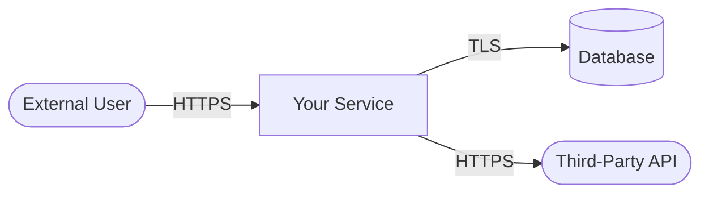

# Threat Model Template

> Fork this template and fill it out for your system. Delete the instructional text in italics when you're done.

---

## 1. System Overview

**System Name**: _[Name of the system or feature being modeled]_

**Version/Date**: _[Version number or date of this threat model]_

**Author(s)**: _[Who performed this threat model]_

**Reviewers**: _[Who reviewed it]_

**Status**: Draft | In Review | Approved | Needs Update

### Description

_[2-3 sentences describing what the system does, who uses it, and why it exists.]_

### Scope

_[What is included in this threat model? What is explicitly excluded? Be specific.]_

**In scope:**
- _Component A_
- _Data flow X to Y_

**Out of scope:**
- _Third-party infrastructure (covered by vendor assessment)_
- _Physical security_

---

## 2. Architecture

### Data Flow Diagram

_[Insert or draw a data flow diagram. Use Mermaid, draw.io, or any tool. Include:]_
- _External entities (users, third-party services)_
- _Processes (application components, services)_
- _Data stores (databases, caches, file storage)_
- _Data flows (arrows with protocol/data type labels)_
- _Trust boundaries (where trust level changes)_

### Components

| Component | Technology | Owner | Description |
|-----------|-----------|-------|-------------|
| _Web frontend_ | _React_ | _Team A_ | _User-facing application_ |
| _API server_ | _Node.js_ | _Team A_ | _Business logic and data access_ |
| _Database_ | _PostgreSQL_ | _Platform_ | _Primary data store_ |

### Data Classification

| Data Element | Classification | Storage Location | Encrypted at Rest | Encrypted in Transit |
|-------------|---------------|-----------------|-------------------|---------------------|
| _User credentials_ | _Confidential_ | _PostgreSQL_ | _Yes (AES-256)_ | _Yes (TLS 1.3)_ |
| _Session tokens_ | _Confidential_ | _Redis_ | _No_ | _Yes (TLS 1.3)_ |
| _User profiles_ | _Internal_ | _PostgreSQL_ | _Yes (AES-256)_ | _Yes (TLS 1.3)_ |

### Trust Boundaries

| Boundary | Description | Controls |
|----------|-------------|----------|
| _Internet -> Load Balancer_ | _Untrusted to semi-trusted_ | _WAF, TLS termination, rate limiting_ |
| _App Server -> Database_ | _Semi-trusted to trusted_ | _Network segmentation, TLS, IAM auth_ |

---

## 3. Threat Identification

_[Use STRIDE per component, or per data flow. For each threat, describe the attack, not just the category.]_

### STRIDE Analysis

| ID | Component/Flow | STRIDE Category | Threat Description | Attacker Profile |
|----|---------------|-----------------|-------------------|------------------|
| T1 | _Login endpoint_ | _Spoofing_ | _Credential stuffing using breached password databases_ | _External, unskilled_ |
| T2 | _API -> DB_ | _Tampering_ | _SQL injection via unsanitized input in search parameter_ | _External, skilled_ |
| T3 | _Session management_ | _Spoofing_ | _Session hijacking via stolen JWT from XSS_ | _External, skilled_ |
| T4 | _Admin panel_ | _Elevation of Privilege_ | _Broken access control allows regular user to access admin functions_ | _Authenticated user_ |
| T5 | _Auth events_ | _Repudiation_ | _No audit trail for failed login attempts_ | _Any_ |
| T6 | _Error responses_ | _Information Disclosure_ | _Stack traces returned in production error responses_ | _External, unskilled_ |
| T7 | _API endpoint_ | _Denial of Service_ | _Unbounded query results cause OOM on large datasets_ | _Authenticated user_ |

---

## 4. Risk Assessment

_[Rate each threat using a consistent methodology. DREAD, CVSS, or simple High/Medium/Low with justification.]_

| Threat ID | Likelihood | Impact | Risk Level | Justification |
|-----------|-----------|--------|------------|---------------|
| T1 | _High_ | _High_ | **Critical** | _Breached credential databases are widely available. Successful attack compromises user accounts._ |
| T2 | _Medium_ | _High_ | **High** | _Modern frameworks reduce likelihood, but impact of SQL injection is severe._ |
| T3 | _Medium_ | _High_ | **High** | _Requires XSS vulnerability as a precondition, but JWT theft is game over._ |
| T4 | _Medium_ | _Critical_ | **Critical** | _IDOR and broken access control are common. Admin access = full compromise._ |
| T5 | _High_ | _Medium_ | **High** | _Without logs, attacks go undetected. Compliance risk._ |
| T6 | _High_ | _Low_ | **Medium** | _Easy to trigger, but information disclosure is a stepping stone, not direct impact._ |
| T7 | _Medium_ | _Medium_ | **Medium** | _Service degradation but not full outage if rate limiting exists._ |

---

## 5. Mitigations

_[For each threat, decide: Mitigate, Accept, Transfer, or Avoid. If mitigating, be specific about the control.]_

| Threat ID | Decision | Mitigation | Owner | Status | Target Date |
|-----------|----------|-----------|-------|--------|-------------|
| T1 | Mitigate | _Implement rate limiting (5/min per IP), MFA enforcement, breached password check on registration_ | _Auth team_ | _Planned_ | _Q2 2026_ |
| T2 | Mitigate | _Parameterized queries already in place. Add SQLi-specific WAF rule. Add SAST rule to CI._ | _Platform_ | _In progress_ | _Q1 2026_ |
| T3 | Mitigate | _HttpOnly + Secure cookie flags. CSP headers. Short JWT expiry (15 min) with refresh tokens._ | _Auth team_ | _Planned_ | _Q2 2026_ |
| T4 | Mitigate | _Authorization check on every endpoint. Automated IDOR testing in CI._ | _API team_ | _Not started_ | _Q2 2026_ |
| T5 | Mitigate | _Structured auth event logging to SIEM. Alert on >10 failed logins per account per hour._ | _Security_ | _Planned_ | _Q1 2026_ |
| T6 | Mitigate | _Custom error handler returning generic messages. Stack traces only in dev/staging._ | _API team_ | _Not started_ | _Q1 2026_ |
| T7 | Accept | _Rate limiting exists. Pagination enforced. Residual risk accepted for authenticated users._ | _Security_ | _Accepted_ | _N/A_ |

---

## 6. Residual Risk

_[After mitigations, what risk remains? Document it explicitly.]_

| Threat ID | Residual Risk | Justification | Review Date |
|-----------|--------------|---------------|-------------|
| T1 | _Low_ | _MFA + rate limiting significantly reduce credential stuffing success rate. Sophisticated attackers may use residential proxies to bypass IP-based rate limiting._ | _Q3 2026_ |
| T7 | _Medium_ | _Accepted. Pagination limits impact. Monitoring in place to detect abuse._ | _Q3 2026_ |

---

## 7. Assumptions & Dependencies

### Assumptions
- _The cloud provider's physical security and hypervisor isolation are adequate_
- _TLS 1.3 is not broken by a practical attack_
- _The IdP (Okta/Azure AD) is not compromised_

### Dependencies
- _WAF rules are maintained and updated monthly_
- _SIEM ingestion pipeline has <5 minute latency_
- _CI/CD pipeline security scanning is not bypassed_

---

## 8. Review Schedule

| Review Trigger | Action |
|---------------|--------|
| Major feature change | Re-evaluate affected threats, add new ones |
| Quarterly | Review residual risks and mitigation status |
| Post-incident | Update threat model with new attack patterns |
| Annually | Full threat model refresh |

---

## Changelog

| Date | Author | Change |
|------|--------|--------|
| _2026-03-10_ | _[Author]_ | _Initial threat model_ |
